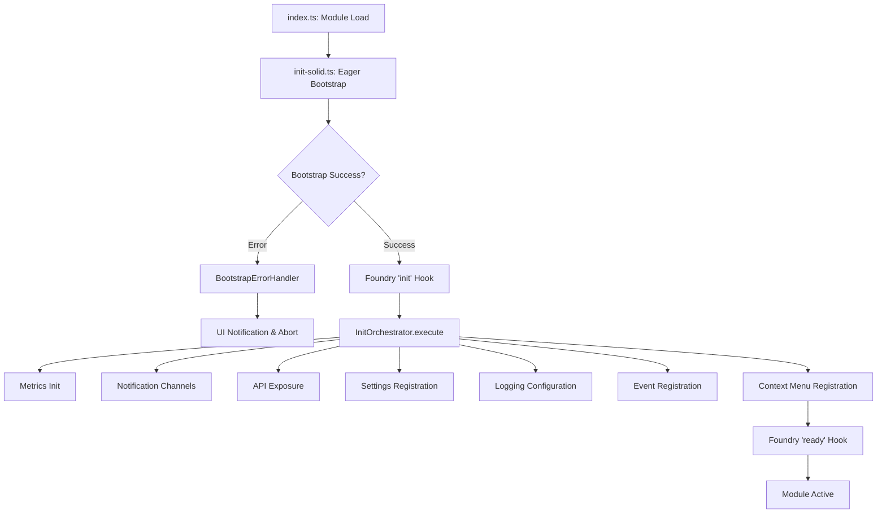

# Bootstrap Flow & Module Lifecycle

**Model:** Claude Sonnet 4.5  
**Datum:** 2025-11-16 (aktualisiert 2025-11-29)  
**Stand:** Version 0.30.0+ (mit Init-Orchestratoren für SOLID-Konformität)

---

## 📋 Übersicht

Das Modul verwendet einen **zweiphasigen Bootstrap-Prozess** mit klarer Trennung zwischen DI-Container-Initialisierung und Foundry-Integration.

**Design-Prinzipien:**
- **Fail-Fast**: Bootstrap-Fehler führen zu sofortigem Abort
- **Lazy Port Loading**: Verhindert Crashes durch inkompatible APIs
- **Defensive Guards**: Prüft Foundry-Verfügbarkeit vor jeder Interaktion
- **Result Pattern**: Keine Exceptions während Bootstrap
- **Self-Registration**: Services registrieren sich selbst für Observability
- **Modular Config**: DI-Konfiguration in thematische Module aufgeteilt

---

## 🔄 Boot-Phasen



---

## Phase 0: Module Load (index.ts)

**Datei:** `src/index.ts`  
**Zeitpunkt:** Beim Laden des Moduls (vor Foundry init)

```typescript
// 1. Polyfills anwenden
import "@/polyfills/cytoscape-assign-fix";

// 2. Bootstrap starten (eager!)
import "@/core/init-solid";

// 3. Styles laden
import "../styles/tailwind.css";
```

**Wichtig:**
- `init-solid.ts` wird **eager** ausgeführt (vor Foundry `init`)
- Bootstrap läuft **VOR** Foundry-Hooks
- Side-Effect-Only-Import (keine Exports)

---

## Phase 1: Eager Bootstrap (vor Foundry init)

**Datei:** `src/core/init-solid.ts`  
**Zeitpunkt:** Sofort beim Module-Load

### 1.1 Container erstellen

```typescript
// Eager bootstrap DI before Foundry init
const root = new CompositionRoot();
const bootstrapResult = root.bootstrap();
```

### 1.2 CompositionRoot.bootstrap()

**Datei:** `src/core/composition-root.ts`

```typescript
bootstrap(): Result<ServiceContainer, string> {
  // 1. Container erstellen
  const container = ServiceContainer.createRoot();
  
  // 2. Performance Tracking initialisieren
  const runtimeConfig = new RuntimeConfigService(ENV);
  const performanceTracker = new BootstrapPerformanceTracker(runtimeConfig, null);
  
  // 3. Dependencies konfigurieren
  const configured = performanceTracker.track(
    () => configureDependencies(container),
    (duration) => {
      // Log nach erfolgreichem Bootstrap
      const loggerResult = container.resolveWithError(loggerToken);
      if (loggerResult.ok) {
        loggerResult.value.debug(`Bootstrap completed in ${duration.toFixed(2)}ms`);
      }
    }
  );
  
  if (configured.ok) {
    this.container = container;
    return { ok: true, value: container };
  }
  return { ok: false, error: configured.error };
}
```

### 1.3 configureDependencies()

**Datei:** `src/config/dependencyconfig.ts`

**Registrierungs-Reihenfolge (kritisch!):**

```typescript
function configureDependencies(container: ServiceContainer): Result<void, string> {
  // 1. Fallbacks (kritische Services)
  registerFallbacks(container);  // Logger Fallback
  
  // 2. Core Infrastructure
  registerCoreServices(container);
  // → EnvironmentConfig
  // → MetricsCollector (deps: [ENV])
  // → MetricsRecorder/MetricsSampler (Aliases)
  // → ConsoleLoggerService (deps: [ENV])
  // → ModuleHealthService (deps: [Container, Metrics])
  
  // 3. Utility Services
  registerUtilityServices(container);
  // → PerformanceTrackingService (deps: [ENV, Metrics])
  // → RetryService (deps: [Logger, Metrics])
  
  // 4. Port Infrastructure
  registerPortInfrastructure(container);
  // → PortSelector (deps: [])
  // → PortRegistries (6 Registries als Value)
  // → PortSelectionObserver (Event-basiert)
  
  // 5. Foundry Services
  registerFoundryServices(container);
  // → FoundryGameService, FoundryHooksService, etc. (je 6)
  // → FoundryJournalFacade
  // → JournalVisibilityService
  
  // 6. i18n Services
  registerI18nServices(container);
  // → FoundryI18nService
  // → LocalI18nService
  // → I18nFacadeService
  
  // 7. Validation
  validateContainer(container);
  
  // 8. Logger konfigurieren
  configureLogger(container);
  
  return ok(undefined);
}
```

### 1.4 Hook-Registrierung über Bootstrap-Services

**Nach erfolgreichem Bootstrap:**

```typescript
// Bootstrap-Services aus Container holen und registrieren
const initHookServiceResult = container.resolveWithError<BootstrapInitHookService>(
  bootstrapInitHookServiceToken
);
if (!initHookServiceResult.ok) {
  logger.error(`Failed to resolve BootstrapInitHookService: ${initHookServiceResult.error.message}`);
  return;
}
initHookServiceResult.value.register();

const readyHookServiceResult = container.resolveWithError<BootstrapReadyHookService>(
  bootstrapReadyHookServiceToken
);
if (!readyHookServiceResult.ok) {
  logger.error(`Failed to resolve BootstrapReadyHookService: ${readyHookServiceResult.error.message}`);
  return;
}
readyHookServiceResult.value.register();
```

**Bootstrap-Services:**
- `BootstrapInitHookService`: Registriert den `init` Hook und kapselt die gesamte Init-Phase-Logik
- `BootstrapReadyHookService`: Registriert den `ready` Hook und kapselt die Ready-Phase-Logik
- Beide Services nutzen direkte `Hooks.on()` Aufrufe, um das Henne-Ei-Problem zu vermeiden (Version-Detection benötigt `game.version`, welches erst nach `init` verfügbar ist)
- Services sind als Singletons im Container registriert und nutzen Dependency Injection für alle Dependencies

### 1.5 Fehlerbehandlung

**Bei Bootstrap-Fehler:**

```typescript
if (!bootstrapOk) {
  // 1. Log Error
  BootstrapErrorHandler.logError(error, {
    phase: "bootstrap",
    component: "CompositionRoot",
    metadata: { foundryVersion: tryGetFoundryVersion() }
  });
  
  // 2. Prüfe Foundry-Version
  if (foundryVersion < 13) {
    ui.notifications.error(
      "Module benötigt Foundry VTT v13+. Ihre Version: " + foundryVersion,
      { permanent: true }
    );
  } else {
    ui.notifications.error(
      "Module failed to initialize. Check console.",
      { permanent: true }
    );
  }
  
  // 3. Soft Abort (keine Hook-Registrierung)
  return;
}
```

**Wichtig:**
- **Keine Exceptions**: Verwendet `Result` Pattern
- **Soft Abort**: Bei Fehler werden keine Hooks registriert
- **User Feedback**: UI-Notifications bei kritischen Fehlern

---

## Phase 2: Foundry `init` Hook

**Zeitpunkt:** Foundry VTT `init` Phase  
**Voraussetzung:** Bootstrap erfolgreich abgeschlossen  
**Verantwortlich:** `BootstrapInitHookService` (DI-Service)

### 2.1 Hook-Registrierung

Der `init` Hook wird von `BootstrapInitHookService` registriert:

```typescript
// BootstrapInitHookService.register() - aufgerufen in initializeFoundryModule()
Hooks.on("init", () => {
  logger.info("init-phase");
  
  // Init-Phase-Logik wird im Service ausgeführt
  // (siehe bootstrap-init-hook.ts)
});
```

**Wichtig:**
- Direkte `Hooks.on()` Nutzung (nicht über `PlatformEventPort`) um Henne-Ei-Problem zu vermeiden
- Service nutzt injizierten Container für alle Service-Resolutions
- Vollständige DI-Integration: Alle Dependencies werden über Constructor injiziert

### 2.2 Init-Phase-Logik

Die Init-Phase-Logik ist vollständig in `BootstrapInitHookService` gekapselt:

```typescript
// BootstrapInitHookService - init hook callback
Hooks.on("init", () => {
  logger.info("init-phase");
  
  // 1. Expose Public API via ModuleApiInitializer (DI-Service)
  const apiInitializer = this.container.resolveWithError(moduleApiInitializerToken);
  if (apiInitializer.ok) {
    const exposeResult = apiInitializer.value.expose(this.container);
    if (!exposeResult.ok) {
      logger.error(`Failed to expose API: ${exposeResult.error}`);
      return;
    }
  }
  // → game.modules.get(MODULE_ID).api.resolve()
  // → game.modules.get(MODULE_ID).api.tokens
  // → game.modules.get(MODULE_ID).api.getMetrics()
  // → game.modules.get(MODULE_ID).api.getHealth()
```

**Public API (via ModuleApiInitializer):**

**Verantwortlich:** `ModuleApiInitializer` (DI-Service, registriert in `core-services.config.ts`)

```typescript
// Verfügbar unter: game.modules.get(MODULE_ID).api
const api: ModuleApi = {
  version: "1.0.0",
  
  // Service Resolution (mit Deprecation-Check + ReadOnly-Wrapping)
  resolve: <T>(token: ApiSafeToken<T>) => T,
  
  // Token Registry
  tokens: {
    loggerToken,
    journalVisibilityServiceToken,
    foundryGameToken,
    // ... weitere Tokens
  },
  
  // Available Tokens
  getAvailableTokens: () => Map<symbol, TokenInfo>,
  
  // Metrics
  getMetrics: () => MetricsSnapshot,
  
  // Health Status
  getHealth: () => HealthStatus
};
```

### 2.2 Settings registrieren

```typescript
  // 2. Register Module Settings
  new ModuleSettingsRegistrar().registerAll(container);
  // → Log-Level-Setting
  // → Weitere Settings (falls vorhanden)
```

**ModuleSettingsRegistrar:** Registriert alle Modul-Einstellungen in Foundry Settings-System.

### 2.3 Logger konfigurieren

```typescript
  // 3. Configure Logger with current setting
  const settings = container.resolve(foundrySettingsToken);
  const logLevel = settings.get(MODULE_ID, "logLevel");
  
  if (logLevel.ok && logger.setMinLevel) {
    logger.setMinLevel(logLevel.value);
    logger.debug(`Logger configured with level: ${LogLevel[logLevel.value]}`);
  }
```

**Logger-Reihenfolge:**
1. Bootstrap: Logger mit Default-Level (INFO)
2. Init: Logger mit User-Setting (aus Foundry Settings)

### 2.4 Event-Listener registrieren

```typescript
  // 4. Register Module Event Listeners
  const eventRegistrarResult = this.container.resolveWithError(moduleEventRegistrarToken);
  if (!eventRegistrarResult.ok) {
    this.logger.error(`Failed to resolve ModuleEventRegistrar: ${eventRegistrarResult.error.message}`);
    return;
  }
  const eventRegistrationResult = eventRegistrarResult.value.registerAll();
  if (!eventRegistrationResult.ok) {
    this.logger.error("Failed to register one or more event listeners", {
      errors: eventRegistrationResult.error.map((e) => e.message),
    });
    return;
  }
  
  this.logger.info("init-phase completed");
});
```

**ModuleEventRegistrar:** Registriert alle Foundry-Hook-Handler des Moduls (z.B. `renderJournalDirectory` für Journal-Verstecken).

---

## Phase 3: Foundry `ready` Hook

**Zeitpunkt:** Foundry VTT `ready` Phase (nach init)  
**Zweck:** Leichte Start-Aktionen, Logging  
**Verantwortlich:** `BootstrapReadyHookService` (DI-Service)

### 3.1 Hook-Registrierung

Der `ready` Hook wird von `BootstrapReadyHookService` registriert:

```typescript
// BootstrapReadyHookService.register() - aufgerufen in initializeFoundryModule()
Hooks.on("ready", () => {
  logger.info("ready-phase");
  
  // Ready-Phase-Logik wird im Service ausgeführt
  // (siehe bootstrap-ready-hook.ts)
});
```

**Wichtig:**
- Direkte `Hooks.on()` Nutzung (nicht über `PlatformEventPort`) um Henne-Ei-Problem zu vermeiden
- Service nutzt injizierten Logger für Logging
- Vollständige DI-Integration: Logger wird über Constructor injiziert

### 3.2 Ready-Phase-Logik

```typescript
// BootstrapReadyHookService - ready hook callback
Hooks.on("ready", () => {
  this.logger.info("ready-phase");
  
  // Optionale Start-Aktionen
  // - Metriken loggen
  // - Startup-Checks
  // - User-Begrüßung
  
  this.logger.info("ready-phase completed");
});
```

**Wichtig:**
- Services sind bereits über `api.resolve()` verfügbar
- Heavy Logic gehört in `init`, nicht in `ready`
- `ready` ist optional (nur für Light-Weight-Actions)

---

## 🔍 Detaillierter Bootstrap-Ablauf

### Timeline

```
Module Load
    ↓
[0ms] index.ts: Import init-solid.ts (eager)
    ↓
[0ms] init-solid.ts: const root = new CompositionRoot()
    ↓
[0ms] root.bootstrap()
    ↓
[0-10ms] ServiceContainer.createRoot()
    ↓
[0-10ms] configureDependencies(container)
    ├─ [0-2ms] registerFallbacks (Logger)
    ├─ [0-2ms] registerCoreServices (ENV, Metrics, Logger, Health, BootstrapInitHookService, BootstrapReadyHookService)
    ├─ [0-2ms] registerUtilityServices (Performance, Retry)
    ├─ [0-2ms] registerPortInfrastructure (PortSelector, Registries)
    ├─ [0-2ms] registerFoundryServices (6 Services + Facade)
    ├─ [0-2ms] registerI18nServices (3 Services)
    ├─ [0-2ms] validateContainer()
    └─ [0-1ms] configureLogger()
    ↓
[10-20ms] Bootstrap completed ✅
    ↓
[10-20ms] initializeFoundryModule()
    ├─ BootstrapInitHookService.resolve() & register()
    └─ BootstrapReadyHookService.resolve() & register()
    ↓
[...] Waiting for Foundry init
    ↓
[Foundry Time] BootstrapInitHookService: Hooks.on("init", ...)
    ├─ ModuleApiInitializer.expose(container)
    ├─ ModuleSettingsRegistrar.registerAll()
    ├─ Configure Logger with User-Setting
    └─ ModuleEventRegistrar.registerAll()
    ↓
[Foundry Time] BootstrapReadyHookService: Hooks.on("ready", ...)
    └─ Logging & Light Actions
    ↓
[Running] Module Active ✅
```

**Typische Bootstrap-Dauer:** 10-20ms (gemessen via PerformanceTrackingService)

---

## 🛡️ Fehlerbehandlung

### Bootstrap-Fehler-Szenarien

#### Szenario 1: Alte Foundry-Version (< v13)

**Detection:**
```typescript
const foundryVersion = tryGetFoundryVersion();
if (foundryVersion < 13) {
  // PORT_SELECTION_FAILED Error
}
```

**User Feedback:**
```
UI-Notification (permanent):
"Beziehungsnetzwerke benötigt mindestens Foundry VTT v13. 
 Ihre Version: 12. Bitte aktualisieren Sie Foundry VTT."
```

**Abort:** ✅ Keine Hook-Registrierung

---

#### Szenario 2: Dependency-Validation-Fehler

**Detection:**
```typescript
const validateResult = container.validate();
if (!validateResult.ok) {
  // ContainerError[] mit Details
}
```

**User Feedback:**
```
Console Error:
"[Beziehungsnetzwerke] Validation failed: Missing dependency..."

UI-Notification (permanent):
"Beziehungsnetzwerke failed to initialize. Check console for details."
```

**Abort:** ✅ Keine Hook-Registrierung

---

#### Szenario 3: Service-Registration-Fehler

**Detection:**
```typescript
const result = container.registerClass(token, Class, lifecycle);
if (!result.ok) {
  // ContainerError mit Code + Message
}
```

**User Feedback:**
```
Console Error:
"[Beziehungsnetzwerke] Failed to register [Service]: [Error Message]"

UI-Notification (permanent):
"Beziehungsnetzwerke failed to initialize."
```

**Abort:** ✅ Keine Hook-Registrierung

---

### Error Recovery

**Keine automatische Recovery:**
- Bootstrap-Fehler sind kritisch → Module funktioniert nicht
- User muss Ursache beheben (Foundry-Update, Modul-Neuinstallation, etc.)
- Bei Fehler: Modul bleibt inaktiv (keine Hook-Handler)

**Debugging:**
```javascript
// Foundry Console
const api = game.modules.get("fvtt_relationship_app_module").api;
if (!api) {
  console.log("Module not initialized - check console for bootstrap errors");
}
```

---

## 🔌 Port Selection (Lazy Loading)

### Wann werden Ports selektiert?

**NICHT während Bootstrap!**

Ports werden **lazy** beim ersten Service-Aufruf selektiert:

```typescript
// Phase 1: Bootstrap
container.registerClass(foundryGameToken, FoundryGameService, SINGLETON);
// ✅ Service registriert, aber Port noch NICHT selektiert

// Phase 2: Erste Nutzung
const gameService = container.resolve(foundryGameToken);
// ✅ Service instantiiert, aber Port immer noch NICHT selektiert

// Phase 3: Erste Method-Call
const journals = gameService.getJournalEntries();
// ✅ JETZT wird Port selektiert (via PortSelector)
```

### Warum Lazy Loading?

**Verhindert Crashes:**

```typescript
// BAD: Eager Port Instantiation
class FoundryGameService {
  constructor() {
    // ❌ CRASH bei Foundry v13, wenn v14-Port-Constructor 
    //    auf v14-APIs zugreift!
    this.port = new FoundryGamePortV14();
  }
}

// GOOD: Lazy Port Selection
class FoundryGameService {
  private port: FoundryGame | null = null;
  
  private getPort(): Result<FoundryGame, FoundryError> {
    if (this.port === null) {
      // ✅ Factory-basiert: Nur kompatible Ports werden instantiiert
      this.port = portSelector.selectPortFromFactories(factories);
    }
    return { ok: true, value: this.port };
  }
}
```

---

## 🎯 Service-Lifecycle

### Singleton Services

**Lifecycle:** Einmal instantiiert, für gesamte Modul-Laufzeit

```typescript
container.registerClass(loggerToken, ConsoleLoggerService, SINGLETON);

// Erste Resolution
const logger1 = container.resolve(loggerToken);  // Instantiiert

// Zweite Resolution
const logger2 = container.resolve(loggerToken);  // Cached!

// Identität
logger1 === logger2  // true ✅
```

**Alle Services im Modul sind SINGLETON** (keine Transient/Scoped Services)

---

## 📊 Bootstrap-Performance-Metriken

### Typische Werte (Development)

| Metrik | Wert | Gemessen mit |
|--------|------|--------------|
| **Container Creation** | ~2-5ms | BootstrapPerformanceTracker |
| **Dependency Registration** | ~5-10ms | BootstrapPerformanceTracker |
| **Validation** | ~1-3ms | BootstrapPerformanceTracker |
| **Gesamt-Bootstrap** | **~10-20ms** | BootstrapPerformanceTracker |

### Metriken abrufen

```javascript
// Foundry Console
const api = game.modules.get("fvtt_relationship_app_module").api;
const metrics = api.getMetrics();
console.table(metrics);

// Output:
// containerResolutions: 15
// resolutionErrors: 0
// avgResolutionTimeMs: 0.5
// cacheHitRate: 80%
```

---

## 🔍 Debugging & Troubleshooting

### Bootstrap-Status prüfen

```javascript
// Foundry Console
const api = game.modules.get("fvtt_relationship_app_module").api;

if (!api) {
  console.error("Module not initialized - Bootstrap failed!");
  // Check Console für Bootstrap-Errors
} else {
  console.log("✅ Module initialized successfully");
  
  // Health Status
  const health = api.getHealth();
  console.log(health);
  // {
  //   status: "healthy",
  //   checks: {
  //     containerValidated: true,
  //     portsSelected: true
  //   },
  //   timestamp: "2025-11-09T..."
  // }
}
```

---

### Verfügbare Tokens prüfen

```javascript
const api = game.modules.get("fvtt_relationship_app_module").api;
const tokens = api.getAvailableTokens();

console.table(Array.from(tokens.entries()).map(([symbol, info]) => ({
  Token: info.description,
  Registered: info.isRegistered ? "✅" : "❌"
})));
```

---

### Service Resolution testen

```javascript
const api = game.modules.get("fvtt_relationship_app_module").api;

// Logger testen
const logger = api.resolve(api.tokens.loggerToken);
logger.info("Test message from console");

// Foundry Game Service testen
const gameService = api.resolve(api.tokens.foundryGameToken);
const journals = gameService.getJournalEntries();
console.log(journals);
```

---

## 🔐 Guards & Defensive Checks

### Foundry API Availability

**Alle Foundry-Interaktionen haben Guards:**

```typescript
// Guard: Foundry Hooks API
if (typeof Hooks === "undefined") {
  logger.warn("Foundry Hooks API not available");
  return;  // Soft abort
}

// Guard: Foundry Game Object
if (typeof game === "undefined" || !game?.modules) {
  throw new Error("Game modules not available");
}

// Guard: UI Notifications
if (typeof ui !== "undefined" && ui?.notifications) {
  ui.notifications.info("Message");
}
```

**Warum notwendig?**
- Modul könnte außerhalb von Foundry geladen werden (Testing)
- Foundry-Objekte sind nicht in allen Kontexten verfügbar
- Prevents Runtime-Errors

---

## 📋 Hook-Registrierungs-Lifecycle

### ModuleHookRegistrar

**Datei:** `src/core/module-hook-registrar.ts`

```typescript
class ModuleHookRegistrar {
  registerAll(container: ServiceContainer): void {
    const hooksService = container.resolve(foundryHooksToken);
    
    // 1. renderJournalDirectory Hook
    const journalVisibilityService = container.resolve(
      journalVisibilityServiceToken
    );
    
    hooksService.on("renderJournalDirectory", (app, html) => {
      journalVisibilityService.processJournalDirectory(html[0]);
    });
    
    // 2. Weitere Hooks (falls vorhanden)
    // ...
  }
}
```

**Hook-Lifecycle:**
- Registriert in: `init` Phase
- Gefeuert: Bei entsprechendem Foundry-Event
- Cleanup: Automatisch via `FoundryHooksService.dispose()`

---

## 🎯 Port Selection Events

### PortSelector Event Flow

```typescript
// PortSelector emittiert Events bei Port-Selektion
portSelector.onEvent((event) => {
  if (event.type === "success") {
    logger.debug(`Port v${event.selectedVersion} selected`);
    metrics.recordPortSelection(event.selectedVersion);
  } else {
    logger.error(`Port selection failed: ${event.error.message}`);
    metrics.recordPortSelectionFailure(event.foundryVersion);
  }
});
```

**Observer Pattern:**
- PortSelector: Zero Dependencies (emittiert nur Events)
- PortSelectionObserver: Reagiert auf Events (Logging, Metrics)
- Decoupling von Port Selection und Observability

---

## 🧹 Cleanup & Disposal

### Container Disposal (bei Modul-Deaktivierung)

```typescript
// Wird automatisch aufgerufen bei Modul-Disable
container.dispose();

// Cascading Cleanup:
// 1. ScopeManager disposes alle Child-Container
// 2. Alle Disposable Services werden disposed:
//    - FoundryHooksService → deregisters alle Hooks
//    - FoundryGameService → cleanup Port-Reference
//    - etc.
// 3. InstanceCache.clear()
```

**Disposable Services:**
- `FoundryHooksService`: Deregistriert alle Hook-Handler
- `FoundryGameService`, `FoundryDocumentService`, etc.: Reset Port-References
- (Weitere nach Bedarf)

---

## 🎨 Boot-Flow-Diagramm (Detailliert)

```
┌─────────────────────────────────────────────────────────────┐
│ MODULE LOAD (index.ts)                                      │
│ • Polyfills                                                 │
│ • Import init-solid.ts (eager)                             │
│ • Styles                                                    │
└─────────────────┬───────────────────────────────────────────┘
                  │
                  ▼
┌─────────────────────────────────────────────────────────────┐
│ PHASE 1: EAGER BOOTSTRAP (vor Foundry init)                │
│                                                             │
│ ┌─────────────────────────────────────────────────────────┐│
│ │ 1. CompositionRoot.bootstrap()                          ││
│ │    ├─ ServiceContainer.createRoot()                     ││
│ │    └─ configureDependencies(container)                  ││
│ │       ├─ registerFallbacks (Logger)                     ││
│ │       ├─ registerCoreServices (ENV, Metrics, Logger)    ││
│ │       ├─ registerUtilityServices (Perf, Retry)          ││
│ │       ├─ registerPortInfrastructure (Selector, Registry)││
│ │       ├─ registerFoundryServices (6 Services)           ││
│ │       ├─ registerI18nServices (3 Services)              ││
│ │       ├─ validateContainer()                            ││
│ │       └─ configureLogger()                              ││
│ └─────────────────────────────────────────────────────────┘│
│                                                             │
│ Result: ✅ Container initialized & validated                │
│         ❌ Bootstrap error → Abort (no hooks)               │
└─────────────────┬───────────────────────────────────────────┘
                  │
                  ▼
┌─────────────────────────────────────────────────────────────┐
│ PHASE 2: FOUNDRY INIT HOOK                                  │
│                                                             │
│ ┌─────────────────────────────────────────────────────────┐│
│ │ BootstrapInitHookService.register()                     ││
│ │   └─ Hooks.on("init", () => {                          ││
│ │       ├─ ModuleApiInitializer.expose(container)         ││
│ │       │  └─ game.modules.get(MODULE_ID).api = { ... }   ││
│ │       ├─ ModuleSettingsRegistrar.registerAll()         ││
│ │       │  └─ Register Log-Level-Setting                  ││
│ │       ├─ Configure Logger with User-Setting             ││
│ │       │  └─ logger.setMinLevel(logLevel)                ││
│ │       └─ ModuleEventRegistrar.registerAll()            ││
│ │          └─ Register renderJournalDirectory Hook        ││
│ │     })                                                   ││
│ └─────────────────────────────────────────────────────────┘│
│                                                             │
│ Result: ✅ API exposed, Hooks registered                    │
└─────────────────┬───────────────────────────────────────────┘
                  │
                  ▼
┌─────────────────────────────────────────────────────────────┐
│ PHASE 3: FOUNDRY READY HOOK                                 │
│                                                             │
│ ┌─────────────────────────────────────────────────────────┐│
│ │ BootstrapReadyHookService.register()                    ││
│ │   └─ Hooks.on("ready", () => {                         ││
│ │       ├─ logger.info("ready-phase")                     ││
│ │       ├─ Optional: Startup-Checks                       ││
│ │       └─ logger.info("ready-phase completed")           ││
│ │ })                                                       ││
│ └─────────────────────────────────────────────────────────┘│
│                                                             │
│ Result: ✅ Module fully active                              │
└─────────────────┬───────────────────────────────────────────┘
                  │
                  ▼
        ┌──────────────────┐
        │ MODULE RUNNING   │
        │ Services via API │
        └──────────────────┘
```

---

## 🔄 Service Resolution Flow

### Example: Journal Visibility Service

```
User Opens Journal Directory
    ↓
Foundry fires "renderJournalDirectory" Hook
    ↓
ModuleHookRegistrar Handler
    ↓
container.resolve(journalVisibilityServiceToken)
    ├─ Check Cache: Miss
    ├─ ServiceResolver.resolve()
    │   ├─ Resolve Dependency: foundryJournalFacadeToken
    │   │   ├─ Resolve: foundryGameToken
    │   │   │   ├─ Resolve: portSelectorToken (cached)
    │   │   │   ├─ Resolve: foundryGamePortRegistryToken (cached)
    │   │   │   └─ Instantiate FoundryGameService
    │   │   ├─ Resolve: foundryDocumentToken (analog)
    │   │   └─ Resolve: foundryUIToken (analog)
    │   └─ Instantiate FoundryJournalFacade
    ├─ Resolve Dependency: loggerToken (cached)
    └─ Instantiate JournalVisibilityService
    ↓
Cache Instance (Singleton)
    ↓
journalVisibilityService.processJournalDirectory(html)
    ↓
getPort() in FoundryGameService (lazy!)
    ├─ portSelector.selectPortFromFactories(factories)
    │   ├─ getFoundryVersion() → 13
    │   ├─ Find best match: v13 Factory ✅
    │   └─ Execute Factory: () => new FoundryGamePortV13()
    └─ Cache Port-Reference
    ↓
FoundryGamePortV13.getJournalEntries()
    └─ game.journal.contents (Foundry API)
```

**Wichtig:**
- Services werden bei erster Nutzung instantiiert
- Ports werden bei erstem Method-Call selektiert
- Alles wird gecached (Singleton)

---

## 📚 Wichtige Dateien

| Datei | Zweck | Phase |
|-------|-------|-------|
| `src/index.ts` | Entry Point | 0 (Module Load) |
| `src/core/init-solid.ts` | Boot-Orchestration | 1 (Eager Bootstrap) |
| `src/core/composition-root.ts` | DI-Container-Bootstrap | 1 (Eager Bootstrap) |
| `src/config/dependencyconfig.ts` | Service-Registrierungen | 1 (Eager Bootstrap) |
| `src/di_infrastructure/container.ts` | DI-Container | 1 (Eager Bootstrap) |
| `src/core/module-settings-registrar.ts` | Settings-Registrierung | 2 (Init Hook) |
| `src/core/module-hook-registrar.ts` | Hook-Registrierung | 2 (Init Hook) |
| `src/core/bootstrap-error-handler.ts` | Error Handling | 1 (Bei Fehler) |

---

## 🎯 Best Practices

### 1. Keine Heavy Logic im Constructor

```typescript
// ❌ BAD: Heavy Logic im Constructor
class MyService {
  constructor(private dep: Dependency) {
    this.loadData();  // ❌ Heavy I/O
    this.initCache();  // ❌ Heavy Computation
  }
}

// ✅ GOOD: Lazy Initialization
class MyService {
  constructor(private dep: Dependency) {
    // Nur Dependency-Zuweisung
  }
  
  private ensureInitialized(): void {
    if (!this.initialized) {
      this.loadData();
      this.initCache();
      this.initialized = true;
    }
  }
  
  public doSomething(): Result<T, E> {
    this.ensureInitialized();  // ✅ Lazy
    // ...
  }
}
```

### 2. Keine Foundry-API-Aufrufe im Constructor

```typescript
// ❌ BAD: Foundry API im Constructor
class MyService {
  constructor() {
    this.version = game.version;  // ❌ game ist ggf. noch undefined
  }
}

// ✅ GOOD: Lazy Foundry API Access
class MyService {
  getFoundryVersion(): Result<string, Error> {
    if (typeof game === "undefined") {
      return err("Game not available");
    }
    return ok(game.version);
  }
}
```

### 3. Result Pattern in Services

```typescript
// ✅ Alle Service-Methods returnen Result
class MyService {
  doSomething(): Result<string, MyError> {
    // ...
    return ok("success");
  }
  
  async doSomethingAsync(): Promise<Result<string, MyError>> {
    // ...
    return ok("success");
  }
}
```

---

## 🎯 Observability & Self-Registration

### Self-Registration Pattern

Services registrieren sich **automatisch** für Observability im Constructor:

```typescript
class PortSelector {
  static dependencies = [
    portSelectionEventEmitterToken,
    observabilityRegistryToken
  ] as const;
  
  constructor(
    private eventEmitter: PortSelectionEventEmitter,
    observability: ObservabilityRegistry
  ) {
    // Self-registration: Service meldet sich selbst an
    observability.registerPortSelector(this);
  }
  
  selectPort() {
    // Events werden automatisch zu Logger/Metrics geroutet
    this.eventEmitter.emit({ type: "success", ... });
  }
}
```

**Vorteile:**
- ✅ Kein manuelles Wiring nötig
- ✅ Service-Erstellung = automatische Observability
- ✅ Keine zentrale Verdrahtungsliste
- ✅ Erweiterbar ohne Code-Änderungen

### ObservabilityRegistry

Zentraler Hub für Observable Services:

```typescript
class ObservabilityRegistry {
  static dependencies = [loggerToken, metricsRecorderToken] as const;
  
  registerPortSelector(service: ObservableService<PortSelectionEvent>) {
    service.onEvent((event) => {
      if (event.type === "success") {
        this.logger.debug(`Port v${event.selectedVersion} selected`);
        this.metrics.recordPortSelection(event.selectedVersion);
      }
    });
  }
}
```

---

## 📦 Modular Config Structure

### Config-Module nach Themen

DI-Konfiguration ist in thematische Module aufgeteilt:

```
src/config/
├── dependencyconfig.ts                (Orchestrator)
├── modules/
│   ├── core-services.config.ts        (Logger, Metrics, Environment)
│   ├── observability.config.ts        (EventEmitter, ObservabilityRegistry)
│   ├── port-infrastructure.config.ts  (PortSelector, PortRegistries)
│   ├── foundry-services.config.ts     (FoundryGame, Hooks, Document, UI)
│   ├── utility-services.config.ts     (Performance, Retry)
│   ├── i18n-services.config.ts        (I18n-Services)
│   └── registrars.config.ts           (ModuleSettingsRegistrar, ModuleHookRegistrar)
```

### Orchestrator Pattern

`dependencyconfig.ts` orchestriert alle Config-Module:

```typescript
export function configureDependencies(container: ServiceContainer) {
  registerFallbacks(container);
  
  // Orchestriere thematische Config-Module
  registerCoreServices(container);
  registerObservability(container);
  registerUtilityServices(container);
  registerPortInfrastructure(container);
  registerFoundryServices(container);
  registerI18nServices(container);
  registerRegistrars(container);
  
  validateContainer(container);
  return ok(undefined);
}
```

**Vorteile:**
- ✅ Jedes Modul < 200 Zeilen
- ✅ Klare Verantwortlichkeiten
- ✅ Einfach erweiterbar
- ✅ Übersichtlicher Orchestrator

### Self-Configuring Services

Services konfigurieren sich selbst via Constructor-Dependencies:

```typescript
// Logger mit EnvironmentConfig-Dependency
class ConsoleLoggerService {
  static dependencies = [environmentConfigToken] as const;
  
  constructor(env: EnvironmentConfig) {
    this.minLevel = env.logLevel;  // Self-configuring!
  }
}
```

**Keine manuelle Konfiguration nach Registrierung mehr nötig!**

---

## 🔗 Siehe auch

- [PROJECT-ANALYSIS.md](./PROJECT-ANALYSIS.md) → Service-Details
- [ARCHITECTURE.md](../ARCHITECTURE.md) → Clean Architecture
- [DEPENDENCY-MAP.md](./DEPENDENCY-MAP.md) → Dependency-Tree
- [API.md](./API.md) → Public API Dokumentation

---

**Ende Bootflow**
