# Dependency Map - Services & Utilities Übersicht

Diese Dokumentation bietet eine vollständige Übersicht aller Services, Utilities und deren Abhängigkeiten im Projekt.

## Inhaltsverzeichnis

1. [Services](#services)
2. [Utilities](#utilities)
3. [DI Infrastructure](#di-infrastructure)
4. [Foundry Services](#foundry-services)
5. [Ports & Versioning](#ports--versioning)
6. [Dependency Graph](#dependency-graph)

---

## Services

### Core Application Services

#### `ConsoleLoggerService` (`src/services/consolelogger.ts`)
- **Typ**: Service
- **Dependencies**: `[]` (keine)
- **Token**: `loggerToken`
- **Lifecycle**: SINGLETON
- **Beschreibung**: Console-basierte Logger-Implementierung mit konfigurierbarem Log-Level
- **Abhängigkeiten**:
  - `MODULE_CONSTANTS` (constants)
  - `LogLevel` (environment)

#### `I18nFacadeService` (`src/services/I18nFacadeService.ts`)
- **Typ**: Service
- **Dependencies**: `[foundryI18nToken, localI18nToken]`
- **Token**: `i18nFacadeToken`
- **Lifecycle**: SINGLETON
- **Beschreibung**: Facade-Service, der Foundry i18n und lokale Übersetzungen kombiniert
- **Abhängigkeiten**:
  - `FoundryI18nService` (foundryI18nToken)
  - `LocalI18nService` (localI18nToken)

#### `JournalVisibilityService` (`src/services/JournalVisibilityService.ts`)
- **Typ**: Service
- **Dependencies**: `[foundryGameToken, foundryDocumentToken, foundryUIToken, loggerToken]`
- **Token**: `journalVisibilityServiceToken`
- **Lifecycle**: SINGLETON
- **Beschreibung**: Verwaltet die Sichtbarkeit von Journal-Einträgen basierend auf Modul-Flags
- **Abhängigkeiten**:
  - `FoundryGame` (foundryGameToken)
  - `FoundryDocument` (foundryDocumentToken)
  - `FoundryUI` (foundryUIToken)
  - `Logger` (loggerToken)
  - `MODULE_CONSTANTS` (constants)
  - `match` (result utils)
  - `sanitizeHtml` (foundry validation)

#### `LocalI18nService` (`src/services/LocalI18nService.ts`)
- **Typ**: Service
- **Dependencies**: `[]` (keine)
- **Token**: `localI18nToken`
- **Lifecycle**: SINGLETON
- **Beschreibung**: Foundry-unabhängiger i18n-Service mit JSON-basierten Übersetzungen
- **Abhängigkeiten**: Keine (nur interne Map für Übersetzungen)

---

## Utilities

### `error-sanitizer.ts`
- **Typ**: Utility (Funktionen)
- **Dependencies**: `ENV` (environment)
- **Sollte Service sein?**: ❌ Nein - stateless utility functions
- **Beschreibung**: Sanitisiert Fehler für Production-Umgebungen
- **Abhängigkeiten**:
  - `ENV` (config/environment)
  - `ContainerError` (di_infrastructure interfaces)

### `performance-utils.ts`
- **Typ**: Utility (Funktionen)
- **Dependencies**: `ENV`, `MetricsCollector` (als Parameter)
- **Sollte Service sein?**: ⚠️ **Könnte Service sein** - nutzt MetricsCollector, könnte über DI injiziert werden
- **Beschreibung**: Performance-Tracking mit Sampling-Support
- **Abhängigkeiten**:
  - `ENV` (config/environment)
  - `MetricsCollector` (als Parameter übergeben, nicht injiziert)

**Empfehlung**: Könnte zu einem `PerformanceTrackingService` werden, der `MetricsCollector` über DI erhält.

### `promise-timeout.ts`
- **Typ**: Utility (Funktionen)
- **Dependencies**: Keine
- **Sollte Service sein?**: ❌ Nein - pure utility function
- **Beschreibung**: Wrappt Promises mit Timeout-Funktionalität
- **Abhängigkeiten**: Keine

### `result.ts`
- **Typ**: Utility (Funktionen)
- **Dependencies**: Keine
- **Sollte Service sein?**: ❌ Nein - pure functional utilities
- **Beschreibung**: Result-Pattern Utilities für funktionales Error-Handling
- **Abhängigkeiten**: Keine (nur Type-Definitionen aus types/result)

### `retry.ts`
- **Typ**: Utility (Funktionen)
- **Dependencies**: `result.ts` utilities
- **Sollte Service sein?**: ⚠️ **Könnte Service sein** - könnte konfigurierbare Retry-Strategien als Service anbieten
- **Beschreibung**: Retry-Logik mit exponential backoff
- **Abhängigkeiten**:
  - `Result` type (types/result)
  - `err` function (utils/result)

**Empfehlung**: Könnte zu einem `RetryService` werden, der konfigurierbare Retry-Strategien bereitstellt.

### `throttle.ts`
- **Typ**: Utility (Funktionen)
- **Dependencies**: Keine
- **Sollte Service sein?**: ❌ Nein - pure utility functions
- **Beschreibung**: Throttle und Debounce Funktionen für Rate-Limiting
- **Abhängigkeiten**: Keine

### `trace.ts`
- **Typ**: Utility (Funktionen)
- **Dependencies**: Keine
- **Sollte Service sein?**: ❌ Nein - pure utility functions
- **Beschreibung**: Trace-ID Generation für distributed tracing
- **Abhängigkeiten**: Keine

---

## DI Infrastructure

### Core Container Components

#### `ServiceContainer` (`src/di_infrastructure/container.ts`)
- **Typ**: Facade/Container
- **Dependencies**: 
  - `ServiceRegistry`
  - `ContainerValidator`
  - `InstanceCache`
  - `ServiceResolver`
  - `ScopeManager`
- **Beschreibung**: Haupt-DI-Container, koordiniert alle DI-Komponenten
- **Abhängigkeiten**:
  - `ServiceRegistry` (registry)
  - `ContainerValidator` (validation)
  - `InstanceCache` (cache)
  - `ServiceResolver` (resolution)
  - `ScopeManager` (scope)
  - `withTimeout` (utils/promise-timeout)

#### `ServiceRegistry` (`src/di_infrastructure/registry/ServiceRegistry.ts`)
- **Typ**: Infrastructure Component
- **Dependencies**: `ServiceRegistration` type
- **Beschreibung**: Verwaltet Service-Registrierungen
- **Abhängigkeiten**:
  - `ServiceRegistration` (types)
  - `InjectionToken` (types)
  - `ServiceClass` (types)

#### `ContainerValidator` (`src/di_infrastructure/validation/ContainerValidator.ts`)
- **Typ**: Infrastructure Component
- **Dependencies**: `ServiceRegistry`
- **Beschreibung**: Validiert Container-Konfiguration und Dependency-Graph
- **Abhängigkeiten**:
  - `ServiceRegistry` (registry)
  - `InjectionToken` (types)
  - `ServiceDependencies` (types)

#### `InstanceCache` (`src/di_infrastructure/cache/InstanceCache.ts`)
- **Typ**: Infrastructure Component
- **Dependencies**: `MetricsCollector` (optional, via setter injection)
- **Beschreibung**: Cache für Service-Instanzen (Singleton/Scoped)
- **Abhängigkeiten**:
  - `InjectionToken` (types)
  - `ServiceType` (types)
  - `MetricsCollector` (observability, optional)

#### `ServiceResolver` (`src/di_infrastructure/resolution/ServiceResolver.ts`)
- **Typ**: Infrastructure Component
- **Dependencies**: `ServiceRegistry`, `InstanceCache`, `MetricsCollector`, `Logger`
- **Beschreibung**: Löst Services auf und injiziert Dependencies
- **Abhängigkeiten**:
  - `ServiceRegistry` (registry)
  - `InstanceCache` (cache)
  - `MetricsCollector` (observability)
  - `Logger` (interfaces)
  - `withPerformanceTracking` (utils/performance-utils)

#### `ScopeManager` (`src/di_infrastructure/scope/ScopeManager.ts`)
- **Typ**: Infrastructure Component
- **Dependencies**: `InstanceCache`
- **Beschreibung**: Verwaltet Container-Scopes und Lifecycle
- **Abhängigkeiten**:
  - `InstanceCache` (cache)
  - `Disposable` (interfaces)

---

## Foundry Services

### Foundry Service Wrapper

#### `FoundryGameService` (`src/foundry/services/FoundryGameService.ts`)
- **Typ**: Service
- **Dependencies**: `[portSelectorToken, foundryGamePortRegistryToken]`
- **Token**: `foundryGameToken`
- **Lifecycle**: SINGLETON
- **Beschreibung**: Service-Wrapper für Foundry Game API mit automatischer Port-Auswahl
- **Abhängigkeiten**:
  - `PortSelector` (portSelectorToken)
  - `PortRegistry<FoundryGame>` (foundryGamePortRegistryToken)
  - `Disposable` (di_infrastructure interfaces)

#### `FoundryHooksService` (`src/foundry/services/FoundryHooksService.ts`)
- **Typ**: Service
- **Dependencies**: `[portSelectorToken, foundryHooksPortRegistryToken, loggerToken]`
- **Token**: `foundryHooksToken`
- **Lifecycle**: SINGLETON
- **Beschreibung**: Service-Wrapper für Foundry Hooks API mit automatischer Port-Auswahl
- **Abhängigkeiten**:
  - `PortSelector` (portSelectorToken)
  - `PortRegistry<FoundryHooks>` (foundryHooksPortRegistryToken)
  - `Logger` (loggerToken)
  - `Disposable` (di_infrastructure interfaces)

#### `FoundryDocumentService` (`src/foundry/services/FoundryDocumentService.ts`)
- **Typ**: Service
- **Dependencies**: `[portSelectorToken, foundryDocumentPortRegistryToken]`
- **Token**: `foundryDocumentToken`
- **Lifecycle**: SINGLETON
- **Beschreibung**: Service-Wrapper für Foundry Document API mit automatischer Port-Auswahl
- **Abhängigkeiten**:
  - `PortSelector` (portSelectorToken)
  - `PortRegistry<FoundryDocument>` (foundryDocumentPortRegistryToken)
  - `Disposable` (di_infrastructure interfaces)

#### `FoundryUIService` (`src/foundry/services/FoundryUIService.ts`)
- **Typ**: Service
- **Dependencies**: `[portSelectorToken, foundryUIPortRegistryToken]`
- **Token**: `foundryUIToken`
- **Lifecycle**: SINGLETON
- **Beschreibung**: Service-Wrapper für Foundry UI API mit automatischer Port-Auswahl
- **Abhängigkeiten**:
  - `PortSelector` (portSelectorToken)
  - `PortRegistry<FoundryUI>` (foundryUIPortRegistryToken)
  - `Disposable` (di_infrastructure interfaces)

#### `FoundrySettingsService` (`src/foundry/services/FoundrySettingsService.ts`)
- **Typ**: Service
- **Dependencies**: `[portSelectorToken, foundrySettingsPortRegistryToken]`
- **Token**: `foundrySettingsToken`
- **Lifecycle**: SINGLETON
- **Beschreibung**: Service-Wrapper für Foundry Settings API mit automatischer Port-Auswahl
- **Abhängigkeiten**:
  - `PortSelector` (portSelectorToken)
  - `PortRegistry<FoundrySettings>` (foundrySettingsPortRegistryToken)
  - `Disposable` (di_infrastructure interfaces)

#### `FoundryI18nService` (`src/foundry/services/FoundryI18nService.ts`)
- **Typ**: Service
- **Dependencies**: `[portSelectorToken, foundryI18nPortRegistryToken]`
- **Token**: `foundryI18nToken`
- **Lifecycle**: SINGLETON
- **Beschreibung**: Service-Wrapper für Foundry I18n API mit automatischer Port-Auswahl
- **Abhängigkeiten**:
  - `PortSelector` (portSelectorToken)
  - `PortRegistry<FoundryI18n>` (foundryI18nPortRegistryToken)

---

## Ports & Versioning

### Versioning Infrastructure

#### `PortSelector` (`src/foundry/versioning/portselector.ts`)
- **Typ**: Service
- **Dependencies**: `[metricsCollectorToken, loggerToken]`
- **Token**: `portSelectorToken`
- **Lifecycle**: SINGLETON
- **Beschreibung**: Wählt passenden Port basierend auf Foundry-Version aus
- **Abhängigkeiten**:
  - `MetricsCollector` (metricsCollectorToken)
  - `Logger` (loggerToken)
  - `getFoundryVersionResult` (versiondetector)
  - `createFoundryError` (foundry/errors)
  - `MODULE_CONSTANTS` (constants)
  - `withPerformanceTracking` (utils/performance-utils)

#### `PortRegistry<T>` (`src/foundry/versioning/portregistry.ts`)
- **Typ**: Infrastructure Component (Generic Class)
- **Dependencies**: Keine (wird als Value registriert)
- **Beschreibung**: Registry für Port-Factories pro Version
- **Abhängigkeiten**:
  - `Result` type (types/result)
  - `FoundryError` (foundry/errors)

#### `VersionDetector` (`src/foundry/versioning/versiondetector.ts`)
- **Typ**: Utility (Funktionen)
- **Dependencies**: Keine
- **Beschreibung**: Erkennt Foundry-Version
- **Abhängigkeiten**: Keine (nutzt globales `game`)

### Port Implementations (v13)

Alle Ports folgen demselben Muster:
- Implementieren ein Foundry-Interface
- Werden als Factories in PortRegistry registriert
- Haben keine Dependencies (direkter Zugriff auf Foundry APIs)

**Ports**:
- `FoundryGamePortV13`
- `FoundryHooksPortV13`
- `FoundryDocumentPortV13`
- `FoundryUIPortV13`
- `FoundrySettingsPortV13`
- `FoundryI18nPortV13`

---

## Observability

#### `MetricsCollector` (`src/observability/metrics-collector.ts`)
- **Typ**: Service
- **Dependencies**: `[]` (keine)
- **Token**: `metricsCollectorToken`
- **Lifecycle**: SINGLETON
- **Beschreibung**: Sammelt Performance-Metriken für Observability
- **Abhängigkeiten**:
  - `InjectionToken` (di_infrastructure types)
  - `ServiceType` (types)
  - `METRICS_CONFIG` (constants)
  - `ENV` (environment)

---

## Dependency Graph

### Mermaid Diagram

```mermaid
graph TB
    %% Core Services (no dependencies)
    subgraph Core["Core Services (No Dependencies)"]
        Logger[ConsoleLoggerService]
        Metrics[MetricsCollector]
        LocalI18n[LocalI18nService]
    end

    %% DI Infrastructure
    subgraph DI["DI Infrastructure"]
        Container[ServiceContainer]
        Registry[ServiceRegistry]
        Validator[ContainerValidator]
        Cache[InstanceCache]
        Resolver[ServiceResolver]
        Scope[ScopeManager]
        
        Container --> Registry
        Container --> Validator
        Container --> Cache
        Container --> Resolver
        Container --> Scope
        Validator --> Registry
        Resolver --> Registry
        Resolver --> Cache
        Resolver --> Metrics
        Resolver --> Logger
        Cache -.->|optional| Metrics
        Scope --> Cache
    end

    %% Port Infrastructure
    subgraph PortInfra["Port Infrastructure"]
        PortSelector[PortSelector]
        PortRegistry[PortRegistry&lt;T&gt;]
        VersionDetector[VersionDetector]
        
        PortSelector --> Metrics
        PortSelector --> Logger
        PortSelector --> VersionDetector
    end

    %% Foundry Services
    subgraph Foundry["Foundry Services"]
        FoundryGame[FoundryGameService]
        FoundryHooks[FoundryHooksService]
        FoundryDoc[FoundryDocumentService]
        FoundryUI[FoundryUIService]
        FoundrySettings[FoundrySettingsService]
        FoundryI18n[FoundryI18nService]
        
        FoundryGame --> PortSelector
        FoundryGame --> PortRegistry
        FoundryHooks --> PortSelector
        FoundryHooks --> PortRegistry
        FoundryHooks --> Logger
        FoundryDoc --> PortSelector
        FoundryDoc --> PortRegistry
        FoundryUI --> PortSelector
        FoundryUI --> PortRegistry
        FoundrySettings --> PortSelector
        FoundrySettings --> PortRegistry
        FoundryI18n --> PortSelector
        FoundryI18n --> PortRegistry
    end

    %% Application Services
    subgraph App["Application Services"]
        JournalVisibility[JournalVisibilityService]
        I18nFacade[I18nFacadeService]
        
        JournalVisibility --> FoundryGame
        JournalVisibility --> FoundryDoc
        JournalVisibility --> FoundryUI
        JournalVisibility --> Logger
        I18nFacade --> FoundryI18n
        I18nFacade --> LocalI18n
    end

    %% Styling
    classDef coreService fill:#90EE90,stroke:#006400,stroke-width:2px
    classDef diInfra fill:#87CEEB,stroke:#0066CC,stroke-width:2px
    classDef portInfra fill:#FFD700,stroke:#FF8C00,stroke-width:2px
    classDef foundryService fill:#FFB6C1,stroke:#DC143C,stroke-width:2px
    classDef appService fill:#DDA0DD,stroke:#8B008B,stroke-width:2px

    class Logger,Metrics,LocalI18n coreService
    class Container,Registry,Validator,Cache,Resolver,Scope diInfra
    class PortSelector,PortRegistry,VersionDetector portInfra
    class FoundryGame,FoundryHooks,FoundryDoc,FoundryUI,FoundrySettings,FoundryI18n foundryService
    class JournalVisibility,I18nFacade appService
```



### Textual Representation

```
┌─────────────────────────────────────────────────────────────┐
│                    Application Layer                        │
├─────────────────────────────────────────────────────────────┤
│                                                              │
│  JournalVisibilityService                                    │
│    ├─→ FoundryGame (foundryGameToken)                       │
│    ├─→ FoundryDocument (foundryDocumentToken)               │
│    ├─→ FoundryUI (foundryUIToken)                           │
│    └─→ Logger (loggerToken)                                 │
│                                                              │
│  I18nFacadeService                                           │
│    ├─→ FoundryI18nService (foundryI18nToken)              │
│    └─→ LocalI18nService (localI18nToken)                   │
│                                                              │
└─────────────────────────────────────────────────────────────┘
                            │
                            ▼
┌─────────────────────────────────────────────────────────────┐
│                    Foundry Services Layer                    │
├─────────────────────────────────────────────────────────────┤
│                                                              │
│  FoundryGameService ──┐                                      │
│  FoundryHooksService ─┼─→ PortSelector                     │
│  FoundryDocumentService│    ├─→ MetricsCollector            │
│  FoundryUIService ────┤    └─→ Logger                      │
│  FoundrySettingsService│                                    │
│  FoundryI18nService ──┘                                      │
│                                                              │
└─────────────────────────────────────────────────────────────┘
                            │
                            ▼
┌─────────────────────────────────────────────────────────────┐
│                    Port Infrastructure                       │
├─────────────────────────────────────────────────────────────┤
│                                                              │
│  PortSelector                                               │
│    ├─→ MetricsCollector                                     │
│    ├─→ Logger                                               │
│    └─→ VersionDetector (utility)                            │
│                                                              │
│  PortRegistry<T> (für jeden Port-Typ)                       │
│    └─→ Port Factories (v13, v14, ...)                      │
│                                                              │
└─────────────────────────────────────────────────────────────┘
                            │
                            ▼
┌─────────────────────────────────────────────────────────────┐
│                    DI Infrastructure                        │
├─────────────────────────────────────────────────────────────┤
│                                                              │
│  ServiceContainer (Facade)                                  │
│    ├─→ ServiceRegistry                                      │
│    ├─→ ContainerValidator                                   │
│    ├─→ InstanceCache ──→ MetricsCollector (optional)        │
│    ├─→ ServiceResolver ──→ MetricsCollector                 │
│    │                      └─→ Logger                        │
│    └─→ ScopeManager ──→ InstanceCache                       │
│                                                              │
└─────────────────────────────────────────────────────────────┘
                            │
                            ▼
┌─────────────────────────────────────────────────────────────┐
│                    Core Services                            │
├─────────────────────────────────────────────────────────────┤
│                                                              │
│  ConsoleLoggerService (keine Dependencies)                   │
│  MetricsCollector (keine Dependencies)                      │
│  LocalI18nService (keine Dependencies)                       │
│                                                              │
└─────────────────────────────────────────────────────────────┘
```

### Dependency Chains

#### Initialization Order (kritisch für Bootstrap)

1. **Core Services** (keine Dependencies):
   - `MetricsCollector`
   - `ConsoleLoggerService`
   - `LocalI18nService`

2. **Port Infrastructure**:
   - `PortSelector` (deps: MetricsCollector, Logger)
   - `PortRegistry<T>` (als Values registriert)

3. **Foundry Services**:
   - Alle Foundry*Services (deps: PortSelector, PortRegistry)

4. **Application Services**:
   - `FoundryI18nService` (deps: PortSelector, PortRegistry)
   - `I18nFacadeService` (deps: FoundryI18nService, LocalI18nService)
   - `JournalVisibilityService` (deps: FoundryGame, FoundryDocument, FoundryUI, Logger)

---

## Empfehlungen: Utilities → Services

### ⚠️ Kandidaten für Service-Konvertierung

#### 1. `performance-utils.ts` → `PerformanceTrackingService`
**Aktuell**: Utility-Funktionen, die `MetricsCollector` als Parameter erhalten
**Vorteil als Service**:
- `MetricsCollector` wird über DI injiziert
- Konsistente API mit anderen Services
- Einfacher zu testen (Mocking über DI)
- Konfiguration über Service-Properties möglich

**Abhängigkeiten als Service**:
- `MetricsCollector` (metricsCollectorToken)
- `ENV` (könnte als Config-Service injiziert werden)

#### 2. `retry.ts` → `RetryService`
**Aktuell**: Utility-Funktionen mit konfigurierbaren Optionen
**Vorteil als Service**:
- Zentrale Retry-Konfiguration
- Verschiedene Retry-Strategien als Service-Varianten
- Logging über Logger-Service
- Metriken über MetricsCollector

**Abhängigkeiten als Service**:
- `Logger` (loggerToken) - für Retry-Logs
- `MetricsCollector` (metricsCollectorToken) - für Retry-Metriken
- Optional: Config-Service für Default-Retry-Parameter

### ✅ Sollten Utility bleiben

- `error-sanitizer.ts` - Stateless, pure functions
- `promise-timeout.ts` - Pure utility, keine State
- `result.ts` - Functional utilities, keine State
- `throttle.ts` - Pure functions, keine State
- `trace.ts` - Pure functions, keine State

---

## Zusammenfassung

### Service-Statistik

- **Core Services**: 3 (ConsoleLoggerService, MetricsCollector, LocalI18nService)
- **Application Services**: 2 (I18nFacadeService, JournalVisibilityService)
- **Foundry Services**: 6 (FoundryGameService, FoundryHooksService, FoundryDocumentService, FoundryUIService, FoundrySettingsService, FoundryI18nService)
- **Infrastructure Services**: 1 (PortSelector)
- **DI Infrastructure Components**: 5 (ServiceContainer, ServiceRegistry, ContainerValidator, InstanceCache, ServiceResolver, ScopeManager)

**Gesamt**: ~17 Services + 5 DI-Komponenten

### Utility-Statistik

- **Pure Utilities** (bleiben Utilities): 5
- **Service-Kandidaten**: 2 (performance-utils, retry)

### Dependency-Komplexität

- **Höchste Dependency-Tiefe**: 3 Ebenen
  - Beispiel: `JournalVisibilityService` → `FoundryGameService` → `PortSelector` → `MetricsCollector`
- **Zirkuläre Dependencies**: Keine erkannt ✅
- **Kritische Initialisierungsreihenfolge**: Ja - Core Services müssen zuerst initialisiert werden

---

## Nächste Schritte

1. ✅ Dependency-Map erstellt
2. ⚠️ Überprüfung: Sollen `performance-utils` und `retry` zu Services konvertiert werden?
3. 📊 Optional: Automatisierte Dependency-Visualisierung (z.B. mit Mermaid-Diagramm)
4. 🔍 Optional: Dependency-Analyse-Tool für zukünftige Änderungen

