# Projektanalyse: FVTT Relationship App Module

**Erstellungsdatum:** 2025-11-09  
**Aktualisiert:** 2025-11-14 (v0.20.0)  
**Zweck:** Grundlage für Refactoring-Planungen  
**Model:** Claude Sonnet 4.5

---

## 📋 Inhaltsverzeichnis

1. [Übersicht](#übersicht)
2. [Services](#services)
3. [Utilities](#utilities)
4. [Foundry Adapter (Ports & Services)](#foundry-adapter-ports--services)
5. [Infrastruktur-Komponenten](#infrastruktur-komponenten)
6. [Dependency Map](#dependency-map)
7. [Architektur-Analyse](#architektur-analyse)
8. [Refactoring-Empfehlungen](#refactoring-empfehlungen)

---

## Übersicht

Das Projekt implementiert eine **Clean Architecture** mit **Dependency Injection**, **Port-Adapter-Pattern** für Foundry VTT-Versionskompatiblität und **Result-Pattern** für fehlerfreies Error Handling.

**Status:** Version 0.20.0 (Pre-Release Phase)  
**Breaking Changes:** ✅ Erlaubt (bis Modul 1.0.0)  
**Legacy-Code:** ❌ Wird unmittelbar bereinigt  
**Ab Modul 1.0.0:** Breaking Changes nur mit Deprecation-Phase & Migration Guide

### Release-Highlights v0.20.0
- **NotificationCenter-only Routing:** Alle Services publizieren Errors/Infos über Channels; `ErrorService` ist entfernt und API-Token spiegeln die neue Architektur wider.
- **Service Logging Migration (NEW):** JournalVisibility-, Retry-, FoundryHooks- & Observability-Services loggen nur noch über das NotificationCenter (ConsoleChannel + optional UI), inkl. dynamischer Log-Level-Steuerung über Module Settings.
- **DI-Wrapper-Standardisierung:** Wrapper-Varianten (`DI…`) sind für alle Klassen Pflicht, wodurch Unit-Tests Basisklassen direkt instantiieren können und Config-Module nur Wrapper registrieren.
- **Persistente Observability:** `PersistentMetricsCollector` + konfigurierbarer Storage ermöglicht Long-Running-Diagnosen; gesteuert über `VITE_ENABLE_METRICS_PERSISTENCE` / `VITE_METRICS_PERSISTENCE_KEY`.
- **Dokumentationsabgleich:** Architektur-, Versionierungs- und Testing-Guides spiegeln aktuelle Module, Kommandos und Quality Gates wider.

### Architektur-Prinzipien

- **Clean Architecture**: Klare Schichtentrennung (Core → Services → Foundry Adapters)
- **Dependency Injection**: Custom DI-Container mit automatischer Dependency Resolution
- **Modular Config Structure**: DI-Konfiguration in 7 thematische Module aufgeteilt ⭐ NEW v0.8.0
- **Port-Adapter-Pattern**: Version-agnostische Foundry-Integration (v13, v14+)
- **Result Pattern**: Keine Exceptions, type-safe Error Handling
- **Interface Segregation**: Segregierte Interfaces (z.B. MetricsRecorder/MetricsSampler)
- **Self-Registration Pattern**: Services registrieren sich automatisch für Observability ⭐ NEW v0.8.0
- **Observer Pattern**: Event-basierte Observability (PortSelector)

### Code-Überblick (src/)

| Pfad | Inhalt | Kernthemen |
|------|--------|------------|
| `src/index.ts` | Einstiegspunkt & Modul-Bootstrap | verbindet Foundry Hooks mit `init-solid` |
| `src/constants.ts` | Zentrale Konstanten (`MODULE_CONSTANTS`, Flags, Cache) | Wiederverwendbare Werte |
| `src/config/` | DI-Konfiguration (Orchestrator + Module) | Registriert Services & Wrapper |
| `src/core/` | Bootstrap, API-Exposition, Health, Hooks, Settings | Clean-Architecture Kern |
| `src/di_infrastructure/` | Container, Registry, Resolver, Token-Utilities, Validation | Fundament des DI-Systems |
| `src/foundry/` | Port-Adapter, Risiken, Ports v13, Facades, Validation | Foundry-spezifische Integration |
| `src/notifications/` | NotificationCenter & Channels (Console/UI) | Strategy-/Observer-Pattern |
| `src/observability/` | MetricsCollector, TraceContext, Performance Tracking, ObservabilityRegistry | Monitoring & Telemetrie |
| `src/services/` | Business- & Utility-Services (Logger, I18n, Journal, Retry, Performance) | Applikationslogik |
| `src/utils/` | Result-/Async-/Event-/Trace-/Security-Helfer | Querschnittliche Helferfunktionen |
| `src/tokens/` | `tokenindex.ts` – alle Injection Tokens + API-safe Tokens | Zentrales Token-Register |
| `src/types/` | Gemeinsame Typen (`Result`, `ServiceTypeIndex`) | TypeScript-Shared Types |
| `src/polyfills/` | Browser-spezifische Workarounds (`cytoscape-assign-fix`) | Kompatibilitätslayer |
| `src/svelte/` | UI-Stubs (ErrorBoundary, Demo-Komponenten) | Platzhalter für UI-Integration |
| `src/test/` | Test-Mocks & Setup (Unterstützung für Vitest) | Nur für Tests genutzt |

---

## Services

### Core Services

#### 1. ConsoleLoggerService
**Datei:** `src/services/consolelogger.ts`  
**Zweck:** Console-basierter Logger mit Trace-ID-Support  
**Abhängigkeiten:** ⭐ UPDATED v0.8.0
- `EnvironmentConfig` - Self-Configuring: Logger konfiguriert sich selbst beim Instantiieren
- Verwendet: `MODULE_CONSTANTS`, `LogLevel`

**Features:**
- Log-Level-Filtering (DEBUG, INFO, WARN, ERROR)
- Trace-ID-Support via `withTraceId()` (Decorator Pattern)
- Nested Trace-IDs für hierarchisches Tracing

**Design Pattern:** Decorator Pattern (TracedLogger)

---

#### 2. I18nFacadeService
**Datei:** `src/services/I18nFacadeService.ts`  
**Zweck:** Facade für Foundry i18n mit lokalem Fallback  
**Abhängigkeiten:**
- `FoundryI18nService` (foundryI18nToken)
- `LocalI18nService` (localI18nToken)

**DI Wrapper:** `DII18nFacadeService` kapselt die Token-Registrierung im DI-Container ([Details](../src/services/I18nFacadeService.ts))

**Features:**
- Strategie: Foundry-First → Local Fallback → Key Fallback
- Format-Support für Placeholder-Ersetzung
- `has()` prüft beide i18n-Systeme

**Design Pattern:** Facade Pattern, Strategy Pattern

**Weitere DI Wrapper:** `DILocalI18nService`, `DIFoundryTranslationHandler`, `DILocalTranslationHandler`, `DIFallbackTranslationHandler` halten alle i18n-Bestandteile konsistent registrierbar.

---

#### 3. JournalVisibilityService
**Datei:** `src/services/JournalVisibilityService.ts`  
**Zweck:** Business-Logik für versteckte Journal-Einträge  
**Abhängigkeiten:**
- `FoundryJournalFacade` (foundryJournalFacadeToken)
- `Logger` (loggerToken)
- `NotificationCenter` (notificationCenterToken)

**Features:**
- Filterung von Journals via Module-Flags
- HTML-Sanitization für sichere Log-Ausgabe
- UI-Manipulation (entfernt DOM-Elemente)
- **Offene Baustelle (CA-02):** Keine Caching-Strategie mehr aktiv; `getHiddenJournalEntries()` läuft pro Render über alle Journals. Ein neuer Ansatz (leichter Cache oder differenzierte Events) wird noch gesucht.

**Dependency Reduction:** 4 → 3 Dependencies via Facade Pattern (50% Reduktion ggü. ursprünglicher Version)

**DI Wrapper:** `DIJournalVisibilityService` registriert Facade, Logger & NotificationCenter im Container ([Details](../src/services/JournalVisibilityService.ts))

---

#### 4. LocalI18nService
**Datei:** `src/services/LocalI18nService.ts`  
**Zweck:** Foundry-unabhängiges i18n-System  
**Abhängigkeiten:** Keine

**Features:**
- Browser Locale Detection (`navigator.language`)
- JSON-basierte Translations
- Regex-Injection-Protection bei Placeholder-Ersetzung
- Lazy-Loading von Translation-Files

**DI Wrapper:** `DILocalI18nService` stellt eine konsistente Container-Registrierung ohne zusätzliche Tokens sicher.

---

#### 5. PerformanceTrackingService
**Datei:** `src/services/PerformanceTrackingService.ts`  
**Zweck:** DI-fähiger Performance Tracker  
**Abhängigkeiten:**
- `EnvironmentConfig` (environmentConfigToken)
- `MetricsSampler` (metricsSamplerToken)

**Features:**
- Extends `PerformanceTrackerImpl` (Code-Reuse mit Bootstrap-Tracker)
- Sampling-basiertes Tracking (Production: konfigurierbar)
- Callback-Support für Metrics-Collection

**DI Wrapper:** `DIPerformanceTrackingService` übernimmt die Token-Registrierung für ENV & MetricsSampler ([Details](../src/services/PerformanceTrackingService.ts))

---

#### 6. RetryService
**Datei:** `src/services/RetryService.ts`  
**Zweck:** Retry-Logik mit Exponential Backoff  
**Abhängigkeiten:**
- `NotificationCenter` (notificationCenterToken)
- `MetricsCollector` (metricsCollectorToken)

**Features:**
- Async & Sync Retry-Varianten
- Exponential Backoff (konfigurierbar)
- Exception Mapping (safe `as` cast via mapException)
- Legacy API-Support (backwards compatible)

**DI Wrapper:** `DIRetryService` hält NotificationCenter- & MetricsCollector-Tokens gebündelt für den DI-Container ([Details](../src/services/RetryService.ts))

---


### Foundry Services (Version-Agnostic Wrappers)

#### 7. FoundryDocumentService
**Datei:** `src/foundry/services/FoundryDocumentService.ts`  
**Zweck:** Wrapper für Foundry Document API  
**Abhängigkeiten:**
- `PortSelector` (portSelectorToken)
- `PortRegistry<FoundryDocument>` (foundryDocumentPortRegistryToken)

**Features:**
- Lazy Port Loading (verhindert Version-Inkompatibilitäten)
- `getFlag()`, `setFlag()` Delegation
- Disposable (Cleanup bei Container-Dispose)

**DI Wrapper:** `DIFoundryDocumentService` registriert Selector, Registry und RetryService im DI-Container ([Details](../src/foundry/services/FoundryDocumentService.ts))

---

#### 8. FoundryGameService
**Datei:** `src/foundry/services/FoundryGameService.ts`  
**Zweck:** Wrapper für Foundry Game API  
**Abhängigkeiten:**
- `PortSelector` (portSelectorToken)
- `PortRegistry<FoundryGame>` (foundryGamePortRegistryToken)

**Features:**
- Journal Entry Management
- Lazy Port Loading
- Disposable

**DI Wrapper:** `DIFoundryGameService` injiziert Selector, Registry und RetryService ([Details](../src/foundry/services/FoundryGameService.ts))

---

#### 9. FoundryHooksService
**Datei:** `src/foundry/services/FoundryHooksService.ts`  
**Zweck:** Wrapper für Foundry Hooks API mit Lifecycle Management  
**Abhängigkeiten:**
- `PortSelector` (portSelectorToken)
- `PortRegistry<FoundryHooks>` (foundryHooksPortRegistryToken)
- `Logger` (loggerToken)

**Features:**
- Bidirectional Hook Tracking (hookName ↔ callback ↔ id)
- Auto-Cleanup bei Container-Dispose
- Support für reused callbacks
- `once()` Hooks (auto-cleanup durch Foundry)

**DI Wrapper:** `DIFoundryHooksService` registriert Selector, Registry, RetryService und NotificationCenter ([Details](../src/foundry/services/FoundryHooksService.ts))

---

#### 10. FoundryI18nService
**Datei:** `src/foundry/services/FoundryI18nService.ts`  
**Zweck:** Wrapper für Foundry i18n API  
**Abhängigkeiten:**
- `PortSelector` (portSelectorToken)
- `PortRegistry<FoundryI18n>` (foundryI18nPortRegistryToken)

**Features:**
- `localize()`, `format()`, `has()`
- Lazy Port Loading

**DI Wrapper:** `DIFoundryI18nService` injiziert Selector, Registry und RetryService ([Details](../src/foundry/services/FoundryI18nService.ts))

---

#### 11. FoundrySettingsService
**Datei:** `src/foundry/services/FoundrySettingsService.ts`  
**Zweck:** Wrapper für Foundry Settings API  
**Abhängigkeiten:**
- `PortSelector` (portSelectorToken)
- `PortRegistry<FoundrySettings>` (foundrySettingsPortRegistryToken)

**Features:**
- `register()`, `get()`, `set()`
- Disposable

**DI Wrapper:** `DIFoundrySettingsService` injiziert Selector, Registry und RetryService ([Details](../src/foundry/services/FoundrySettingsService.ts))

---

#### 12. FoundryUIService
**Datei:** `src/foundry/services/FoundryUIService.ts`  
**Zweck:** Wrapper für Foundry UI API  
**Abhängigkeiten:**
- `PortSelector` (portSelectorToken)
- `PortRegistry<FoundryUI>` (foundryUIPortRegistryToken)

**Features:**
- DOM-Manipulation (`removeJournalElement`, `findElement`)
- UI-Notifications (`notify`)
- Disposable

**DI Wrapper:** `DIFoundryUIService` registriert Selector, Registry und RetryService ([Details](../src/foundry/services/FoundryUIService.ts))

---

### Observability Services

#### 13. MetricsCollector
**Datei:** `src/observability/metrics-collector.ts`  
**Zweck:** Zentrale Metrics-Sammlung  
**Abhängigkeiten:**
- `EnvironmentConfig` (environmentConfigToken)

**Implementiert:**
- `MetricsRecorder` (Interface Segregation)
- `MetricsSampler` (Interface Segregation)

**Features:**
- Circular Buffer für Resolution Times (O(1) statt O(n))
- Cache Hit Rate Tracking
- Port Selection Tracking
- Sampling-Support (Production: konfigurierbar)
- `getSnapshot()`, `logSummary()`, `reset()`

**DI Wrapper:** `DIMetricsCollector` (ENV) & `DIPersistentMetricsCollector` (ENV + MetricsStorage) ermöglichen konsistente Registrierungen je nach Persistence-Feature-Flag.

---

#### 13b. TraceContext
**Datei:** `src/observability/trace/TraceContext.ts`  
**Zweck:** Automatische Trace-ID-Propagation über synchrone und asynchrone Aufrufe  
**Abhängigkeiten:** Keine (bewusst, um Logger-Zyklen zu vermeiden)

**Features:**
- `trace()` / `traceAsync()` kapseln Trace-Kontexte
- Context-Stack für verschachtelte Aufrufe
- Zugriff auf aktuelle Trace-ID via `getCurrentTraceId()`
- Implements `Disposable` für deterministisches Cleanup

**DI Wrapper:** `DITraceContext` registriert den Service explizit im Container, obwohl keine Konstruktorabhängigkeiten bestehen.

---

#### 14. PerformanceTrackerImpl (Base Class)
**Datei:** `src/observability/performance-tracker-impl.ts`  
**Zweck:** Shared Base Class für Performance Tracking  
**Abhängigkeiten:**
- `EnvironmentConfig`
- `MetricsSampler`

**Features:**
- `track()` (sync)
- `trackAsync()` (async)
- Callback-basiertes Result-Handling

**Verwendung:**
- `PerformanceTrackingService` (DI-enabled)
- `BootstrapPerformanceTracker` (Bootstrap-Phase, kein DI)

---

#### 15. BootstrapPerformanceTracker
**Datei:** `src/observability/bootstrap-performance-tracker.ts`  
**Zweck:** Performance Tracking während Bootstrap (kein DI verfügbar)  
**Abhängigkeiten:**
- `EnvironmentConfig` (direkt, nicht via DI)
- `MetricsSampler | null` (optional, da noch nicht verfügbar)

**Features:**
- Extends `PerformanceTrackerImpl`
- Null-safe MetricsSampler-Handling

---

### Core Infrastructure Services

#### 16. ModuleHealthService
**Datei:** `src/core/module-health-service.ts`  
**Zweck:** Health-Checks für Modul-API  
**Abhängigkeiten:**
- `HealthCheckRegistry` (healthCheckRegistryToken)

**DI Wrapper:** `DIModuleHealthService` injiziert das Registry-Singleton via Token ([Details](../src/core/module-health-service.ts))
**Registry Wrapper:** `DIHealthCheckRegistry` stellt sicher, dass das Registry-Singleton ohne direkte Container-Referenz registriert wird.

**Features:**
- Aggregiert registrierte Health-Checks (Container, Metrics, Ports)
- Lazy-Initialisierung, damit Registrierungen erst nach Container-Validation passieren
- Liefert Timestamp & Status (`healthy`, `degraded`, `unhealthy`)
- Timestamp & Status Reporting

---

#### 16b. ModuleApiInitializer
**Datei:** `src/core/api/module-api-initializer.ts`  
**Zweck:** Exponiert das öffentliche API-Objekt des Moduls (`game.modules.get(id).api`)  
**Abhängigkeiten:** Keine (DI-neutral, nutzt Container nur zur Auflösung exportierter Tokens)

**Features:**
- Prüft Foundry-Kontext (Game + Module vorhanden)
- Veröffentlicht `resolve()`, `getAvailableTokens()`, `getMetrics()`, `getHealth()`
- Stellt ReadOnly-Proxys für sensible Services bereit

**DI Wrapper:** `DIModuleApiInitializer` registriert den Bootstrap-Service trotz leerer Dependency-Liste im Container.

---

#### 17. ObservabilityRegistry ⭐ NEW v0.8.0
**Datei:** `src/observability/observability-registry.ts`  
**Zweck:** Zentraler Hub für Self-Registration Pattern  
**Abhängigkeiten:**
- `Logger` (loggerToken)
- `MetricsRecorder` (metricsRecorderToken)

**DI Wrapper:** `DIObservabilityRegistry` kapselt NotificationCenter & MetricsRecorder für die Container-Registrierung ([Details](../src/observability/observability-registry.ts))

**Features:**
- Self-Registration: Services registrieren sich selbst im Constructor
- Event-Routing: Routet Events zu Logger & Metrics
- Type-Safe: `ObservableService<TEvent>` Interface
- Erweiterbar: Neue Observable Services via `registerXxx()` Methoden

**Design Pattern:** Observer Pattern, Registry Pattern

**Siehe:** [ADR-0006 Update](./adr/0006-observability-strategy.md#update-2025-11-09-self-registration-pattern--observabilityregistry)

---

#### 18. PortSelectionEventEmitter ⭐ NEW v0.8.0
**Datei:** `src/foundry/versioning/port-selection-events.ts`  
**Zweck:** Event-Emitter für PortSelector-Events  
**Abhängigkeiten:** Keine  
**Lifecycle:** TRANSIENT (neue Instanz pro Resolution)

**Features:**
- Listener-Management (add/remove)
- Type-Safe Events: `PortSelectionEvent` Union Type
- Cleanup-Support via Unsubscribe-Funktion

**Design Pattern:** Event Emitter Pattern

---

#### 19. ModuleSettingsRegistrar ⭐ NEW v0.8.0
**Datei:** `src/core/module-settings-registrar.ts`  
**Zweck:** Registrierung von Modul-Settings in Foundry  
**Abhängigkeiten:** ⭐ UPDATED (DI-managed)
- `FoundrySettings` (foundrySettingsToken)
- `Logger` (loggerToken)
- `I18nFacadeService` (i18nFacadeToken)

**Features:**
- Registriert Log-Level-Setting
- onChange-Callback für dynamische Logger-Konfiguration
- Result-Pattern für Fehlerbehandlung

**DI Wrapper:** `DIModuleSettingsRegistrar` sorgt für konsistente Registrierung ohne direkte Token-Liste in der Basisklasse.

---

#### 20. ModuleHookRegistrar ⭐ NEW v0.8.0
**Datei:** `src/core/module-hook-registrar.ts`  
**Zweck:** Registrierung von Foundry-Hook-Handlern  
**Abhängigkeiten:** ⭐ UPDATED (DI-managed)
- `RenderJournalDirectoryHook` (renderJournalDirectoryHookToken)

**Features:**
- Hook-Registrierung via DI
- Erweiterbar: Neue Hooks via Constructor-Dependencies
- Clean Separation: Jeder Hook als eigene Klasse

---

#### 21. RenderJournalDirectoryHook ⭐ NEW v0.8.0
**Datei:** `src/core/hooks/render-journal-directory-hook.ts`  
**Zweck:** Spezifischer Hook-Handler für Journal-Directory-Rendering  
**Abhängigkeiten:**
- `FoundryHooksService` (foundryHooksToken)
- `Logger` (loggerToken)
- `JournalVisibilityService` (journalVisibilityServiceToken)

**Features:**
- Eigenständige Hook-Registrierung
- Implements `HookRegistrar` Interface
- Result-Pattern für Fehlerbehandlung
- Unsubscribe-Support via `dispose()`

**Design Pattern:** Strategy Pattern

**DI Wrapper:** `DIRenderJournalDirectoryHook` kapselt die Hook-Registrierung für den Container (leere `dependencies`, dennoch einheitliches Pattern).

---

## Utilities

### Functional Utilities

#### 1. Result Pattern Utilities
**Datei:** `src/utils/functional/result.ts`  
**Zweck:** Functional Error Handling ohne Exceptions  
**Abhängigkeiten:** Keine

**Funktionen:**
- `ok()`, `err()` - Result Constructors
- `isOk()`, `isErr()` - Type Guards
- `map()`, `mapError()` - Transformationen
- `andThen()` - Chaining (flatMap)
- `unwrapOr()`, `unwrapOrElse()` - Safe Unwrapping
- `getOrThrow()` - Unsafe Unwrapping (Legacy-Support)
- `tryCatch()` - Exception Wrapping
- `all()` - Kombination mehrerer Results
- `match()` - Pattern Matching
- `lift()` - Function Lifting
- **Async-Varianten:** `asyncMap()`, `asyncAndThen()`, `fromPromise()`, `asyncAll()`

**Design:** Functional Programming, Monad-Pattern

---

### Async Utilities

#### 2. Promise Timeout Utility
**Datei:** `src/utils/async/promise-timeout.ts`  
**Zweck:** Timeout-Wrapping für Promises  
**Abhängigkeiten:** Keine

**Funktionen:**
- `withTimeout()` - Promise mit Timeout
- `TimeoutError` - Custom Error für Timeouts

**Features:**
- Auto-Cleanup via `finally()`
- `Promise.race()` für Timeout-Handling

---

### Event Utilities

#### 3. Throttle & Debounce
**Datei:** `src/utils/events/throttle.ts`  
**Zweck:** Rate-Limiting für High-Frequency Events  
**Abhängigkeiten:** Keine

**Funktionen:**
- `throttle()` - First-Call-Execution, dann Window-Blocking
- `debounce()` - Execution nach Inaktivitäts-Periode
  - Mit `cancel()` Support

---

### Observability Utilities

#### 4. Trace Utilities
**Datei:** `src/utils/observability/trace.ts`  
**Zweck:** Trace-ID-Generierung für Distributed Tracing  
**Abhängigkeiten:** Keine

**Funktionen:**
- `generateTraceId()` - Format: `{timestamp}-{random}`
- `getTraceTimestamp()` - Extrahiert Timestamp aus Trace-ID

---

### Security Utilities

#### 5. Error Sanitizer
**Datei:** `src/utils/security/error-sanitizer.ts`  
**Zweck:** Production-safe Error Messages  
**Abhängigkeiten:**
- `EnvironmentConfig`

**Funktionen:**
- `sanitizeErrorForProduction()` - Entfernt sensitive ContainerError-Details
- `sanitizeMessageForProduction()` - Generic Message Sanitization

**Features:**
- Development: Full Details
- Production: Generic Messages

---

## Foundry Adapter (Ports & Services)

### Port-Adapter-Pattern

Das Projekt verwendet **Port-Adapter-Pattern** für Foundry-Version-Kompatibilität:

```
Service Layer (Version-Agnostic)
    ↓
Port Selector (Version Detection & Selection)
    ↓
Port Registry (Version → Port Mapping)
    ↓
Ports (Version-Specific Foundry API Calls)
```

---

### Port Implementations (v13)

**Versionskompatibilität (module.json):**
```json
"compatibility": {
  "minimum": 13,
  "verified": 13,
  "maximum": 13
}
```

**Aktueller Stand:**
- ✅ Foundry v13 Ports vollständig implementiert (requirement erfüllt)
- ⏳ Foundry v14 in Entwicklung (API noch nicht verfügbar)
- 🎯 v14 Ports werden benötigt **WENN** `compatibility.maximum` auf 14 erhöht wird
- ✅ Port-Infrastruktur bereit für künftige Versionen

**Port-Strategie:**
- Ports sind nur für Hauptversionen zwischen `minimum` und `maximum` in module.json notwendig
- Aktuell: `minimum: 13, maximum: 13` → nur v13 Port erforderlich ✅
- Bei v14-Support: `maximum: 14` setzen → v14 Ports implementieren

**Implementierte v13 Ports:**

1. **FoundryGamePortV13** (`src/foundry/ports/v13/FoundryGamePort.ts`)
   - Journal Entry Access
   - `game.journal` API

2. **FoundryHooksPortV13** (`src/foundry/ports/v13/FoundryHooksPort.ts`)
   - Hook Registration (`Hooks.on()`, `Hooks.once()`)
   - Hook Deregistration (`Hooks.off()`)

3. **FoundryDocumentPortV13** (`src/foundry/ports/v13/FoundryDocumentPort.ts`)
   - Document Flag Management (`getFlag()`, `setFlag()`)

4. **FoundryUIPortV13** (`src/foundry/ports/v13/FoundryUIPort.ts`)
   - DOM Manipulation
   - UI Notifications

5. **FoundrySettingsPortV13** (`src/foundry/ports/v13/FoundrySettingsPort.ts`)
   - Settings Registration & Access
   - `game.settings` API

6. **FoundryI18nPortV13** (`src/foundry/ports/v13/FoundryI18nPort.ts`)
   - i18n API (`game.i18n.localize()`, `game.i18n.format()`)

---

### Facades

#### FoundryJournalFacade
**Datei:** `src/foundry/facades/foundry-journal-facade.ts`  
**Zweck:** Facade für Journal-Operations (kombiniert Game, Document, UI)  
**Abhängigkeiten:**
- `FoundryGameService` (foundryGameToken)
- `FoundryDocumentService` (foundryDocumentToken)
- `FoundryUIService` (foundryUIToken)

**Reduziert Abhängigkeiten:** JournalVisibilityService von 4 → 2 (50% Reduktion)

**DI Wrapper:** `DIFoundryJournalFacade` injiziert die drei Foundry-Services via Token ([Details](../src/foundry/facades/foundry-journal-facade.ts))

---

### Zukunftssicherheit & Erweiterbarkeit

Das Port-Adapter-Pattern wurde mit Blick auf zukünftige Foundry-Versionen entwickelt:

**Design-Entscheidungen für Erweiterbarkeit:**
1. **Factory-basierte Port-Registration**: Neue Versionen können hinzugefügt werden ohne bestehendes Code zu ändern
2. **Automatische Version-Detection**: `PortSelector` erkennt Foundry-Version zur Laufzeit
3. **Fallback-Strategie**: Bei fehlenden Ports automatischer Fallback auf ältere Versionen
4. **Lazy Port Loading**: Verhindert Crashes durch inkompatible API-Aufrufe
5. **Generic PortRegistry<T>**: Unterstützt beliebige Port-Typen und Versionen

**Beispiel: v14 Port hinzufügen (nach API-Release):**
```typescript
// 1. Port implementieren
class FoundryGamePortV14 implements FoundryGame {
  // v14-spezifische Implementierung
}

// 2. In PortRegistry registrieren (dependencyconfig.ts)
registerPortToRegistry(
  gamePortRegistry,
  14,  // Version Number
  () => new FoundryGamePortV14(),  // Factory
  "FoundryGame",
  portRegistrationErrors
);

// 3. Fertig! PortSelector wählt automatisch v14 bei Foundry v14+
```

**Migration-Path für neue Versionen:**
- Bestehender Code: Keine Änderungen notwendig
- Service Layer: Version-agnostisch (keine Breaking Changes)
- Port Layer: Nur neue Port-Klassen hinzufügen
- Tests: Port-Selection-Tests erweitern

---

### Version Selection Infrastructure

#### PortSelector
**Datei:** `src/foundry/versioning/portselector.ts`  
**Zweck:** Automatische Port-Selektion basierend auf Foundry-Version  
**Abhängigkeiten:** Keine (Zero-Dependency Design!)

**Features:**
- Factory-basierte Port-Instantiation (verhindert Crashes)
- Fallback-Strategie (v14 → v13 Fallback)
- Event-basierte Observability (Observer Pattern)
- `onEvent()` für externe Logger/Metrics-Integration

**Design:** 
- Observer Pattern (Event Emitter)
- Strategy Pattern (Factory-basiert)

---

#### PortRegistry
**Datei:** `src/foundry/versioning/portregistry.ts`  
**Zweck:** Registry für Port-Factories nach Version  
**Abhängigkeiten:** Keine

**Features:**
- `register()` - Port Factory Registrierung
- `getFactories()` - Alle registrierten Factories
- `getFactory()` - Specific Version Factory
- Generic Type Support `<T>`

---

#### PortSelectionObserver
**Datei:** `src/foundry/versioning/port-selection-observer.ts`  
**Zweck:** Observer für PortSelector-Events (Logging, Metrics)  
**Abhängigkeiten:**
- `Logger`
- `MetricsRecorder`

**Features:**
- Event-Handler für Success/Failure
- Metrics Recording
- Structured Logging

---

## Infrastruktur-Komponenten

### Dependency Injection Container

#### ServiceContainer
**Datei:** `src/di_infrastructure/container.ts`  
**Zweck:** Custom DI-Container (Facade Pattern)  
**Abhängigkeiten:**
- `ServiceRegistry` (Registration Management)
- `ContainerValidator` (Dependency Validation)
- `InstanceCache` (Singleton/Transient Cache)
- `ServiceResolver` (Dependency Resolution)
- `ScopeManager` (Scope & Disposal Management)

**Features:**
- `registerClass()`, `registerFactory()`, `registerValue()`, `registerAlias()`
- `resolve()`, `resolveWithError()`, `resolveAsync()`
- `validate()` - Dependency Graph Validation
- `createScope()` - Child Container Creation
- `dispose()` - Cascading Cleanup (Parent → Children)
- Fallback Factories für kritische Services
- Timeout-Protection (RESOLUTION_TIMEOUT_MS)

**Design:**
- Facade Pattern (delegiert an spezialisierte Komponenten)
- Factory Pattern (createRoot)
- Template Method Pattern (lazy resolution)

---

#### ServiceRegistry
**Datei:** `src/di_infrastructure/registry/ServiceRegistry.ts`  
**Zweck:** Service-Registrierungen verwalten  
**Abhängigkeiten:** Keine

**Features:**
- Token → Registration Mapping
- Lifecycle Management (SINGLETON, TRANSIENT, SCOPED)
- Validation (duplicate, missing dependencies)

---

#### ContainerValidator
**Datei:** `src/di_infrastructure/validation/ContainerValidator.ts`  
**Zweck:** Dependency Graph Validation  
**Abhängigkeiten:** Keine

**Features:**
- Missing Dependency Detection
- Circular Dependency Detection (DFS-based)
- Validation Caching

---

#### InstanceCache
**Datei:** `src/di_infrastructure/cache/InstanceCache.ts`  
**Zweck:** Singleton/Scoped Instance Caching  
**Abhängigkeiten:** Keine

**Features:**
- `get()`, `set()`, `has()`, `clear()`
- Metrics Recording (Cache Hit/Miss)

---

#### ServiceResolver
**Datei:** `src/di_infrastructure/resolution/ServiceResolver.ts`  
**Zweck:** Service-Auflösung & Instantiation  
**Abhängigkeiten:**
- `ServiceRegistry`
- `InstanceCache`
- `MetricsCollector` (optional, für Metrics)

**Features:**
- Recursive Dependency Resolution
- Lifecycle-aware Caching
- Metrics Recording (Resolution Time, Success/Failure)

---

#### ScopeManager
**Datei:** `src/di_infrastructure/scope/ScopeManager.ts`  
**Zweck:** Scope-Hierarchie & Cascading Disposal  
**Abhängigkeiten:** Keine

**Features:**
- Parent-Child Tracking
- Cascading Dispose (Parent → All Children)
- Disposable Service Cleanup

---

### Core Bootstrap

#### CompositionRoot
**Datei:** `src/core/composition-root.ts`  
**Zweck:** Bootstrap-Kernel für DI-Container  
**Abhängigkeiten:**
- `ServiceContainer`
- `configureDependencies()`

**Features:**
- `bootstrap()` - Container Initialization & Configuration
- `exposeToModuleApi()` - Public API Exposure (`game.modules.get(MODULE_ID).api`)
- Performance Tracking (via BootstrapPerformanceTracker)

**Lifecycle:**
1. Bootstrap (Container erstellen)
2. configureDependencies (Registrierungen)
3. exposeToModuleApi (Public API)

---

#### Dependency Configuration
**Datei:** `src/config/dependencyconfig.ts`  
**Zweck:** Zentrale DI-Konfiguration  
**Abhängigkeiten:**
- Alle Services & Infrastructure-Komponenten

**Features:**
- `configureDependencies()` - Orchestriert alle Registrierungen
- Port Registry Setup (v13 Ports)
- Fallback Registration (Logger)
- Service Registration (Core, Foundry, Utility, i18n)
- Validation & Logger-Konfiguration

**Registrierungs-Reihenfolge (kritisch!):**
1. **Core Infrastructure**: ENV → MetricsCollector → Logger → ModuleHealthService
2. **Utility Services**: PerformanceTracking, Retry
3. **Port Infrastructure**: PortSelector → Port Registries → Ports
4. **Foundry Services**: Game, Hooks, Document, UI, Settings, i18n
5. **Facades**: FoundryJournalFacade
6. **Business Services**: JournalVisibilityService
7. **i18n Services**: Foundry i18n → Local i18n → i18n Facade
8. **Validation**

---

## Dependency Map

### Visual Dependency Graph

```mermaid
graph TD
    %% Core Infrastructure
    ENV[EnvironmentConfig]
    METRICS[MetricsCollector]
    LOGGER[ConsoleLoggerService]
    HEALTH[ModuleHealthService]
    
    %% Utility Services
    PERF[PerformanceTrackingService]
    RETRY[RetryService]
    
    %% Port Infrastructure
    PORT_SELECTOR[PortSelector]
    PORT_REGISTRY[PortRegistry]
    PORT_OBSERVER[PortSelectionObserver]
    
    %% Foundry Services
    FOUNDRY_GAME[FoundryGameService]
    FOUNDRY_HOOKS[FoundryHooksService]
    FOUNDRY_DOC[FoundryDocumentService]
    FOUNDRY_UI[FoundryUIService]
    FOUNDRY_SETTINGS[FoundrySettingsService]
    FOUNDRY_I18N[FoundryI18nService]
    
    %% Facades
    JOURNAL_FACADE[FoundryJournalFacade]
    I18N_FACADE[I18nFacadeService]
    
    %% Business Services
    JOURNAL_VIS[JournalVisibilityService]
    LOCAL_I18N[LocalI18nService]
    
    %% Dependencies
    METRICS --> ENV
    LOGGER --> ENV
    HEALTH --> METRICS
    
    PERF --> ENV
    PERF --> METRICS
    
    RETRY --> LOGGER
    RETRY --> METRICS
    
    PORT_OBSERVER --> LOGGER
    PORT_OBSERVER --> METRICS
    
    FOUNDRY_GAME --> PORT_SELECTOR
    FOUNDRY_GAME --> PORT_REGISTRY
    
    FOUNDRY_HOOKS --> PORT_SELECTOR
    FOUNDRY_HOOKS --> PORT_REGISTRY
    FOUNDRY_HOOKS --> LOGGER
    
    FOUNDRY_DOC --> PORT_SELECTOR
    FOUNDRY_DOC --> PORT_REGISTRY
    
    FOUNDRY_UI --> PORT_SELECTOR
    FOUNDRY_UI --> PORT_REGISTRY
    
    FOUNDRY_SETTINGS --> PORT_SELECTOR
    FOUNDRY_SETTINGS --> PORT_REGISTRY
    
    FOUNDRY_I18N --> PORT_SELECTOR
    FOUNDRY_I18N --> PORT_REGISTRY
    
    JOURNAL_FACADE --> FOUNDRY_GAME
    JOURNAL_FACADE --> FOUNDRY_DOC
    JOURNAL_FACADE --> FOUNDRY_UI
    
    JOURNAL_VIS --> JOURNAL_FACADE
    JOURNAL_VIS --> LOGGER
    
    I18N_FACADE --> FOUNDRY_I18N
    I18N_FACADE --> LOCAL_I18N
    
    LOCAL_I18N --> ENV
```



---

### Dependency Matrix

| Service | Dependencies | Dependents |
|---------|-------------|------------|
| **EnvironmentConfig** | - | MetricsCollector, Logger, PerformanceTracking, LocalI18n, ErrorSanitizer |
| **MetricsCollector** | ENV | ModuleHealthService, PortObserver, Retry, PerformanceTracking |
| **ConsoleLoggerService** | ENV | NotificationCenter (ConsoleChannel) |
| **ModuleHealthService** | Container, Metrics | CompositionRoot (API) |
| **PerformanceTrackingService** | ENV, Metrics | - |
| **RetryService** | NotificationCenter, Metrics | - |
| **PortSelector** | - | Alle Foundry Services |
| **PortRegistry** | - | Alle Foundry Services |
| **PortSelectionObserver** | NotificationCenter, Metrics | - |
| **FoundryGameService** | PortSelector, PortRegistry | FoundryJournalFacade |
| **FoundryHooksService** | PortSelector, PortRegistry, RetryService, NotificationCenter | - |
| **FoundryDocumentService** | PortSelector, PortRegistry | FoundryJournalFacade |
| **FoundryUIService** | PortSelector, PortRegistry | FoundryJournalFacade |
| **FoundrySettingsService** | PortSelector, PortRegistry | - |
| **FoundryI18nService** | PortSelector, PortRegistry | I18nFacadeService |
| **FoundryJournalFacade** | Game, Document, UI | JournalVisibilityService |
| **JournalVisibilityService** | JournalFacade, Logger | - |
| **LocalI18nService** | ENV | I18nFacadeService |
| **I18nFacadeService** | FoundryI18n, LocalI18n | - |

---

### Dependency Depth Analysis

**Level 0 (No Dependencies):**
- EnvironmentConfig (CONFIG)
- PortSelector
- PortRegistry
- Result Utilities
- Async Utilities (Promise Timeout)
- Event Utilities (Throttle, Debounce)
- Trace Utilities

**Level 1 (1 Dependency):**
- MetricsCollector → ENV
- ConsoleLoggerService → ENV
- LocalI18nService → ENV
- Error Sanitizer → ENV

**Level 2 (2 Dependencies):**
- PerformanceTrackingService → ENV, Metrics
- RetryService → NotificationCenter, Metrics
- PortSelectionObserver → NotificationCenter, Metrics
- ModuleHealthService → Container, Metrics

**Level 3 (3 Dependencies):**
- Alle Foundry Services → PortSelector, PortRegistry, (optional Logger)
- FoundryJournalFacade → Game, Document, UI

**Level 4 (4 Dependencies):**
- JournalVisibilityService → JournalFacade, Logger
- I18nFacadeService → FoundryI18n, LocalI18n

---

## Architektur-Analyse

### Stärken

1. **Clean Architecture**: Klare Schichtentrennung
   - Core (DI, Infrastructure)
   - Services (Business Logic)
   - Foundry Adapters (Port-Adapter-Pattern)

2. **Result Pattern**: Konsistente, type-safe Error Handling ohne Exceptions

3. **Dependency Injection**: 
   - Testbarkeit (Mocking)
   - Loose Coupling
   - Automatic Dependency Resolution

4. **Port-Adapter-Pattern**: 
   - Version-Kompatibilität (v13, v14+)
   - Factory-basierte Lazy Loading (verhindert Crashes)

5. **Interface Segregation**: 
   - `MetricsRecorder` / `MetricsSampler`
   - Segregierte Foundry-Interfaces

6. **Observer Pattern**: 
   - PortSelector Event-basiert (Zero Dependencies)
   - Decoupling von Observability

7. **Facade Pattern**: 
   - FoundryJournalFacade (4 → 2 Dependencies)
   - I18nFacadeService (Foundry + Local Fallback)

8. **Performance Optimizations**:
   - Circular Buffer für Metrics (O(1))
   - Lazy Port Loading
   - Sampling-basiertes Performance Tracking

9. **Code-Reuse**:
   - `PerformanceTrackerImpl` (shared base class)
   - Utility-Functions (Result, Async, Events)

10. **Zukunftssicherheit**:
   - Port-Adapter-Pattern für beliebige Foundry-Versionen
   - Vorbereitet für v14+ (aktuell in Entwicklung)
   - Fallback-Strategie verhindert Breaking Changes
   - Factory-basierte Port-Registration ermöglicht einfache Erweiterung

11. **DI Wrapper Pattern** ⭐ UPDATED 2025-11-13:
    - Basisklassen bleiben DI-neutral (keine `static dependencies`)
    - `DI…`-Wrapper übernehmen Token-Definition & Registrierung
    - Vereinheitlicht Konfiguration und Testbarkeit der Services
    - Siehe `src/config/modules/*.config.ts` für aktualisierte Registrierungen

---

### Schwächen & Verbesserungspotenziale

#### 1. **Vorbereitung für zukünftige Foundry-Versionen**
**Status:** ✅ **Projekt ist vorbereitet!**  
**Kontext:** Foundry VTT v14 ist aktuell in Entwicklung (Stand: Nov 2025), API noch nicht veröffentlicht  
**Versionskompatibilität:** Definiert in `module.json` (`compatibility.minimum/maximum`)

**Aktueller Stand (module.json):**
```json
"compatibility": { "minimum": 13, "verified": 13, "maximum": 13 }
```
→ **Nur v13 Ports erforderlich** ✅ (vorhanden)

**Architektur-Vorbereitung:**
- ✅ Port-Adapter-Pattern implementiert
- ✅ Factory-basierte Lazy Loading
- ✅ Automatische Version-Detection
- ✅ Fallback-Strategie (v14 → v13)
- ✅ PortRegistry unterstützt beliebige Versionen

**v14-Support aktivieren (sobald API verfügbar):**
- [ ] Foundry v14 API-Änderungen analysieren
- [ ] v14 Ports implementieren (6 Port-Typen)
- [ ] `module.json` aktualisieren: `"maximum": 14`
- [ ] Port-Selection-Tests erweitern
- [ ] Integration-Tests mit v13/v14-Fallback

**Geschätzter Aufwand:** ~8-16h (nach API-Release + module.json Update)

---

#### 2. **ModuleHealthService: Container Self-Reference**
**Problem:** `ModuleHealthService` hat Self-Reference zum Container  
**Impact:** Tight Coupling, Service Locator Anti-Pattern Risk  
**Status:** ✅ **Breaking Changes erlaubt** (Pre-Release 0.x.x)

**Refactoring (JETZT MÖGLICH):**
- [x] **Health-Check-Registry implementieren** (empfohlen)
  - Eliminiert Container-Reference komplett
  - Bessere Testbarkeit
  - Erweiterbar ohne Code-Änderungen
  - Aufwand: ~4-6h
- [ ] Alternative: Health-Checks via Event-System (Observer Pattern)

**Empfehlung:** Sofort umsetzen (vor 1.0.0-Release)

---

#### 3. **Error Sanitizer: Hohe ENV-Coupling**
**Problem:** `sanitizeErrorForProduction()` braucht ENV-Injection  
**Impact:** Erhöht Dependency-Tree-Tiefe

**Refactoring:**
- [ ] Überlegen: ENV-Check via Static Flag statt Injection
- [ ] Oder: Separate Production/Development Sanitizer-Klassen (Strategy Pattern)

---

#### 4. **Trace Utilities: Kein Integration mit Logger**
**Problem:** `generateTraceId()` ist standalone, Logger hat `withTraceId()`  
**Impact:** Trace-ID muss manuell generiert und gepasst werden

**Refactoring:**
- [ ] Logger-Method: `logger.trace(() => { ... })` auto-generiert Trace-ID
- [ ] Oder: Trace-Context-Manager (Thread-Local-Storage Pattern)

---

#### 5. **Foundry Services: Duplizierter Lazy-Loading-Code**
**Problem:** Alle 6 Foundry Services haben identischen `getPort()` Code  
**Impact:** Code-Duplikation, Wartbarkeit

**Refactoring:**
- [ ] Base Class: `FoundryServiceBase<T>` mit `getPort()` Template Method
- [ ] Oder: Decorator-Pattern: `withLazyPort(service)`

**Beispiel:**
```typescript
abstract class FoundryServiceBase<T> {
  private port: T | null = null;
  
  constructor(
    private portSelector: PortSelector,
    private portRegistry: PortRegistry<T>
  ) {}
  
  protected getPort(): Result<T, FoundryError> {
    if (this.port === null) {
      const factories = this.portRegistry.getFactories();
      const result = this.portSelector.selectPortFromFactories(factories);
      if (!result.ok) return result;
      this.port = result.value;
    }
    return { ok: true, value: this.port };
  }
}

// Usage
class FoundryGameService extends FoundryServiceBase<FoundryGame> {
  getJournalEntries() {
    const port = this.getPort();
    if (!port.ok) return port;
    return port.value.getJournalEntries();
  }
}
```

---

#### 6. **I18n-Services: Doppelte Translation-Logik**
**Problem:** I18nFacadeService hat Fallback-Logik in `translate()` und `format()`  
**Impact:** Code-Duplikation

**Refactoring:**
- [ ] Private Helper: `tryTranslate(key, translator1, translator2, fallback)`
- [ ] Oder: Chain-of-Responsibility-Pattern

---

#### 7. **Result Utilities: Fehlende Type-Coverage-Suppressions**
**Problem:** Viele `/* type-coverage:ignore-next-line */` Comments  
**Impact:** Type Safety Risk

**Refactoring:**
- [ ] Review: Sind alle Type-Casts wirklich notwendig?
- [ ] Überlegen: Generics-Constraints verschärfen

---

#### 8. **Retry-Service: Legacy API Support**
**Problem:** `retry()` hat backwards-compatible Signatur mit `| number`  
**Impact:** API-Komplexität, Type Safety Risk  
**Status:** ✅ **Breaking Changes erlaubt** (Pre-Release 0.x.x)

**Refactoring (JETZT MÖGLICH):**
- [x] **Legacy API entfernen** (empfohlen)
  - Nur noch Options-Object-Signatur
  - Bessere Type Safety
  - Simplify API
  - Aufwand: ~1-2h
- [ ] Alternative: Deprecation-Warning hinzufügen

**Empfehlung:** Sofort umsetzen (vor 1.0.0-Release)

---

#### 9. **Container: Lange Methode `configureDependencies()`**
**Problem:** 640 Zeilen, viele Subfunctions  
**Impact:** Wartbarkeit

**Refactoring:**
- [x] **BEREITS REFACTORED**: Subfunctions extrahiert (registerCoreServices, etc.)
- [ ] Überlegen: Separate Config-Klassen pro Service-Kategorie

---

#### 10. **Metrics: Keine Persistierung**
**Problem:** Metrics gehen bei Browser-Reload verloren  
**Impact:** Keine Langzeit-Analyse

**Refactoring:**
- [ ] Metrics Persistierung (LocalStorage, IndexedDB)
- [ ] Metrics Export (JSON, CSV)
- [ ] Metrics Dashboard (Optional)

---

## Refactoring-Empfehlungen

### ✅ Abgeschlossen (v0.14.0 - v0.15.0)

#### ✅ 1. Base Class für Foundry Services (Code-Deduplication)
**Status:** ✅ **ERLEDIGT** (v0.14.0)  
**Implementiert:** `FoundryServiceBase<T>` Abstract Class  
**Ergebnis:** Alle 6 Foundry Services nutzen Base Class, Code-Duplikation eliminiert

---

#### ✅ 2. Health-Check-Registry (Container Self-Reference eliminieren)
**Status:** ✅ **ERLEDIGT** (v0.14.0)  
**Implementiert:** `src/core/health/health-check-registry.ts`  
**Ergebnis:** `ModuleHealthService` nutzt jetzt `HealthCheckRegistry` statt Container Self-Reference

---

#### ✅ 3. Trace-Context-Manager
**Status:** ✅ **ERLEDIGT** (v0.15.0 - Unreleased)  
**Implementiert:** `TraceContext` Service mit automatischer Trace-ID-Propagation  
**Features:**
- `trace()` für synchrone Operationen
- `traceAsync()` für asynchrone Operationen
- Context-Stacking für verschachtelte Traces
- Logger-Integration ohne manuelle Trace-ID-Weitergabe

---

#### ✅ 4. Retry-Service: Legacy API entfernen
**Status:** ✅ **ERLEDIGT** (v0.14.0)  
**Ergebnis:** Nur noch moderne API mit `RetryOptions` vorhanden  
**Breaking Change:** Legacy `retry(fn, maxAttempts, delayMs)` entfernt

---

### Priorität: MITTEL (Nächste Iteration)

#### ✅ 5. I18n-Facade-Refactoring (Chain of Responsibility)
**Status:** ✅ **ERLEDIGT** (v0.15.0 - Unreleased)  
**Implementiert:** Chain of Responsibility Pattern für Translation Handler  
**Ergebnis:** Code-Duplikation eliminiert + SOLID-Prinzipien eingehalten  
**Details:**
- `TranslationHandler` Interface + `AbstractTranslationHandler` Base Class
- `FoundryTranslationHandler` → `LocalTranslationHandler` → `FallbackTranslationHandler`
- **SOLID-konform**: Alle Handler per DI-Token injiziert (kein `new` in Application-Code)
- Handler-Chain per Factory gebaut, Dependencies automatisch aufgelöst
- 4 neue Tokens in `tokenindex.ts` + `TranslationHandler` zu `ServiceType` hinzugefügt
- +39 neue Handler-Tests, -11 vereinfachte Facade-Tests = +28 Tests netto (1076 → 1104)
- Öffentliche API unverändert (keine Breaking Changes)

---

#### 6. Metrics Persistierung
**Ziel:** Langzeit-Metriken  
**Aufwand:** ~4-8h  
**Impact:** Observability ↑  
**Breaking Changes:** Keine (additive Feature)

---

### Priorität: WARTEND

#### 7. Foundry v14 Ports (sobald API verfügbar + module.json Update)
**Ziel:** Support für neue Foundry-Version  
**Status:** ⏳ **Wartend auf Foundry v14 API-Release**  
**Trigger:** `module.json` → `compatibility.maximum` auf 14 erhöhen  
**Aufwand:** ~8-16h (nach API-Veröffentlichung)  
**Impact:** Foundry v14 Support ↑

**Vorbereitung abgeschlossen:**
- ✅ Port-Adapter-Infrastruktur vorhanden
- ✅ Automatische Version-Detection
- ✅ PortRegistry unterstützt neue Versionen
- ✅ Fallback auf v13 konfiguriert
- ✅ v13 Ports vollständig implementiert (aktuelles `maximum: 13`)

**Umsetzung (nach v14-Release):**
1. Foundry v14 API-Änderungen analysieren
2. v14 Ports implementieren (6 Port-Typen)
3. **`module.json` aktualisieren:** `"maximum": 14`
4. Port-Selection-Tests erweitern
5. Integration-Tests mit v13/v14-Fallback validieren

---

#### 8. Error Sanitizer: Strategy Pattern
**Ziel:** Reduce ENV Coupling  
**Aufwand:** ~2-4h  
**Impact:** Testability ↑

---

#### ✅ 9. Dependency Config: Separate Config Classes
**Status:** ✅ **GELÖST** (v0.8.0 + aktuelles Design optimal)  
**Ergebnis:** Bereits in 7 Module aufgeteilt, verbleibende `new` Aufrufe architektonisch gerechtfertigt  
**Details:**
- ✅ 7 thematische Config-Module seit v0.8.0 (core, observability, utility, port-infra, foundry, i18n, registrars)
- ✅ Klare Verantwortlichkeiten pro Modul
- ✅ Gut testbar (einzelne Module)
- ✅ Error-Propagation implementiert
- **Verbleibende `new` Aufrufe bewusst so:**
  - `new ContainerHealthCheck(container)` - Container steht außerhalb DI (Self-Reference-Problem)
  - `new MetricsHealthCheck(metrics)` - Konsistent mit ContainerHealthCheck
  - `new ConsoleLoggerService(fallbackConfig)` - Logger-Fallback (Bootstrap-Kontext)
  - `new BootstrapPerformanceTracker(ENV, null)` - Bootstrap vor DI-Initialization
- **Alternative Ansätze geprüft:**
  - Container Self-Registration → ❌ Tight Coupling
  - Lazy Resolution in Registry → ❌ Registry braucht Container (wieder Loop)
  - Factory mit Closure → ❌ Implizite Self-Reference
- **Fazit:** Aktuelles Design ist optimal, weitere Refactorings würden Komplexität erhöhen ohne Mehrwert

---

## Fazit

Das Projekt zeigt eine **professionelle, moderne Architektur** mit:
- ✅ Clean Architecture
- ✅ Type-Safe Error Handling (Result Pattern)
- ✅ Dependency Injection
- ✅ Port-Adapter-Pattern
- ✅ Observability (Metrics, Logging, Tracing)

**Abgeschlossene Refactorings (v0.8.0 - v0.15.0):**
1. ✅ **Base Class für Foundry Services** (Code-Duplikation eliminiert)
2. ✅ **Health-Check-Registry** (Container Self-Reference eliminiert)
3. ✅ **Trace-Context-Manager** (Auto-Trace-ID-Propagation)
4. ✅ **Retry-Service Legacy API entfernt** (Type Safety verbessert)
5. ✅ **I18n-Facade-Refactoring** (Chain of Responsibility Pattern implementiert)
6. ✅ **Dependency Config: Separate Config Classes** (7 Module seit v0.8.0, aktuelles Design optimal)

**Verbleibende optionale Refactorings:**
1. 🟡 **Error Sanitizer Strategy Pattern** (ENV Coupling reduzieren, ~2-4h)
2. 🟢 **Metrics Persistierung** (Nice-to-Have, ~4-8h)
3. ⏳ **v14 Ports** (wartet auf Foundry v14 API-Release, ~8-16h)

**Gesamt-Aufwand verbleibend:** ~6-20h (alle optional, keine kritischen Issues)

---

**Gesamt-Bewertung (aktualisiert nach v0.15.0):** 
- **Architektur-Qualität:** ⭐⭐⭐⭐⭐ (5/5) ✅ +1 (alle kritischen Refactorings erledigt)
- **Code-Qualität:** ⭐⭐⭐⭐⭐ (5/5) ✅ +1 (Legacy-Code eliminiert)
- **Testbarkeit:** ⭐⭐⭐⭐⭐ (5/5)
- **Wartbarkeit:** ⭐⭐⭐⭐⭐ (5/5) ✅ +1 (Code-Duplikation eliminiert)
- **Performance:** ⭐⭐⭐⭐⭐ (5/5)

**Empfehlung:** 
1. ✅ **Alle kritischen Refactorings abgeschlossen!** Architektur ist production-ready
2. ✅ **Alle sinnvollen Architektur-Refactorings erledigt!** (6 von 9 Punkten)
3. 🟢 **Optional (Nice-to-Have):** Error Sanitizer, Metrics Persistierung
4. ⏳ **Nach API-Release:** v14 Ports (~8-16h)

**Verbleibende `new` Aufrufe:**
- ✅ Bewusste Design-Entscheidung für Bootstrap und Container Self-Reference
- ✅ Alle Alternativen würden Architektur verschlechtern (Tight Coupling, Circular Dependencies)
- ✅ Gut isoliert und dokumentiert im Code

**Begründung:** 
- ✅ **Version 0.x.x:** Aggressives Refactoring erwünscht, Legacy-Codes eliminieren
- ⚠️ **Ab Version 1.x.x:** Breaking Changes mit Deprecation-Strategie & Migrationspfad
- 🎯 **Jetzt handeln:** Saubere Architektur vor 1.0.0-Release etablieren

**Siehe auch:** [Versioning-Strategie](./VERSIONING_STRATEGY.md)

