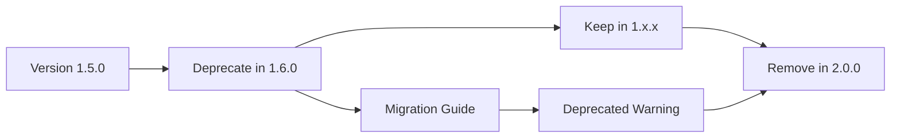

# Versioning-Strategie

**Model:** Claude Sonnet 4.5  
**Datum:** 2025-11-09  
**Projekt:** FVTT Relationship App Module

---

## 📋 Semantic Versioning

Das Projekt folgt [Semantic Versioning 2.0.0](https://semver.org/):

```
MAJOR.MINOR.PATCH

Beispiel: 1.2.3
- MAJOR (1): Breaking Changes
- MINOR (2): Neue Features (backwards compatible)
- PATCH (3): Bug Fixes (backwards compatible)
```

---

## 🚀 Phase 1: Pre-Release (Version 0.x.x)

**Aktueller Status:** Version 0.8.0

### Philosophie

> **Aggressives Refactoring erwünscht!**  
> Legacy-Codes eliminieren, Breaking Changes sind kein Problem.

### Regeln für 0.x.x

1. ✅ **Breaking Changes erlaubt**
   - Keine Rücksicht auf Kompatibilität
   - Aggressive Architektur-Verbesserungen
   - Legacy-Code sofort entfernen

2. ✅ **Refactoring-Priorität**
   - Code-Qualität vor Kompatibilität
   - Technische Schulden abbauen
   - Best Practices etablieren

3. ✅ **Keine Deprecation-Strategie notwendig**
   - Alte APIs können sofort entfernt werden
   - Keine Migrationspfade erforderlich
   - Keine Deprecated-Warnings

### Beispiele für aggressive Refactorings (0.x.x)

#### Beispiel 1: Retry-Service Legacy API entfernen

**Vorher (Legacy-Kompatibilität):**
```typescript
// Unterstützt zwei Signaturen
retry(fn, 3, 100);  // Legacy
retry(fn, { maxAttempts: 3, delayMs: 100 });  // Modern
```

**Nachher (0.x.x - Legacy entfernt):**
```typescript
// Nur noch moderne Signatur
retry(fn, { maxAttempts: 3, delayMs: 100 });
```

**Aktion:** ✅ Sofort entfernen (kein Deprecation-Zeitraum)

---

#### Beispiel 2: ModuleHealthService Container-Reference eliminieren

**Vorher:**
```typescript
class ModuleHealthService {
  constructor(
    private container: ServiceContainer  // ❌ Tight Coupling
  ) {}
}
```

**Nachher (0.x.x - Breaking Change):**
```typescript
class ModuleHealthService {
  constructor(
    private registry: HealthCheckRegistry  // ✅ Loose Coupling
  ) {}
}
```

**Aktion:** ✅ Sofort umsetzen (Breaking Change kein Problem)

---

## 🏭 Phase 2: Production (Version 1.x.x+)

**Start:** Mit Version 1.0.0-Release

### Philosophie

> **Stabilität und Kompatibilität!**  
> Breaking Changes sorgfältig planen, Migrationspfade vorsehen.

### Regeln für 1.x.x+

1. ⚠️ **Breaking Changes besonders hervorheben**
   - Prominent in CHANGELOG dokumentieren
   - Mit ⚠️ **BREAKING CHANGE** markieren
   - Für nächste Main-Version zurückstellen

2. 📋 **Migrationspfad verpflichtend**
   - Deprecated-Zeitraum definieren (mindestens 1 Main-Version)
   - Migration-Guide bereitstellen
   - Ausblick: Ab wann Legacy-Code entfernt wird

3. 🔔 **Deprecated-Strategie**
   - `@deprecated` Annotations
   - Runtime-Warnings (optional)
   - Dokumentation: Alternativ-APIs

### Breaking Change Workflow (1.x.x+)



**Beispiel-Timeline:**
- **v1.5.0**: Alte API funktioniert
- **v1.6.0**: Alte API deprecated (Warning + Migration Guide)
- **v1.7.0 - v1.x**: Beide APIs verfügbar
- **v2.0.0**: Alte API entfernt (Breaking Change)

---

## 📚 Beispiel-Szenarios

### Szenario 1: Retry-Service API Änderung (ab 1.x.x)

#### Phase 1: Deprecation (v1.6.0)

```typescript
export class RetryService {
  /**
   * Retries an operation with exponential backoff.
   * 
   * @deprecated Since v1.6.0. Use retry(fn, options) instead.
   * This signature will be removed in v2.0.0.
   * 
   * Migration:
   * ```typescript
   * // Old (deprecated)
   * await retry(fn, 3, 100);
   * 
   * // New (recommended)
   * await retry(fn, { maxAttempts: 3, delayMs: 100 });
   * ```
   */
  async retry<T, E>(
    fn: () => Promise<Result<T, E>>,
    maxAttempts: number,
    delayMs: number
  ): Promise<Result<T, E>> {
    // Runtime warning
    console.warn(
      '[DEPRECATED] retry(fn, maxAttempts, delayMs) is deprecated. ' +
      'Use retry(fn, options) instead. ' +
      'This signature will be removed in v2.0.0.'
    );
    
    // Delegate to new API
    return this.retry(fn, { maxAttempts, delayMs });
  }
  
  // New API (preferred)
  async retry<T, E>(
    fn: () => Promise<Result<T, E>>,
    options: RetryOptions<E>
  ): Promise<Result<T, E>> {
    // Modern implementation
  }
}
```

#### Phase 2: CHANGELOG (v1.6.0)

```markdown
## [1.6.0] - 2025-XX-XX

### ⚠️ Deprecated

- **RetryService:** Legacy signature `retry(fn, maxAttempts, delayMs)` is deprecated.
  - **Reason:** Type safety improvements, better API design
  - **Migration:** Use `retry(fn, { maxAttempts, delayMs })` instead
  - **Timeline:** Will be removed in v2.0.0
  - **Documentation:** See [Migration Guide](./MIGRATION_1.x_to_2.0.md)

### Added

- **RetryService:** New options-based API with better type safety
```

#### Phase 3: Migration Guide

**Datei:** `docs/MIGRATION_1.x_to_2.0.md`

```markdown
# Migration Guide: v1.x → v2.0

## RetryService API Changes

### Breaking Change
Legacy signature removed: `retry(fn, maxAttempts, delayMs)`

### Migration

**Before (v1.x, deprecated):**
```typescript
await retryService.retry(
  () => foundryApi.fetchData(),
  3,    // maxAttempts
  100   // delayMs
);
```

**After (v2.0+):**
```typescript
await retryService.retry(
  () => foundryApi.fetchData(),
  {
    maxAttempts: 3,
    delayMs: 100,
    backoffFactor: 1,  // Optional: new feature
    operationName: "fetchData"  // Optional: for logging
  }
);
```

### Benefits
- Better type safety (no union types)
- More options available
- Self-documenting code
```

#### Phase 4: Removal (v2.0.0)

```typescript
export class RetryService {
  // Legacy signature REMOVED
  
  // Only modern API remains
  async retry<T, E>(
    fn: () => Promise<Result<T, E>>,
    options: RetryOptions<E>
  ): Promise<Result<T, E>> {
    // Implementation
  }
}
```

**CHANGELOG (v2.0.0):**
```markdown
## [2.0.0] - 2025-XX-XX

### ⚠️ BREAKING CHANGES

- **RetryService:** Removed deprecated signature `retry(fn, maxAttempts, delayMs)`
  - **Deprecated since:** v1.6.0
  - **Migration:** See [Migration Guide](./MIGRATION_1.x_to_2.0.md)
```

---

### Szenario 2: ModuleHealthService Refactoring (ab 1.x.x)

#### Phase 1: Neue API einführen (v1.5.0)

```typescript
// Beide APIs verfügbar
export class ModuleHealthService {
  constructor(
    private container: ServiceContainer,  // Legacy (still supported)
    private registry?: HealthCheckRegistry  // New (optional)
  ) {
    // Auto-detect which API to use
    if (registry) {
      this.useNewApi = true;
    }
  }
}
```

#### Phase 2: Legacy deprecaten (v1.6.0)

```typescript
export class ModuleHealthService {
  /**
   * @deprecated Since v1.6.0. Container injection is deprecated.
   * Use HealthCheckRegistry instead.
   * This will be removed in v2.0.0.
   */
  constructor(
    container: ServiceContainer | HealthCheckRegistry
  ) {
    if (container instanceof ServiceContainer) {
      console.warn(
        '[DEPRECATED] ModuleHealthService(container) is deprecated. ' +
        'Use HealthCheckRegistry instead. ' +
        'This will be removed in v2.0.0.'
      );
    }
  }
}
```

#### Phase 3: Entfernen (v2.0.0)

```typescript
export class ModuleHealthService {
  // Nur noch HealthCheckRegistry
  constructor(
    private registry: HealthCheckRegistry
  ) {}
}
```

---

## 📋 Checkliste für Breaking Changes (1.x.x+)

### Vor dem Breaking Change

- [ ] Breaking Change in GitHub Issue dokumentieren
- [ ] Alternativen evaluieren (kann man es vermeiden?)
- [ ] Migrationspfad planen

### Beim Einführen (Deprecation)

- [ ] `@deprecated` Annotation hinzufügen
- [ ] Runtime-Warning implementieren (optional)
- [ ] CHANGELOG: "Deprecated" Section
- [ ] Migration Guide erstellen
- [ ] Timeline kommunizieren (wann Removal?)
- [ ] Tests für beide APIs

### Beim Entfernen (Breaking Change)

- [ ] CHANGELOG: "⚠️ BREAKING CHANGES" Section prominent
- [ ] Migration Guide aktualisieren
- [ ] Tests für alte API entfernen
- [ ] Legacy-Code entfernen
- [ ] Release Notes: Breaking Changes hervorheben

---

## 🎯 Zusammenfassung

| Phase | Version | Breaking Changes | Strategie |
|-------|---------|------------------|-----------|
| **Pre-Release** | 0.x.x | ✅ Erlaubt | Aggressives Refactoring, sofortige Entfernung |
| **Production** | 1.x.x+ | ⚠️ Vorsicht | Deprecation → Migration → Removal (nächste Main-Version) |

**Aktueller Status:** Version 0.7.1 (Pre-Release)
- ✅ Aggressive Refactorings jetzt durchführen
- ✅ Legacy-Codes eliminieren
- ✅ Breaking Changes kein Problem
- 🎯 Saubere Architektur vor 1.0.0-Release etablieren

**Vor 1.0.0-Release:**
- Alle Legacy-Codes entfernen
- Alle aggressiven Refactorings abschließen
- API-Stabilität erreichen
- Dokumentation finalisieren

**Ab 1.0.0:**
- Semantic Versioning strikt befolgen
- Breaking Changes nur in Major-Versionen
- Migrationspfade verpflichtend

---

**Ende Versioning-Strategie**

