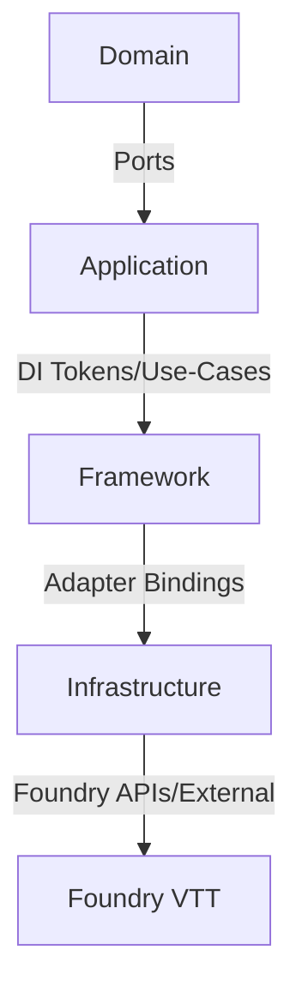

# Konsolidiertes Analyse-Log

Dieses Dokument fasst alle Code-Analysen zu SOLID-Prinzipien, Schichtmodell und Programmierfehlern zusammen.

---

## SOLID-Prinzipien

### Single Responsibility Principle (SRP)

#### Version 1 - Verstöße

1. **Monolithische Init-Sequenz** – `BootstrapInitHookService.handleInit` orchestriert UI-Benachrichtigungen, API-Expose, Settings-Registrierung, Logger-Konfiguration, Event-Registrierung und libWrapper-/Use-Case-Registrierungen in einem einzigen Schritt. Der Service übernimmt damit mehrere kohäsionsfremde Verantwortlichkeiten (UI-Wiring, API-Setup, Settings, Observability, Event-Wiring) und koppelt die Abläufe eng aneinander.
   - Folgen: erschwerte Testbarkeit, hohes Änderungsrisiko, fehlende Wiederverwendbarkeit der einzelnen Phasen.
   - Fundstelle: `src/framework/core/bootstrap-init-hook.ts` (`handleInit`).

#### Version 2 - Verstöße

- **BootstrapInitHookService bündelt mehrere unzusammenhängende Aufgaben** (UI-Channel-Wiring, API-Expose, Settings-Registrierung, Logger-Konfiguration, Event- und Context-Menu-Registrierung) innerhalb einer einzigen Methode `handleInit`. Das verletzt SRP, weil Fehlerbehandlung, Infrastruktur-Verkabelung und Feature-Registrierung in einem Block gekoppelt sind.【F:src/framework/core/bootstrap-init-hook.ts†L36-L183】

#### Verbesserungsvorschläge

- Zerlege `handleInit` in klar abgegrenzte Orchestratoren (z. B. `registerNotifications`, `configureLogging`, `registerEvents`, `registerContextMenu`) und injiziere sie über Ports/Use-Cases statt direktem Container-Zugriff. So bleibt jede Klasse bei einem Grund verantwortlich und kann separat getestet werden.
- Verschiebe plattformspezifische Logik in Adapter-Schichten und halte den Init-Orchestrator frei von konkreten Implementierungen. Dies erhöht Kohäsion und erleichtert zukünftige Anpassungen (z. B. weitere UI-Kanäle oder neue Hooks).
- Zerlege `handleInit` in klar fokussierte Orchestratoren (z. B. `attachNotificationChannels`, `exposeApi`, `registerSettings`, `configureLogging`, `registerEvents`, `registerContextMenu`) und rufe sie sequenziell aus einer schlanken Methode auf. Jede Teilfunktion sollte nur eine Abhängigkeit besitzen und isoliert testbar sein.
- Verschiebe optionale Schritte (Context-Menu, UI-Kanal) in separate Services, die über Ports injiziert werden, damit sie unabhängig versioniert und leichter deaktiviert werden können.

---

### Open/Closed Principle (OCP)

#### Version 1 - Verstöße

1. **Feste Handler-Liste im Context-Menu-Use-Case** – `RegisterContextMenuUseCase.register` erstellt eine statische Handler-Liste (`[this.hideJournalHandler]`). Neue Kontextmenüfunktionen erfordern Codeänderungen im Use-Case statt reiner Erweiterung via DI/Registrierung.
   - Folgen: geringer Erweiterungskomfort, höheres Risiko von Merge-Konflikten, fehlende Konfigurierbarkeit für modulare Features.
   - Fundstelle: `src/application/use-cases/register-context-menu.use-case.ts`.

#### Version 2 - Verstöße

- **TranslationHandlerChain ist auf drei Quellen fest verdrahtet** und erzwingt die Reihenfolge Foundry → Lokal → Fallback im Konstruktor. Neue Übersetzungsquellen oder alternative Reihenfolgen erfordern Codeänderungen in der Klasse statt reine Konfiguration/DI, wodurch Erweiterungen nicht ohne Modifikation möglich sind.【F:src/infrastructure/i18n/TranslationHandlerChain.ts†L12-L35】

#### Verbesserungsvorschläge

- Injiziere eine `JournalContextMenuHandler[]`-Kollektion über DI/Port, sodass Erweiterungen neue Handler bereitstellen können, ohne den Use-Case anzupassen.
- Ergänze Validierung/Short-Circuit-Strategien (z. B. Result-Aggregation), damit zusätzliche Handler ihr eigenes Fehlerverhalten kapseln und die Orchestrierung offen für neue Typen bleibt.
- Ziehe einen konfigurierbaren Handler-Registrar in Betracht, der eine Liste von `TranslationHandler`-Tokens injiziert und die Verkettung dynamisch aufbaut. Damit können zusätzliche Handler (z. B. Remote-Glossar) über DI registriert werden, ohne die Klasse selbst zu ändern.
- Ergänze Integrationstests, die die Reihenfolge aus der Konfiguration ableiten, um unbeabsichtigte Änderungen an der Kette zu verhindern.

---

### Liskov Substitution Principle (LSP)

#### Version 1 - Verstöße

1. **Seiteneffekte im abgeleiteten Collector** – `PersistentMetricsCollector` führt im Konstruktor unmittelbare Storage-I/O über `restoreFromStorage()` aus und verschluckt Fehler still. Wird die Klasse als `MetricsCollector`-Ersatz eingesetzt, verändert sie damit die Instanziierungs-Semantik (I/O vs. reiner In-Memory-Zustand) und unterdrückt beobachtbare Fehlermeldungen, mit denen Aufrufer bei der Basisklasse rechnen könnten.
   - Folgen: unerwartete Latenzen/Fehlerunterdrückung in Kontexten, die einen leichten Collector erwarten (z. B. Tests oder Headless-Läufe), wodurch Substitution ohne Anpassungen nicht valide ist.
   - Fundstelle: `src/infrastructure/observability/metrics-persistence/persistent-metrics-collector.ts`.

#### Version 2 - Feststellungen

- **Keine konkreten LSP-Verstöße identifiziert.** Die vorhandenen DI-Wrapper-Klassen (z. B. `DIBootstrapInitHookService`) erweitern ihre Basisklassen lediglich um statische Abhängigkeitslisten und verändern keine Vor-/Nachbedingungen oder Rückgabewerte.【F:src/framework/core/bootstrap-init-hook.ts†L186-L196】

#### Verbesserungsvorschläge

- Vermeide I/O im Konstruktor; führe Wiederherstellung über ein explizites `initialize()`-Port/Factory durch, das optional aufgerufen werden kann.
- Melde Persistenzfehler konsequent über das Logger-/Result-Pattern, damit die abgeleitete Klasse dieselben verifizierbaren Zusicherungen wie die Basisklasse bietet und substituierbar bleibt.
- Beibehalten: Subklassen sollten weiterhin nur Konstruktor-Injection ergänzen. Neue Subklassen sollten Methoden nicht einschränken (z. B. strengere Fehlerbehandlung), um Substituierbarkeit zu erhalten.
- Ergänze Regressionstests, die Wrapper-Klassen im Austausch zur Basis in Integrationstests einsetzen, um versehentliche API-Abweichungen früh zu erkennen.

---

### Interface Segregation Principle (ISP)

#### Version 1 - Verstöße

1. **Breiter Container-Zugriff im Init-Service** – `BootstrapInitHookService` konsumiert den kompletten `ServiceContainer` statt eines schmalen Ports für die benötigten Resolver-Aufrufe. Dadurch hängt die Klasse von mehr API-Oberfläche ab, als sie tatsächlich braucht (Resolve/Result-Handling), was Test-Doubles und Substitution erschwert.
   - Folgen: stärkere Kopplung an die DI-Implementierung, höherer Aufwand für Mocks und geringere Klarheit über die wirklich benötigten Abhängigkeiten.
   - Fundstelle: `src/framework/core/bootstrap-init-hook.ts` (Konstruktor und `handleInit`).

#### Version 2 - Verstöße

- **PlatformUIPort bündelt heterogene Verantwortungen** (DOM-Manipulation via `removeJournalElement`, UI-Refresh über `rerenderJournalDirectory`, User-Benachrichtigung via `notify`) in einer einzigen Schnittstelle. Konsumenten müssen HTML-DOM-Fähigkeiten mitladen, auch wenn sie nur Notifications benötigen, wodurch Interfaces nicht auf minimale Rollen zugeschnitten sind.【F:src/domain/ports/platform-ui-port.interface.ts†L24-L55】

#### Verbesserungsvorschläge

- Ersetze den `ServiceContainer`-Parameter durch ein dediziertes Interface/Port mit genau den benötigten Methoden (z. B. `resolveWithError`/`addChannel`-Fassaden) oder injiziere die fertigen Abhängigkeiten direkt über die DI-Konfiguration.
- Ergänze für Tests schlanke Fake-Ports; dadurch werden Konsumenten nicht mehr gezwungen, einen vollwertigen Container aufzubauen.
- Spalte die Schnittstelle in domänenspezifische Ports auf, z. B. `JournalDirectoryUiPort` für DOM-Operationen und `NotificationPort` für Benachrichtigungen. Adapter können beide implementieren, während Konsumenten nur die benötigten Ports injizieren.
- Ergänze Validierungstests, die sicherstellen, dass Adapter-Implementierungen nur die jeweils relevanten Ports bereitstellen und keine überflüssigen DOM-Typen in Domain-Services einschleusen.

---

### Dependency Inversion Principle (DIP)

#### Version 1 - Verstöße

1. **Abhängigkeit von konkretem Handler statt Port** – `RegisterContextMenuUseCase` erwartet explizit einen `HideJournalContextMenuHandler` statt ein Interface wie `JournalContextMenuHandler`. Damit hängt die Anwendungsschicht an einer konkreten Implementierung und erschwert alternative Handler (z. B. Feature-Flags, andere Module) ohne Codeanpassung.
   - Folgen: reduzierte Austauschbarkeit, Test-Doubles müssen die konkrete Klasse kennen, Erweiterungen verletzen OCP/DIP gemeinsam.
   - Fundstelle: `src/application/use-cases/register-context-menu.use-case.ts` (Konstruktor-Signatur).

#### Version 1 - DIP Review (2025-11-27)

**Scope:**
- Layered boundaries: domain, application, framework, infrastructure.
- Focus on dependencies between high-level policies (domain/application/framework orchestration) and lower-level details (infrastructure/adapters).

**Findings:**

1. **Application services depend on NotificationCenter concrete implementation**
   - Multiple application services and use-cases type their notification dependency as the infrastructure class `NotificationCenter` instead of an abstraction, e.g. `ModuleEventRegistrar`, `JournalVisibilityService`, and various use-cases.
   - DI tokens (`notificationCenterToken`) are also typed to the concrete class, so high-level logic is coupled to infrastructure details and cannot swap notification implementations without touching application code.
   - This violates DIP because high-level policies depend on a concrete infrastructure service rather than an interface/port.
   - **Suggested remediation:** Introduce an interface/port for notification delivery (e.g., `NotificationService`) and have `NotificationCenter` implement it. Retype DI tokens and application/service constructors to consume the interface so different notification hubs/channels can be substituted without changing high-level logic.

2. **Container health check ties to concrete ServiceContainer class**
   - `ContainerHealthCheck` imports and stores the concrete `ServiceContainer` implementation, and the `serviceContainerToken` is typed to the class as well.
   - The health check only requires the container contract (`getValidationState`) and not the concrete implementation details.
   - Depending on the class instead of the container interface tightens coupling to a specific DI implementation, reducing substitutability and violating DIP.
   - **Suggested remediation:** Depend on the DI container interface (e.g., `Container` from the DI module) for the health check and token typing. This keeps the health check aligned with an abstraction and allows alternative container implementations in the future.

#### Version 2 - Verstöße

- **BootstrapInitHookService hängt direkt vom konkreten `ServiceContainer` ab** und löst innerhalb der Init-Phase zahlreiche Tokens manuell auf. Dadurch wird das Framework-Layer fest an die DI-Implementierung gekoppelt und kann nicht gegen einen alternativen Container/Resolver getauscht werden.【F:src/framework/core/bootstrap-init-hook.ts†L36-L141】

#### Verbesserungsvorschläge

- Signatur auf das abstrakte Handler-Interface umstellen und die konkrete Instanz in der DI-Konfiguration binden. So bleibt der Use-Case unabhängig von Implementierungsdetails und kann neue Handler-Varianten aufnehmen.
- Ergänze optionale Kompositionsports (z. B. `JournalContextMenuHandler[]`), die externe Module befüllen können, ohne die Anwendungsschicht zu ändern.
- Führe ein schlankes `ContainerPort`-Interface ein (resolve/register), das vom Framework genutzt wird und im DI-Layer adaptiert wird. So bleibt das Framework gegen alternative Container (oder Test-Doubles) austauschbar.
- Kapsle die Token-Auflösungen in spezialisierte Orchestratoren, die nur die benötigten Ports injizieren (z. B. `NotificationBootstrapper`, `SettingsBootstrapper`). Dadurch sinkt die direkte Abhängigkeit vom Container und der Init-Service konsumiert nur abstrahierte Ports.

---

## Schichtmodell & Abhängigkeiten

### Version 1 - Schichtmodell



#### Schichten & Artefakte

- **Domain** (reine Modelle/Ports)
  - Entities/Types: `src/domain/entities/journal-entry.ts`
  - Ports: `src/domain/ports/...` (z. B. `events/platform-journal-event-port.interface.ts`)
  - Utilities/Result: `src/domain/types/result`, `@/domain/utils/result`

- **Application** (Use-Cases/Handler)
  - Use-Cases: `src/application/use-cases/register-context-menu.use-case.ts`
  - Handler: `src/application/handlers/hide-journal-context-menu-handler.ts`
  - Tokens für DI: `src/application/tokens.ts`

- **Framework** (Bootstrap/Orchestrierung/UI-Hooks)
  - Init/Bootstrap: `src/framework/core/bootstrap-init-hook.ts`, `composition-root.ts`
  - Konfiguration: `src/framework/config/dependencyconfig.ts`, `environment.ts`
  - UI-Adaption: `src/framework/ui/...` (ApplicationV2/Svelte-Vorgaben)

- **Infrastructure** (Adapter, DI, Logging, Observability)
  - DI-Container: `src/infrastructure/di/container.ts`
  - Observability: `src/infrastructure/observability/metrics-persistence/persistent-metrics-collector.ts`
  - Logging/Constants/Tokens: `src/infrastructure/shared/*`, `src/infrastructure/logging/*`

#### Bewertung der Schichtabhängigkeiten

- **Positiv:** Domain bleibt frei von Framework-/Foundry-Imports; Use-Cases hängen überwiegend an Ports/Tokens.
- **Risiken:**
  - `BootstrapInitHookService` greift zur Laufzeit direkt auf den `ServiceContainer` zu und orchestriert Infrastruktur-Details (Tokens, Settings, UI), wodurch Framework-Logik und Infrastruktur-Resolver eng vermischt sind. Das schwächt eine klare Trennung Application ↔ Framework/Infrastruktur.
  - `RegisterContextMenuUseCase` verlangt einen konkreten Handler statt eines Ports, was die Austauschbarkeit von Application-Komponenten einschränkt.
  - `PersistentMetricsCollector` bringt Storage-I/O in die Observability-Schicht und wird direkt über `MetricsCollector` ersetzt; ohne explizite Grenze zur Infrastruktur kann dies Domänen-nahe Tests verlangsamen.

#### Empfohlene nächste Schritte

1. Schlankes Resolve-Interface für Init-Orchestrierung einführen und den direkten Container-Zugriff ersetzen.
2. Handler-Komposition für Kontextmenüs über Ports/Collections konfigurieren, damit neue Features ohne Schichtverletzungen angesteckt werden können.
3. Persistente Observability-Komponenten über Adapter/Ports entkoppeln und explizit initialisieren, um Seiteneffekte in Domänen-/Application-Tests zu vermeiden.

### Version 2 - Schichten & Abhängigkeitsprüfung

```mermaid
graph TD
  Core[Core Layer\n(init-solid.ts, composition-root.ts)] --> Config[Configuration Layer\n(dependencyconfig.ts)]
  Config --> DI[DI Infrastructure Layer\n(ServiceContainer, Tokens)]
  DI --> Foundry[Foundry Adapter Layer\n(versiondetector, translation handlers, ports)]
  Foundry --> FoundryAPI[Foundry VTT API]
```

#### Schichten & Artefakte

- **Core Layer:** Bootstrapping und Hook-Orchestrierung über `init-solid.ts` und die DI-Bootstrap-Logik in `composition-root.ts`. Verantwortlich für Container-Aufbau und Hook-Registrierung.【F:src/framework/core/init-solid.ts†L16-L147】【F:src/framework/core/composition-root.ts†L28-L80】
- **Configuration Layer:** DI-Registrierung erfolgt über `dependencyconfig.ts` (laut Architekturübersicht) und bleibt versionsagnostisch.【F:ARCHITECTURE.md†L27-L65】
- **DI Infrastructure Layer:** Umsetzung der Container-Funktionalität (Registrierung, Auflösung, Scopes) in `ServiceContainer` und begleitenden Komponenten.【F:src/infrastructure/di/container.ts†L1-L125】
- **Foundry Adapter Layer:** Plattform-spezifische Ports/Handler wie der Versionsdetektor und die I18n-Handler-Kette, die Foundry-APIs kapseln.【F:src/framework/core/init-solid.ts†L55-L147】【F:src/infrastructure/i18n/TranslationHandlerChain.ts†L12-L35】

#### Abhängigkeitsbewertung

- **Core → Config/DI:** Core nutzt den konkreten `ServiceContainer` direkt. Das funktioniert, koppelt aber das Layer an die Implementierung; ein abstrahiertes Container-Port würde die Schichtentkopplung stärken (siehe DIP-Analyse).【F:src/framework/core/init-solid.ts†L32-L147】
- **Config → DI:** Laut Architektur bleibt die Konfiguration versionsagnostisch und verweist nur auf Registrierungsfunktionen; keine direkten Foundry-Abhängigkeiten erkennbar.【F:ARCHITECTURE.md†L27-L138】
- **DI → Adapter:** Adapters werden über Tokens/Registrierungen eingebunden; innerhalb der betrachteten Dateien sind keine Rückkopplungen in Core/Domain sichtbar.【F:src/infrastructure/i18n/TranslationHandlerChain.ts†L12-L35】

#### Empfehlungen

- Führe ein `ContainerPort`-Interface ein, das Core konsumiert, um die derzeitige Kopplung an `ServiceContainer` zu lösen.
- Dokumentiere im Config-Layer explizit, welche Adapter pro Foundry-Version registriert sind, und decke die Layer-Grenzen mit Dependency-Tests (z. B. verbotene Imports) ab.

---

## Programmierfehler & Risiko-Stellen

### Version 1 - Programmierfehler

#### Ungefangene Handler-Fehler im Kontextmenü
- **Problem:** `RegisterContextMenuUseCase` ruft alle Handler direkt im Callback auf. Wirft ein Handler eine Exception (z. B. wegen fehlender Flag-Berechtigungen), propagiert der Fehler bis in libWrapper/Foundry und kann den gesamten Kontextmenü-Hook abbrechen.
- **Fundstelle:** `src/application/use-cases/register-context-menu.use-case.ts` (`register`, Callback-Zeilen).
- **Vorschlag:** Handler-Aufrufe in ein Result/Either packen oder zumindest try/catch mit Fehler-Logging und Fortsetzung nutzen, damit einzelne Handler-Ausfälle den Rest nicht blockieren.

#### Unvollständiges Error-Handling bei Init-Sequenz
- **Problem:** `BootstrapInitHookService.handleInit` bricht bei fehlgeschlagenen Resolvern früh ab, ohne bereits registrierte Teilkomponenten (z. B. Notification-Channel) zurückzusetzen oder Cleanup zu triggern. Das kann inkonsistente Zustände hinterlassen, wenn spätere Resolutions fehlschlagen.
- **Fundstelle:** `src/framework/core/bootstrap-init-hook.ts` (mehrere `return`-Pfade nach Teil-Initialisierung).
- **Vorschlag:** Teilschritte über ein transaktionales Orchestrierungs-Pattern (Result-Aggregation + Cleanup pro Schritt) absichern und bei Fehlern gezielt rollbacken oder zumindest Idempotenz sicherstellen.

### Version 2 - Programmierfehler

#### Zusammenfassung
- Bei der statischen Durchsicht der Kern-Bootstrap- und I18n-Komponenten wurden keine konkreten Laufzeitfehler oder offensichtlichen Typos entdeckt. Die Result-basierte Fehlerbehandlung und Null-Guards sind konsistent umgesetzt (z. B. im Init-Bootstrap).【F:src/framework/core/bootstrap-init-hook.ts†L47-L183】

#### Empfehlungen
- Führe dennoch einen vollständigen Type- und Testlauf im CI durch, um environment-spezifische Zweige (Foundry-Hooks) abzudecken.
- Ergänze Negativtests für Kettenaufbau der TranslationHandlerChain, um Null-Handler oder fehlerhafte Verkettung früh zu erkennen.

---

## Konsolidierte Empfehlungen

### Priorität 1: Kritische Architektur-Verbesserungen

1. **Container-Abstraktion einführen**
   - `ContainerPort`-Interface für Framework-Layer
   - Reduziert Kopplung an konkrete DI-Implementierung
   - Betrifft: `BootstrapInitHookService`, `ContainerHealthCheck`

2. **Init-Sequenz refaktorisieren**
   - Zerlegung von `handleInit` in fokussierte Orchestratoren
   - Transaktionales Error-Handling mit Rollback
   - Betrifft: `src/framework/core/bootstrap-init-hook.ts`

3. **Notification-Abstraktion**
   - `NotificationService`-Interface einführen
   - Application-Layer von `NotificationCenter` entkoppeln
   - Betrifft: Alle Use-Cases und Services mit Notification-Abhängigkeit

### Priorität 2: Erweiterbarkeit verbessern

4. **Handler-Komposition über DI**
   - `JournalContextMenuHandler[]` über DI injizieren
   - `TranslationHandler[]` konfigurierbar machen
   - Betrifft: `RegisterContextMenuUseCase`, `TranslationHandlerChain`

5. **Port-Segregation**
   - `PlatformUIPort` in spezialisierte Ports aufteilen
   - `JournalDirectoryUiPort` und `NotificationPort` trennen
   - Betrifft: `src/domain/ports/platform-ui-port.interface.ts`

### Priorität 3: Robustheit erhöhen

6. **Error-Handling in Handlern**
   - Result-Pattern für Handler-Aufrufe
   - Try/Catch mit Logging und Fortsetzung
   - Betrifft: `RegisterContextMenuUseCase`

7. **Lazy Initialization für I/O**
   - `PersistentMetricsCollector` ohne Konstruktor-I/O
   - Explizite `initialize()`-Methode
   - Betrifft: `src/infrastructure/observability/metrics-persistence/persistent-metrics-collector.ts`

---

## Umsetzungsstatus

### Abgeschlossen (2025-11-29)

**Priorität 1: Kritische Architektur-Verbesserungen**
- ✅ **Container-Abstraktion**: `ContainerPort`-Interface erstellt, `ServiceContainer` implementiert es, Framework-Layer refaktoriert
- ✅ **Init-Sequenz refaktorisieren**: Orchestrator-Services erstellt, `InitOrchestrator` mit transaktionalem Error-Handling, `BootstrapInitHookService` vereinfacht
- ✅ **Notification-Abstraktion**: Bereits korrekt implementiert - Application-Layer nutzt `PlatformNotificationPort`, Token typisiert als `NotificationService`

**Priorität 2: Erweiterbarkeit verbessern**
- ✅ **Handler-Komposition**: `RegisterContextMenuUseCase` und `TranslationHandlerChain` nutzen Handler-Arrays über DI
- ✅ **Port-Segregation**: `PlatformUIPort` in `JournalDirectoryUiPort` und `NotificationPort` aufgeteilt, Services refaktoriert

**Priorität 3: Robustheit erhöhen**
- ✅ **Error-Handling in Handlern**: `RegisterContextMenuUseCase` mit Try-Catch und Fehler-Isolation
- ✅ **Lazy Initialization**: `PersistentMetricsCollector` ohne Konstruktor-I/O, explizite `initialize()`-Methode, `MetricsBootstrapper` erstellt

### Implementierungsdetails

**Container-Abstraktion:**
- `src/domain/ports/container-port.interface.ts` - Minimales Interface für Framework-Bedürfnisse
- `ServiceContainer` implementiert `ContainerPort` zusätzlich zu `Container`
- `BootstrapInitHookService` und `ModuleApiInitializer` nutzen `ContainerPort`
- `containerPortToken` als Alias zu `serviceContainerToken` registriert

**Init-Sequenz:**
- `src/framework/core/bootstrap/orchestrators/` - 7 fokussierte Orchestratoren
- `src/framework/core/bootstrap/init-orchestrator.ts` - Transaktionales Error-Handling
- `BootstrapInitHookService.handleInit()` von 120+ auf < 20 Zeilen reduziert

**Handler-Komposition:**
- `journalContextMenuHandlersToken` - Array-Token für Context-Menu-Handler
- `translationHandlersToken` - Array-Token für Translation-Handler
- Handler werden über DI als Arrays registriert, Reihenfolge konfigurierbar

**Port-Segregation:**
- `JournalDirectoryUiPort` - DOM-Operationen (removeJournalElement, rerenderJournalDirectory)
- `NotificationPort` - Benachrichtigungen (notify)
- `PlatformUIPort` - Composition-Interface erweitert beide
- Services nutzen spezialisierte Ports: `JournalVisibilityService` → `JournalDirectoryUiPort`

**Error-Handling:**
- Try-Catch um jeden Handler-Aufruf in `RegisterContextMenuUseCase`
- Fehler werden geloggt, Verarbeitung setzt mit nächstem Handler fort
- Logger-Injection für Fehler-Logging

**Lazy Initialization:**
- `PersistentMetricsCollector.initialize()` - Explizite Initialisierung mit Result-Pattern
- `MetricsBootstrapper.initializeMetrics()` - Ruft `initialize()` während Bootstrap auf
- Konstruktor ist I/O-frei, Initialisierung fehlerbehandelt

---

*Letzte Aktualisierung: Konsolidiert aus Version 1 und Version 2 Analysen, Umsetzung abgeschlossen 2025-11-29*

