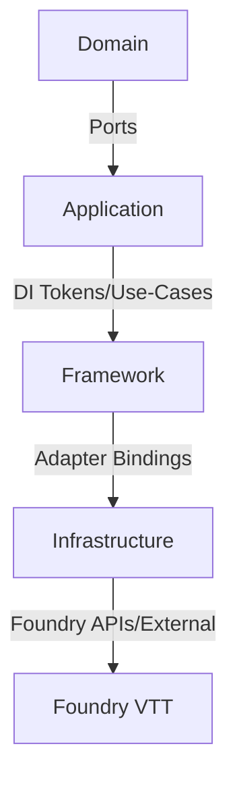

# Schichtmodell & Abhängigkeiten

## Schichten & Artefakte

- **Domain** (reine Modelle/Ports)
  - Entities/Types: `src/domain/entities/journal-entry.ts`
  - Ports: `src/domain/ports/...` (z. B. `events/platform-journal-event-port.interface.ts`)
  - Utilities/Result: `src/domain/types/result`, `@/domain/utils/result`

- **Application** (Use-Cases/Handler)
  - Use-Cases: `src/application/use-cases/register-context-menu.use-case.ts`
  - Handler: `src/application/handlers/hide-journal-context-menu-handler.ts`
  - Tokens für DI: `src/application/tokens.ts`

- **Framework** (Bootstrap/Orchestrierung/UI-Hooks)
  - Init/Bootstrap: `src/framework/core/bootstrap-init-hook.ts`, `composition-root.ts`
  - Konfiguration: `src/framework/config/dependencyconfig.ts`, `environment.ts`
  - UI-Adaption: `src/framework/ui/...` (ApplicationV2/Svelte-Vorgaben)

- **Infrastructure** (Adapter, DI, Logging, Observability)
  - DI-Container: `src/infrastructure/di/container.ts`
  - Observability: `src/infrastructure/observability/metrics-persistence/persistent-metrics-collector.ts`
  - Logging/Constants/Tokens: `src/infrastructure/shared/*`, `src/infrastructure/logging/*`

## Bewertung der Schichtabhängigkeiten

- **Positiv:** Domain bleibt frei von Framework-/Foundry-Imports; Use-Cases hängen überwiegend an Ports/Tokens.
- **Risiken:**
  - `BootstrapInitHookService` greift zur Laufzeit direkt auf den `ServiceContainer` zu und orchestriert Infrastruktur-Details (Tokens, Settings, UI), wodurch Framework-Logik und Infrastruktur-Resolver eng vermischt sind. Das schwächt eine klare Trennung Application ↔ Framework/Infrastruktur.
  - `RegisterContextMenuUseCase` verlangt einen konkreten Handler statt eines Ports, was die Austauschbarkeit von Application-Komponenten einschränkt.
  - `PersistentMetricsCollector` bringt Storage-I/O in die Observability-Schicht und wird direkt über `MetricsCollector` ersetzt; ohne explizite Grenze zur Infrastruktur kann dies Domänen-nahe Tests verlangsamen.

## Empfohlene nächste Schritte

1. Schlankes Resolve-Interface für Init-Orchestrierung einführen und den direkten Container-Zugriff ersetzen.
2. Handler-Komposition für Kontextmenüs über Ports/Collections konfigurieren, damit neue Features ohne Schichtverletzungen angesteckt werden können.
3. Persistente Observability-Komponenten über Adapter/Ports entkoppeln und explizit initialisieren, um Seiteneffekte in Domänen-/Application-Tests zu vermeiden.
