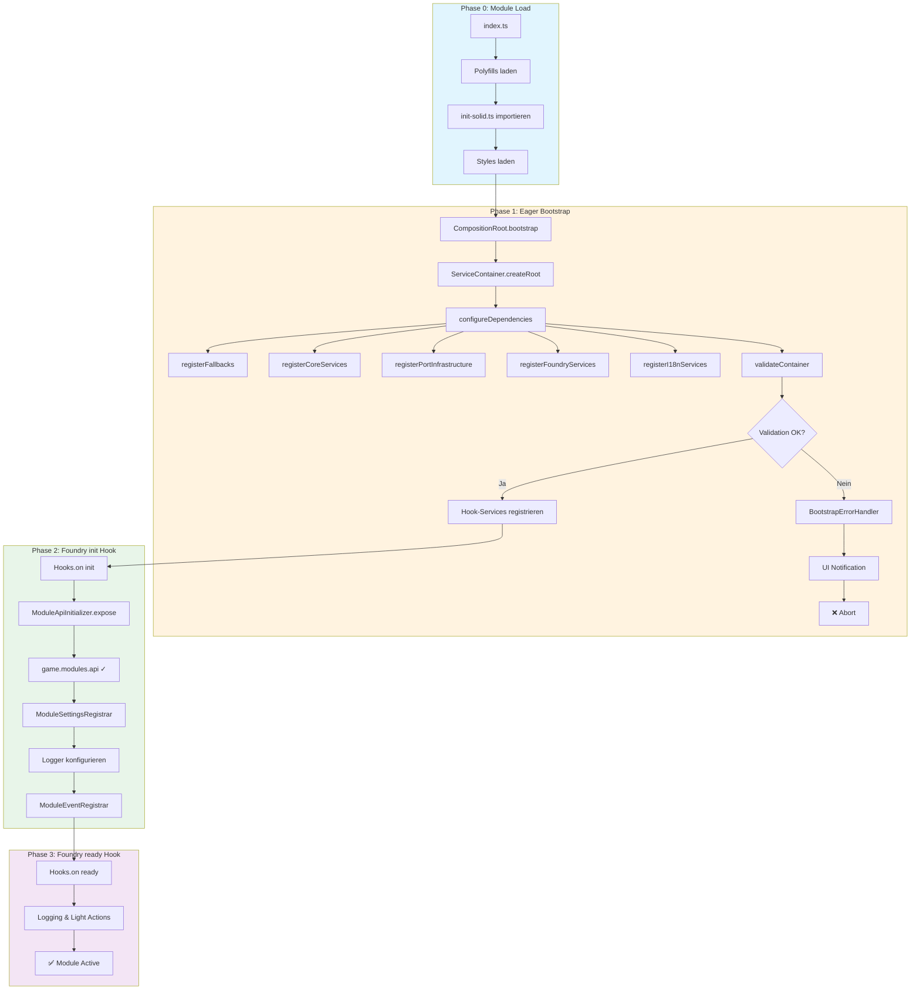
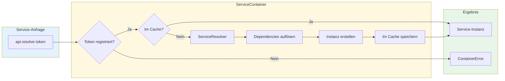
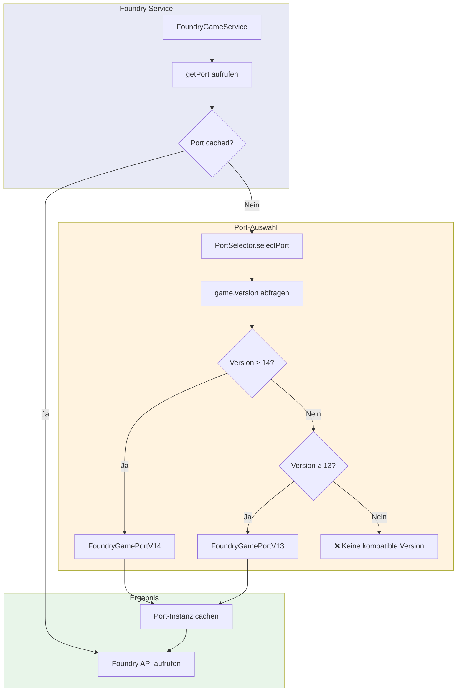
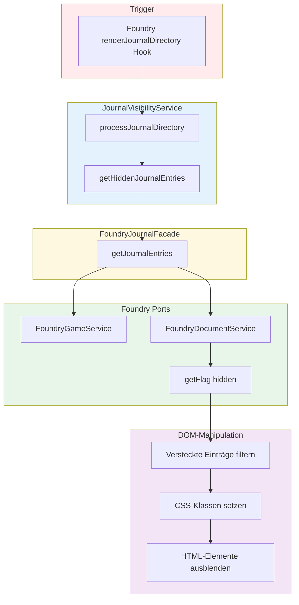
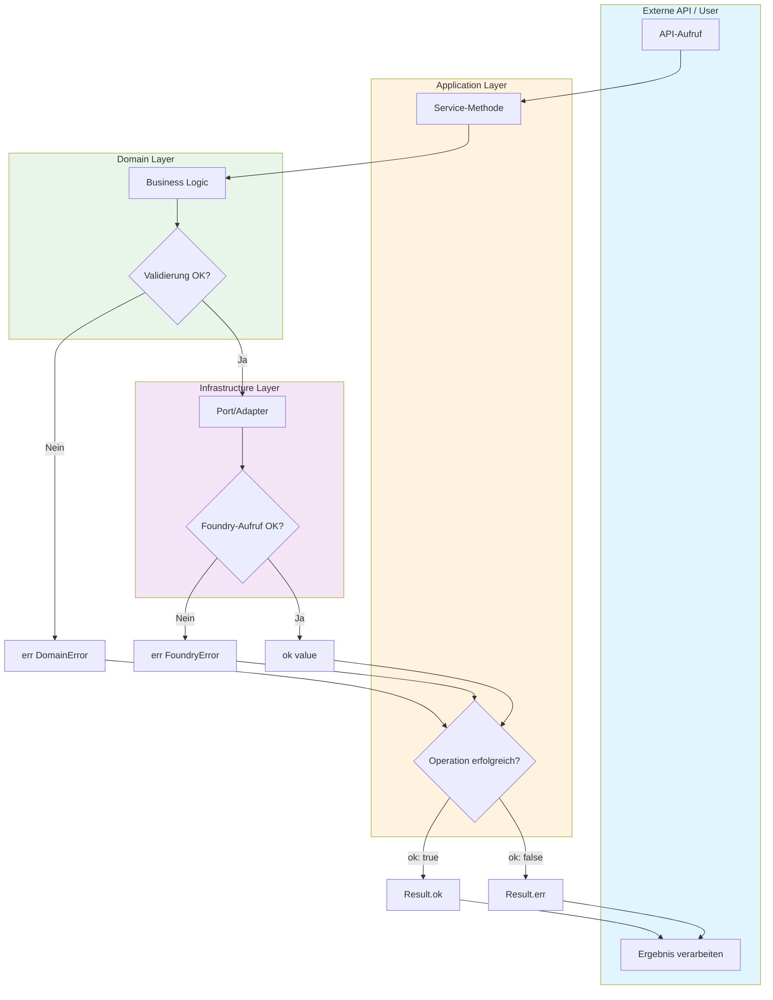
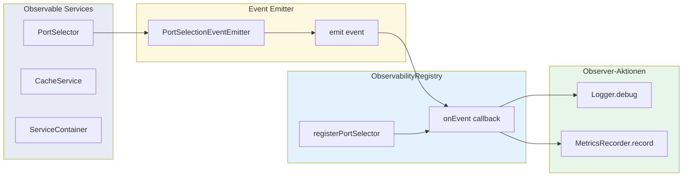
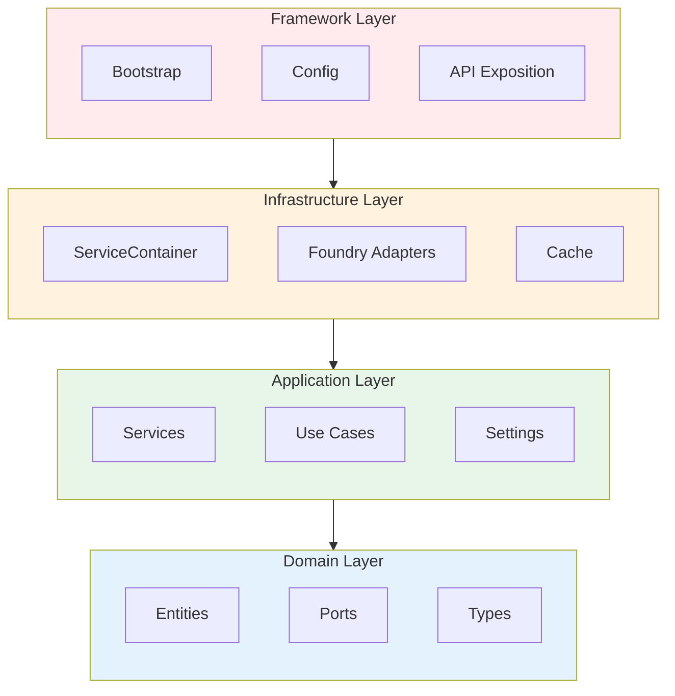
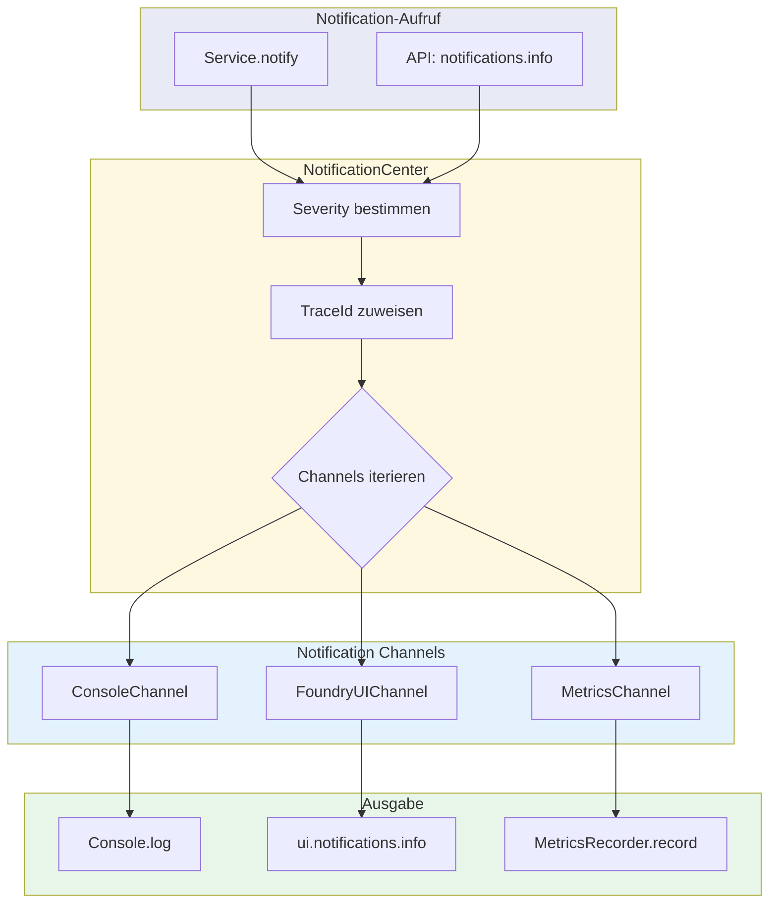
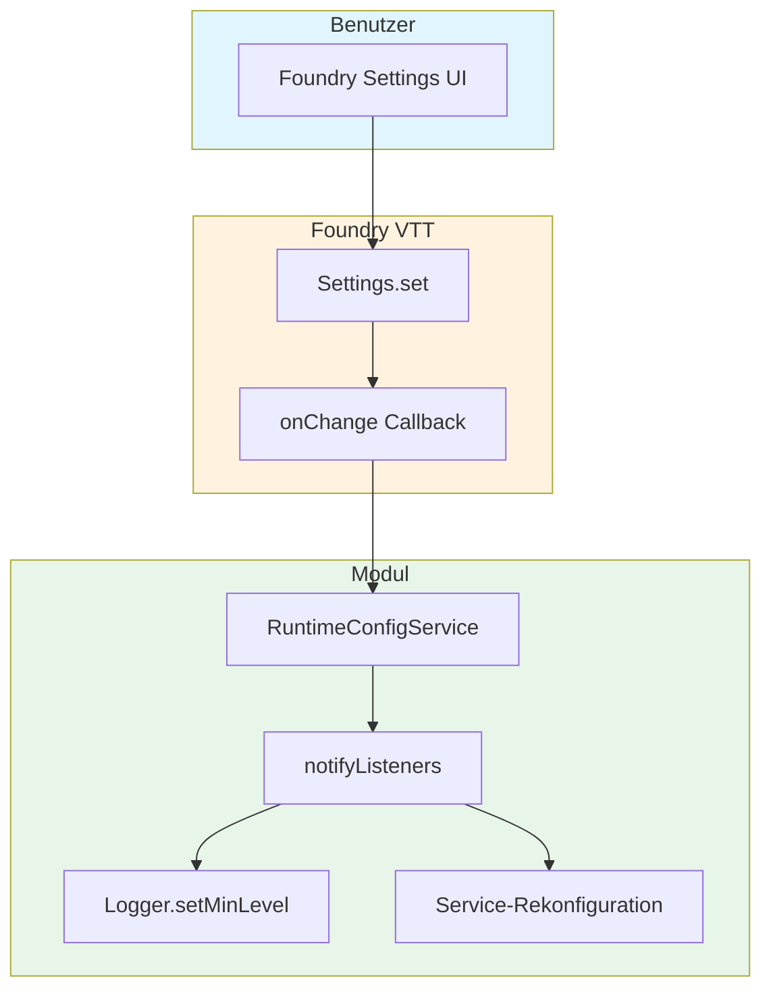

# Datenfluss-Diagramme

**Version:** 0.44.0
**Letzte Aktualisierung:** 2025-12-15

---

## 📖 Übersicht

Dieses Dokument visualisiert die wichtigsten Datenflüsse im Modul mittels Mermaid-Diagrammen. Die Diagramme zeigen die Interaktionen zwischen Schichten, Services und externen Systemen.

---

## 1. Bootstrap-Flow

Der vollständige Modul-Lifecycle vom Laden bis zur Aktivität:

---

## 2. Service-Resolution-Flow

Wie Services über den DI-Container aufgelöst werden:

---

## 3. Port-Selection-Flow (Lazy Loading)

Wie versionsspezifische Foundry-Ports ausgewählt werden:

---

## 4. Journal-Visibility-Flow

Wie Journal-Einträge versteckt/angezeigt werden:

---

## 5. Result-Pattern-Flow

Wie Fehler durch die Schichten propagiert werden:

---

## 6. Event-Flow (Observability)

Wie Events durch das System fließen:

---

## 7. Schichten-Überblick

Die Clean Architecture Layer-Struktur:

**Dependency-Regel:** Abhängigkeiten zeigen nur nach innen (unten). Domain hat keine externen Abhängigkeiten.

---

## 8. Notification-Flow

Wie Benachrichtigungen durch das System geroutet werden:

---

## 9. Settings-Change-Flow

Wie Einstellungsänderungen propagiert werden:

---

## 🔗 Siehe auch

- [Bootstrap-Prozess](./bootstrap.md) – Detaillierter Bootstrap-Ablauf
- [Architektur-Übersicht](./overview.md) – High-Level Architektur
- [Patterns](./patterns.md) – Port-Adapter, Result, DI
- [Modul-Grenzen](./module-boundaries.md) – Layer-Regeln

---

**Ende Datenfluss-Dokumentation**
