# Event-System Hierarchie: Generalisierung & Spezialisierung

**Datum:** 2025-01-27  
**Status:** Konzept-Dokumentation

---

## 📋 Übersicht

Das Event-System verwendet eine **Hierarchie aus Generalisierung und Spezialisierung**, um sowohl generische als auch spezialisierte Event-Behandlung zu ermöglichen. Dies erlaubt:

- **Generalisierung**: `PlatformEventPort<TEvent>` für alle möglichen Event-Typen
- **Spezialisierung**: `PlatformJournalEventPort` für Journal-spezifische Events
- **Platform-Adapter**: `FoundryHooksPort` für Foundry-spezifische Hook-Behandlung
- **Version-Adapter**: `FoundryV13HooksPort` für v13-spezifische Implementierung

---

## 🏗️ Architektur-Hierarchie

### Gesamtübersicht


---

## 🔄 Dependency Chain

### Korrekte Abhängigkeitskette


---

## 📊 Klassendiagramm

### Detaillierte Interface/Class-Hierarchie


---

## 🔀 Generalisierung & Spezialisierung

### Generalisierung: PlatformEventPort

```mermaid
graph TD
    A["`**PlatformEventPort&lt;TEvent&gt;**<br/><br/>**Generisch für alle Event-Typen**<br/><br/>- registerListener()<br/>- unregisterListener()<br/><br/>**Verwendbar für:**<br/>- Journal Events<br/>- Actor Events<br/>- Item Events<br/>- Custom Events`"]
    
    A1["`**PlatformJournalEventPort**<br/>Spezialisiert für Journal`"]
    A2["`**PlatformActorEventPort**<br/>Spezialisiert für Actors<br/>(Zukunft)`"]
    A3["`**PlatformItemEventPort**<br/>Spezialisiert für Items<br/>(Zukunft)`"]
    
    A -->|"kann erweitert werden zu"| A1
    A -->|"kann erweitert werden zu"| A2
    A -->|"kann erweitert werden zu"| A3
    
    style A fill:#90EE90,stroke:#006400,stroke-width:3px,color:#000000
    style A1 fill:#90EE90,stroke:#006400,stroke-width:2px,color:#000000
    style A2 fill:#D3D3D3,stroke:#666666,stroke-width:2px,color:#000000
    style A3 fill:#D3D3D3,stroke:#666666,stroke-width:2px,color:#000000
```



### Spezialisierung: PlatformJournalEventPort


---

## 🔗 Implementierungs-Kette

### Foundry-Adapter-Implementierung


### Journal-Event-Adapter-Implementierung


---

## 💡 Verwendungsbeispiele

### Beispiel 1: Generischer Event-Port


### Beispiel 2: Spezialisierter Journal-Event-Port


---

## 🎯 Vorteile dieser Architektur

### 1. **Generalisierung**
- `PlatformEventPort<TEvent>` kann für **alle** Event-Typen verwendet werden
- Nicht nur Journal-Events, sondern auch Actor-Events, Item-Events, Custom-Events, etc.

### 2. **Spezialisierung**
- `PlatformJournalEventPort` bietet **typsichere, spezialisierte Methoden**
- Bessere API für Journal-spezifische Use Cases
- Kompiliertzeit-Typsicherheit für Journal-Events

### 3. **Wiederverwendbarkeit**
- `FoundryHooksPort` kann für **alle** Foundry-Hooks verwendet werden
- Nicht nur Journal-Hooks, sondern auch Actor-Hooks, Item-Hooks, etc.

### 4. **Klare Dependency Chain**
```
Application → Platform-Port → Foundry-Port → Version-Port → Foundry API
```

### 5. **Erweiterbarkeit**
- Neue spezialisierte Ports können einfach hinzugefügt werden
- Beispiel: `PlatformActorEventPort`, `PlatformItemEventPort`, etc.

---

## 📝 Code-Beispiele

### Generischer Event-Port

```typescript
// Application Layer
class MyUseCase {
  constructor(
    private readonly eventPort: PlatformEventPort<MyEvent> // Generisch
  ) {}
  
  register(): Result<void, Error> {
    const result = this.eventPort.registerListener("myEvent", (event) => {
      console.log("Event received:", event);
    });
    return result.ok ? ok(undefined) : err(new Error(result.error.message));
  }
}
```

### Spezialisierter Journal-Event-Port

```typescript
// Application Layer
class JournalUseCase {
  constructor(
    private readonly journalEvents: PlatformJournalEventPort // Spezialisiert
  ) {}
  
  register(): Result<void, Error> {
    const result = this.journalEvents.onJournalCreated((event) => {
      console.log("Journal created:", event.journalId);
    });
    return result.ok ? ok(undefined) : err(new Error(result.error.message));
  }
}
```

### FoundryHooksPort als PlatformEventPort

```typescript
// Infrastructure Layer
export class FoundryHooksPort 
  extends FoundryServiceBase<FoundryHooks> 
  implements FoundryHooks, PlatformEventPort<unknown> {
  
  // FoundryHooks-Interface
  on(hookName: string, callback: FoundryHookCallback): Result<number, FoundryError> { ... }
  off(...): Result<void, FoundryError> { ... }
  once(...): Result<number, FoundryError> { ... }
  
  // PlatformEventPort-Interface
  registerListener(
    eventType: string, 
    callback: (event: unknown) => void
  ): Result<EventRegistrationId, PlatformEventError> {
    const result = this.on(eventType, callback as FoundryHookCallback);
    if (!result.ok) {
      return err({
        code: "EVENT_REGISTRATION_FAILED",
        message: result.error.message,
        details: result.error
      });
    }
    return ok(result.value);
  }
  
  unregisterListener(registrationId: EventRegistrationId): Result<void, PlatformEventError> {
    // Implementation benötigt Hook-Name-Tracking
    // Oder: ID-basierte Unregistration über erweiterte Registry
    return err({
      code: "EVENT_UNREGISTRATION_FAILED",
      message: "Hook name required for unregistration"
    });
  }
}
```

---

## 🔄 Migration-Plan

### Schritt 1: FoundryHooksPort erweitern
- `PlatformEventPort<unknown>` Interface implementieren
- `registerListener()` und `unregisterListener()` Methoden hinzufügen
- Bestehende `on()`, `off()`, `once()` Methoden beibehalten

### Schritt 2: FoundryJournalEventAdapter anpassen
- `FoundryHooks` durch `FoundryHooksPort` ersetzen
- `registerListener()` und `unregisterListener()` delegieren an `FoundryHooksPort`

### Schritt 3: Application Layer refactoren
- `init-solid.ts`: `Hooks.on()` durch `PlatformEventPort.registerListener()` ersetzen
- Alle direkten `Hooks`-Zugriffe durch Platform-Port ersetzen

---

## 📚 Verwandte Dokumentation

- [ARCHITECTURE.md](../../ARCHITECTURE.md) - Gesamtarchitektur
- [Port-Adapter-Pattern](../../ARCHITECTURE.md#port-adapter-pattern) - Port-Pattern-Details
- [Event System Refactoring](../refactoring/phases/phase-1-event-system-refactoring.md) - Event-System-Refactoring

---

## ✅ Zusammenfassung

Die Hierarchie ermöglicht:

1. **Generalisierung**: `PlatformEventPort<TEvent>` für alle Event-Typen
2. **Spezialisierung**: `PlatformJournalEventPort` für Journal-spezifische Events
3. **Platform-Adapter**: `FoundryHooksPort` implementiert `PlatformEventPort` für Foundry
4. **Version-Adapter**: `FoundryV13HooksPort` implementiert `FoundryHooks` für v13
5. **Domain-Adapter**: `FoundryJournalEventAdapter` nutzt `FoundryHooksPort` für Journal-Events

Diese Architektur erfüllt die **Dependency Chain Rule**: Alle chain-externen Zugriffe gehen über Platform-Ports, nicht direkt auf Foundry-APIs.

