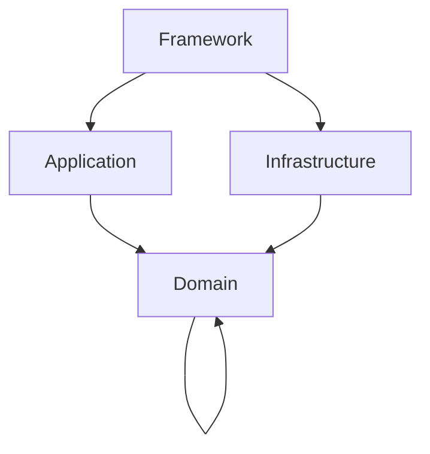

# 1. Problem

Der Domain-Layer definiert mit `PlatformContainerPort` eine **Service-Locator-Abstraktion** (resolve/resolveWithError/isRegistered/validation state). Damit wird DI/Service-Resolution zu einem Domain-Konzept. Das ist ein starker Verstoß gegen DIP/Clean Architecture: **Die Domain kennt die Existenz eines Containers**, statt dass äußere Schichten die Abhängigkeiten komponieren.

Symptome:
- Hidden Dependencies (Abhängigkeiten werden zur Laufzeit aufgelöst statt über Konstruktoren).
- Erschwerte Testbarkeit (Mocks müssen „Container-Verhalten“ simulieren).
- „Leaky Abstraction“: Domain-Ports werden mit DI-Mechanik vermischt.

# 2. Evidence (Belege)

**Pfade & Knoten**
- `src/domain/ports/platform-container-port.interface.ts`
- Nutzung als Infrastruktur-/Framework-Bridge: `src/framework/config/dependencyconfig.ts` (`platformContainerPortToken` Alias)
- Nutzung als Service-Locator in Application/Infra: z. B. `src/application/windows/services/window-factory.ts`, `src/infrastructure/notifications/channels/QueuedUIChannel.ts`

**Minimierte Codeauszüge**

```ts
// src/domain/ports/platform-container-port.interface.ts
export interface PlatformContainerPort {
  resolveWithError<T>(token: symbol): Result<T, ContainerError>;
  resolve<T>(token: symbol): T;
  isRegistered(token: symbol): Result<boolean, never>;
  getValidationState(): ContainerValidationState;
}
```

# 3. SOLID-Analyse

**DIP-Verstoß:** High-Level Policy (Domain) definiert eine Abstraktion, die faktisch ein Low-Level Mechanismus ist (DI-Container/Service-Resolution). Dadurch werden Abhängigkeiten nicht „inverted“, sondern **die Domain wird DI-aware**.

**Nebenwirkungen / Folgeprobleme**
- Verdeckte Coupling-Kaskaden: Sobald `PlatformContainerPort` in Domain existiert, wird er als „bequemer“ Abhängigkeitskanal missbraucht (z. B. Window-Actions, Channels).
- SRP-Erosion: Viele Komponenten bekommen „Container“ statt konkrete Dependencies.
- Architekturregeln werden schwer erzwingbar („Application darf nicht von Infrastructure abhängen“ wird durch Service-Locator umgangen).

# 4. Zielbild

- Domain kennt **keinen Container**.
- Abhängigkeitsauflösung passiert ausschließlich im **Composition Root** (Framework/Bootstrap).
- „Späte“ Auflösung (pro Action/Event) erfolgt über explizite Factory-/Use-Case-Objekte, nicht über einen generischen Locator.

Mermaid (Soll):



Regel: **Kein `resolve*`-API in `src/domain/**`.**

# 5. Lösungsvorschlag

**Approach A (empfohlen): Container-Port entfernen, Dependencies explizit machen**
- Entferne `PlatformContainerPort` aus Domain.
- Ersetze „Container in Context/Constructor“ durch explizite Konstruktor-Dependencies oder Factory-Parameter.
- Falls späte Auflösung nötig ist: introduziere *spezifische* Factories in Application (z.B. `WindowActionHandlersFactory(deps)`), nicht generische Resolution.

**Approach B (Alternative): Container-Port in äußere Schicht verschieben**
- Verschiebe `PlatformContainerPort` nach `src/framework/**` oder `src/infrastructure/di/**` als technisches Interface.
- Domain bekommt stattdessen *fachliche* Ports (z.B. `WindowActionExecutorPort`, `NotificationPublisherPort`).

Trade-offs:
- A ist radikaler, aber „Clean“ und eliminiert den Design-Shortcut.
- B reduziert Blast-Radius, lässt aber Service-Locator als Pattern im System bestehen.

# 6. Refactoring-Schritte

1. **Neues Architektur-Gate**: „Domain enthält kein `resolve`/`resolveWithError`“ (Lint/Arch-Check).
2. Call-Sites inventory: alle Stellen, die `PlatformContainerPort` benutzen (Application/Infrastructure).
3. Für jede Stelle: Dependency-Satz identifizieren und explizit injizieren (Constructor/Factory).
4. `PlatformContainerPort`-Token und Alias-Routing entfernen (`platformContainerPortToken` + Alias in `src/framework/config/dependencyconfig.ts`).
5. Domain-Datei `src/domain/ports/platform-container-port.interface.ts` entfernen.

**Breaking Changes (explizit)**
- Alle Signaturen, die `PlatformContainerPort` akzeptieren oder über `ActionContext.metadata` transportieren, ändern sich.
- `platformContainerPortToken` entfällt (oder wird in Outer Layer verschoben, je nach Approach).

# 7. Beispiel-Code

**Before (Service Locator)**

```ts
// Pseudocode
const service = container.resolveWithError(someToken);
```

**After (Explizite Dependencies)**

```ts
export class JournalOverviewWindowActions {
  constructor(
    private readonly journalOverview: JournalOverviewService,
    private readonly journalRepo: PlatformJournalRepository,
    private readonly cacheInvalidation: CacheInvalidationPort,
    private readonly scheduler: JournalDirectoryRerenderScheduler,
  ) {}

  onOpen(ctx: ActionContext) { /* ... */ }
}
```

# 8. Tests & Quality Gates

- **Arch-Gate:** `src/domain/**` darf keine Container-/Resolution-APIs enthalten.
- **Unit-Tests:** Action/Use-Case Klassen ohne Container-Mock testbar.
- **Integration:** Bootstrap/CompositionRoot verdrahtet weiterhin korrekt.

# 9. Akzeptanzkriterien

- `src/domain/ports/platform-container-port.interface.ts` existiert nicht mehr (oder liegt außerhalb Domain).
- Keine Application/Infrastructure-Komponente erhält „Container“ als generische Dependency (außer Composition Root).
- Action Handler/Window-Definitionen haben explizite Dependencies (keine `container.resolve*` in Business-Flows).
