# Phase 2: Entity Collections & Repositories - Detaillierter Umsetzungsplan

**Datum:** 2025-01-27  
**Status:** 📋 Detaillierter Plan  
**Priorität:** 🟠 HOCH  
**Geschätzter Aufwand:** 12-16 Stunden  
**Komplexität:** Mittel-Hoch  

---

## 🎯 Ziel

Vollständige Entity-Management-Architektur mit:
- **Collection Port**: Read-only Zugriff mit Search & Query Builder
- **Repository Port**: Vollständiger CRUD mit Batch-Operations
- **Flags als normale Properties**: Keine separaten Flag-Ports mehr
- **Convenience-Methods**: Flag-Wrapper im Repository

---

## 📐 Architektur-Übersicht

```
Domain Layer (Ports)
├─ collections/
│  ├─ platform-entity-collection-port.interface.ts
│  ├─ entity-query-builder.interface.ts
│  ├─ entity-search-query.interface.ts
│  └─ journal-collection-port.interface.ts
└─ repositories/
   ├─ platform-entity-repository.interface.ts
   └─ journal-repository.interface.ts

Infrastructure Layer (Adapters)
├─ collection-adapters/
│  └─ foundry-journal-collection-adapter.ts
└─ repository-adapters/
   └─ foundry-journal-repository-adapter.ts
```

### Schichtenarchitektur für CRUD-Operationen

```mermaid
graph TB
    subgraph "Application Layer"
        Service["JournalVisibilityService<br/>(Use Case)"]
        UseCase["CRUD Use Cases<br/>(Create, Update, Delete)"]
    end
    
    subgraph "Domain Layer"
        RepoPort["JournalRepository<br/>(Port Interface)"]
        CollectionPort["JournalCollectionPort<br/>(Port Interface)"]
    end
    
    subgraph "Infrastructure Layer"
        RepoAdapter["FoundryJournalRepositoryAdapter<br/>(CRUD Implementation)"]
        CollectionAdapter["FoundryJournalCollectionAdapter<br/>(Read Implementation)"]
        FoundryGame["FoundryGamePort<br/>(Version-agnostisch)<br/>Collections: game.journal<br/>Nutzt PortSelector"]
        FoundryDoc["FoundryDocumentPort<br/>(Version-agnostisch)<br/>Single-Entity CRUD + Flags<br/>Nutzt PortSelector"]
        FoundryV13Game["FoundryV13GamePort<br/>(v13-spezifisch)"]
        FoundryV13Doc["FoundryV13DocumentPort<br/>(v13-spezifisch)"]
    end
    
    subgraph "Foundry VTT API"
        FoundryAPI["Foundry VTT v13<br/>• game.journal.get()<br/>• entry.update()<br/>• entry.delete()<br/>• entry.setFlag()<br/>• entry.unsetFlag()"]
    end
    
    %% Application → Domain
    Service -->|"depends on"| RepoPort
    Service -->|"depends on"| CollectionPort
    UseCase -->|"depends on"| RepoPort
    
    %% Domain → Infrastructure (Dependency Inversion)
    RepoPort -.->|"implemented by"| RepoAdapter
    CollectionPort -.->|"implemented by"| CollectionAdapter
    
    %% Infrastructure → Foundry (Version-agnostisch)
    RepoAdapter -->|"uses"| FoundryGame
    RepoAdapter -->|"uses"| FoundryDoc
    CollectionAdapter -->|"uses"| FoundryGame
    
    %% Version-agnostisch → Version-spezifisch
    FoundryGame -->|"selects via PortSelector"| FoundryV13Game
    FoundryDoc -->|"selects via PortSelector"| FoundryV13Doc
    
    %% Version-spezifisch → Foundry API
    FoundryV13Game -->|"calls"| FoundryAPI
    FoundryV13Doc -->|"calls"| FoundryAPI
    
    %% Styling
    classDef domainLayer fill:#1565c0,stroke:#0d47a1,stroke-width:2px,color:#ffffff
    classDef appLayer fill:#6a1b9a,stroke:#4a148c,stroke-width:2px,color:#ffffff
    classDef infraLayer fill:#e65100,stroke:#bf360c,stroke-width:2px,color:#ffffff
    classDef foundryAPI fill:#c62828,stroke:#b71c1c,stroke-width:2px,color:#ffffff
    
    class RepoPort,CollectionPort domainLayer
    class Service,UseCase appLayer
    class RepoAdapter,CollectionAdapter,FoundryGame,FoundryDoc,FoundryV13Game,FoundryV13Doc infraLayer
    class FoundryAPI foundryAPI
```



### Datenfluss für CRUD-Operationen


### Schichten-Verantwortlichkeiten

```mermaid
mindmap
  root((CRUD Schichten))
    Domain Layer
      Port Interfaces
        PlatformEntityRepository
        PlatformEntityCollectionPort
      Types
        Result T E
        EntityChanges T
      Keine Foundry-Abhängigkeiten
    Application Layer
      Services
        JournalVisibilityService
        Use Cases
      Business Logic
        Validierung
        Orchestrierung
      Abhängig von Domain Ports
    Infrastructure Layer
      Adapter
        FoundryJournalRepositoryAdapter
        FoundryJournalCollectionAdapter
      Foundry Ports
        FoundryV13GamePort
        FoundryV13DocumentPort
      Mapping
        Domain zu Foundry
        Foundry zu Domain
    Foundry VTT API
      game journal
        get
        create
      entry
        update
        delete
        setFlag
        unsetFlag
```



---

## ⚠️ Struktur-Vergleich: Events vs. Repository/Collection

### Event-Struktur (Referenz)


**Event-Struktur:**
1. **Domain**: `PlatformEventPort<TEvent>` (generisch)
2. **Domain**: `PlatformJournalEventPort` (spezialisiert)
3. **Infrastructure**: `FoundryHooksPort` (version-agnostisch, nutzt `PortSelector`)
4. **Infrastructure**: `FoundryV13HooksPort` (v13-spezifisch)
5. **Infrastructure**: `FoundryJournalEventAdapter` (Journal-spezifisch, nutzt `FoundryHooksPort`)

### Repository/Collection-Struktur (Aktuell im Plan)


**Repository/Collection-Struktur (korrigiert - konsistent mit Events):**
1. **Domain**: `PlatformEntityCollectionPort<TEntity>` (generisch, platform-agnostisch)
2. **Domain**: `JournalCollectionPort` (spezialisiert, platform-agnostisch)
3. **Domain**: `PlatformEntityRepository<TEntity>` (generisch, platform-agnostisch)
4. **Domain**: `JournalRepository` (spezialisiert, platform-agnostisch)
5. **Infrastructure**: `FoundryJournalCollectionAdapter` (nutzt `FoundryGamePort` - version-agnostisch)
6. **Infrastructure**: `FoundryJournalRepositoryAdapter` (nutzt `FoundryGamePort` + `FoundryDocumentPort` - version-agnostisch)
7. **Infrastructure**: `FoundryGamePort` (Foundry-spezifisch, version-agnostisch, nutzt `PortSelector`)
8. **Infrastructure**: `FoundryDocumentPort` (Foundry-spezifisch, version-agnostisch, nutzt `PortSelector`)
9. **Infrastructure**: `FoundryV13GamePort` (v13-spezifisch)
10. **Infrastructure**: `FoundryV13DocumentPort` (v13-spezifisch)

### ✅ Struktur ist jetzt konsistent!

**Event-Struktur:**
```
Domain Port (platform-agnostisch)
  → FoundryHooksPort (Foundry-spezifisch, version-agnostisch)
    → FoundryV13HooksPort (v13-spezifisch)
      → Foundry API
```

**Repository/Collection-Struktur (identisch):**
```
Domain Port (platform-agnostisch)
  → FoundryGamePort / FoundryDocumentPort (Foundry-spezifisch, version-agnostisch)
    → FoundryV13GamePort / FoundryV13DocumentPort (v13-spezifisch)
      → Foundry API
```

**Hinweis:** `FoundryGamePort` und `FoundryDocumentPort` existieren bereits und nutzen `PortSelector` (analog zu `FoundryHooksPort`). Die Adapter müssen diese version-agnostischen Ports verwenden, nicht die v13-Versionen direkt.

### ✅ Empfehlung: Konsistente Struktur

Für Konsistenz sollte Repository/Collection die gleiche Struktur wie Events haben:


**Konsistente Struktur:**
1. **Domain**: Port Interfaces
2. **Infrastructure**: `FoundryGamePort` / `FoundryDocumentPort` (version-agnostisch, nutzt `PortSelector`)
3. **Infrastructure**: `FoundryV13GamePort` / `FoundryV13DocumentPort` (v13-spezifisch)
4. **Infrastructure**: `FoundryJournalCollectionAdapter` / `FoundryJournalRepositoryAdapter` (nutzen version-agnostische Ports)

**Hinweis:** `FoundryGamePort` und `FoundryDocumentPort` existieren bereits als version-agnostische Wrapper-Klassen, die `PortSelector` nutzen (analog zu `FoundryHooksPort`). Die Adapter müssen diese verwenden, nicht die v13-Versionen direkt.

### Verantwortlichkeiten: FoundryGamePort vs. FoundryDocumentPort

**FoundryGamePort** (Collection-Zugriff):
- **Zuständig für:** Zugriff auf Foundry's `game` Objekt und Collections (mehrere Entities)
- **Operationen:**
  - `getJournalEntries()` - Alle Journals aus `game.journal.contents` (Collection-Zugriff)
  - `getJournalEntryById(id)` - Einzelnes Journal aus `game.journal.get(id)` (Collection-Zugriff, liefert Entity für weitere Operationen)
  - `invalidateCache()` - Cache invalidieren
- **Verwendung:** Collection-Adapter (für Read-Operationen auf Collections)
- **Foundry API:** `game.journal.contents`, `game.journal.get(id)`

**FoundryDocumentPort** (Single-Entity CRUD + Flags):
- **Zuständig für:** Alle Operationen auf einzelnen Document-Instanzen (JournalEntry, Actor, Item, etc.)
- **Operationen:**
  - `create(documentClass, data)` - Entity erstellen (`JournalEntry.create(data)`) - statische Methode
  - `update(document, changes)` - Entity-Properties aktualisieren (`entry.update(changes)`)
  - `delete(document)` - Entity löschen (`entry.delete()`)
  - `getFlag(document, scope, key, schema)` - Flag lesen mit Schema-Validierung (`entry.getFlag()`)
  - `setFlag(document, scope, key, value)` - Flag setzen (`entry.setFlag()`)
  - `unsetFlag(document, scope, key)` - Flag löschen (`entry.unsetFlag()`)
- **Verwendung:** Repository-Adapter (für alle CRUD-Operationen + Flags)
- **Foundry API:** `JournalEntry.create()`, `entry.update()`, `entry.delete()`, `entry.getFlag()`, `entry.setFlag()`, `entry.unsetFlag()`
- **Foundry Helpers:** Die [Foundry Helper API](https://foundryvtt.wiki/en/development/api/helpers) bietet zusätzliche Utilities für Document-Operationen (z.B. `foundry.utils.deepClone()`, `foundry.utils.mergeObject()`, etc.)
- **Foundry Helpers:** Die Helper API bietet zusätzliche Utilities für Document-Operationen (siehe [Foundry Helpers](https://foundryvtt.wiki/en/development/api/helpers))

**Trennung der Verantwortlichkeiten:**
- **Game = Collection-Zugriff** (mehrere Entities, `game.journal.contents`, `game.journal.get(id)`)
- **Document = Alle Single-Entity-Operationen** (CRUD + Flags auf einzelnen Entities)

**Warum getrennt?**
- **Separation of Concerns:** Collections (mehrere Entities) vs. Single-Entity-Operationen
- **Klarheit:** Game = Collections, Document = Single-Entity-Operationen
- **Wiederverwendbarkeit:** `FoundryDocumentPort` kann für alle Entity-Typen verwendet werden (Journal, Actor, Item, Scene, etc.)
- **Testbarkeit:** Einzelne Ports können unabhängig getestet werden
- **Konsistenz:** Alle Single-Entity-Operationen (CRUD + Flags) an einem Ort
- **Sicherheit:** `FoundryDocumentPort` hat Schema-Validierung für Flags (Security-Feature)

### Foundry Helper API

Die [Foundry Helper API](https://foundryvtt.wiki/en/development/api/helpers) bietet nützliche Utilities für Document-Operationen:

**Relevante Helper für Document-Operationen:**

1. **`foundry.utils.deepClone()`**
   - Deep Clone von Objekten
   - **Verwendung:** Arrays müssen als Ganzes geschrieben werden - Clone vor Modifikation
   - **Beispiel:**
     ```typescript
     const currentArray = entry.items;
     const clonedArray = foundry.utils.deepClone(currentArray);
     clonedArray.push(newItem);
     await entry.update({ items: clonedArray });
     ```

2. **`foundry.utils.mergeObject()`**
   - Deep Merge von Objekten
   - **Verwendung:** Update-Operationen mit verschachtelten Objekten
   - **Beispiel:**
     ```typescript
     const currentData = entry.system;
     const merged = foundry.utils.mergeObject(currentData, { hp: { value: 50 } });
     await entry.update({ system: merged });
     ```

3. **`foundry.utils.flattenObject()`**
   - Flatten von verschachtelten Objekten zu flachen Keys
   - **Verwendung:** Für Update-Operationen mit `-=` Notation bei verschachtelten Properties
   - **Beispiel:**
     ```typescript
     const flat = foundry.utils.flattenObject({ system: { key: "value" } });
     // { "system.key": "value" }
     ```

4. **`foundry.utils.expandObject()`**
   - Expand von flachen Keys zu verschachtelten Objekten
   - **Verwendung:** Umgekehrte Operation zu `flattenObject()`

**Hinweis:** Diese Helper können in den Implementierungen verwendet werden, um komplexe Update-Operationen zu vereinfachen, insbesondere bei Arrays und verschachtelten Objekten.

---

## 📋 Detaillierte Interface-Definitionen

### 1. Collection Port (Read-Only)

**Datei:** `src/domain/ports/collections/platform-entity-collection-port.interface.ts`

```typescript
import type { Result } from "@/domain/types/result";
import type { EntitySearchQuery } from "./entity-search-query.interface";
import type { EntityQueryBuilder } from "./entity-query-builder.interface";

/**
 * Generic port for read-only entity collection access.
 * 
 * Provides query operations for any entity type (Journal, Actor, Item, Scene...).
 * Platform-agnostic - works with Foundry, Roll20, CSV, etc.
 * 
 * @template TEntity - The entity type this collection manages
 * 
 * @example
 * ```typescript
 * // Journal Collection
 * interface JournalCollectionPort extends PlatformEntityCollectionPort<JournalEntry> {}
 * 
 * // Actor Collection
 * interface ActorCollectionPort extends PlatformEntityCollectionPort<Actor> {}
 * ```
 */
export interface PlatformEntityCollectionPort<TEntity> {
  /**
   * Get all entities in the collection.
   * 
   * Platform mappings:
   * - Foundry: game.journal.contents, game.actors.contents
   * - Roll20: findObjs({_type: "handout"}), findObjs({_type: "character"})
   * - CSV: readdir + parse all files
   * 
   * @returns All entities or error
   */
  getAll(): Result<TEntity[], EntityCollectionError>;

  /**
   * Get a specific entity by its ID.
   * 
   * Platform mappings:
   * - Foundry: game.journal.get(id), game.actors.get(id)
   * - Roll20: getObj("handout", id), getObj("character", id)
   * - CSV: readFile(id.json) + parse
   * 
   * @param id - Entity ID
   * @returns Entity or null if not found, or error
   */
  getById(id: string): Result<TEntity | null, EntityCollectionError>;

  /**
   * Get multiple entities by their IDs.
   * 
   * Performance optimization: Fetch multiple entities in one operation.
   * Platform implementations can optimize this (e.g., batch queries).
   * 
   * @param ids - Array of entity IDs
   * @returns Array of found entities (may be shorter than ids array if some don't exist)
   */
  getByIds(ids: string[]): Result<TEntity[], EntityCollectionError>;

  /**
   * Check if an entity exists.
   * 
   * Convenience method for existence checks without fetching full entity.
   * Platform implementations can optimize this (e.g., index lookup).
   * 
   * @param id - Entity ID
   * @returns true if exists, false if not, or error
   */
  exists(id: string): Result<boolean, EntityCollectionError>;

  /**
   * Get the total count of entities in the collection.
   * 
   * Convenience method for counting without fetching all entities.
   * Platform implementations can optimize this (e.g., collection.size).
   * 
   * @returns Count of entities or error
   */
  count(): Result<number, EntityCollectionError>;

  /**
   * Search entities with a query object.
   * 
   * Flexible search with filters, sorting, pagination.
   * 
   * @param query - Search query with filters, sorting, pagination
   * @returns Matching entities or error
   */
  search(query: EntitySearchQuery<TEntity>): Result<TEntity[], EntityCollectionError>;

  /**
   * Create a query builder for fluent API.
   * 
   * @returns Query builder instance
   * 
   * @example
   * ```typescript
   * // Simple AND query
   * const results = collection
   *   .query()
   *   .where("name", "contains", "Quest")
   *   .where("type", "equals", "journal")
   *   .limit(10)
   *   .sortBy("name", "asc")
   *   .execute();
   * 
   * // OR query
   * const results = collection
   *   .query()
   *   .where("type", "equals", "journal")
   *   .orWhere("name", "contains", "Quest")
   *   .orWhere("name", "contains", "Item")
   *   .execute();
   * // Equivalent to: type equals "journal" AND (name contains "Quest" OR name contains "Item")
   * 
   * // Complex OR group
   * const results = collection
   *   .query()
   *   .where("type", "equals", "journal")
   *   .or((qb) => {
   *     qb.where("name", "contains", "Quest")
   *       .where("name", "contains", "Item")
   *   })
   *   .execute();
   * // Equivalent to: type equals "journal" AND (name contains "Quest" OR name contains "Item")
   * ```
   */
  query(): EntityQueryBuilder<TEntity>;
}

/**
 * Platform-agnostic error for entity collection operations.
 */
export interface EntityCollectionError {
  code: 
    | "COLLECTION_NOT_AVAILABLE"      // Platform not initialized
    | "ENTITY_NOT_FOUND"               // Specific entity not found
    | "INVALID_ENTITY_DATA"            // Entity data corrupted
    | "INVALID_QUERY"                  // Search query invalid
    | "PLATFORM_ERROR";                // Generic platform error
  message: string;
  details?: unknown;
}
```

### 2. Entity Search Query

**Datei:** `src/domain/ports/collections/entity-search-query.interface.ts`

```typescript
/**
 * Search query for entity collections.
 * 
 * Supports filtering, sorting, and pagination.
 * 
 * @template TEntity - The entity type being queried
 */
export interface EntitySearchQuery<TEntity> {
  /**
   * Filter conditions.
   * Filters can be combined with AND or OR logic using filter groups.
   * 
   * @example
   * ```typescript
   * // Simple AND filters
   * filters: [
   *   { field: "name", operator: "contains", value: "Quest" },
   *   { field: "type", operator: "equals", value: "journal" }
   * ]
   * 
   * // OR groups
   * filterGroups: [
   *   { logic: "AND", filters: [...] },  // AND-Gruppe
   *   { logic: "OR", filters: [...] }    // OR-Gruppe
   * ]
   * ```
   */
  filters?: Array<EntityFilter<TEntity>>;
  
  /**
   * Filter groups for complex AND/OR logic.
   * Groups are combined with AND logic by default.
   * 
   * @example
   * ```typescript
   * // (name contains "Quest" OR name contains "Item") AND type equals "journal"
   * filterGroups: [
   *   {
   *     logic: "OR",
   *     filters: [
   *       { field: "name", operator: "contains", value: "Quest" },
   *       { field: "name", operator: "contains", value: "Item" }
   *     ]
   *   },
   *   {
   *     logic: "AND",
   *     filters: [
   *       { field: "type", operator: "equals", value: "journal" }
   *     ]
   *   }
   * ]
   * ```
   */
  filterGroups?: Array<EntityFilterGroup<TEntity>>;

  /**
   * Maximum number of results to return.
   * If not specified, returns all matching results.
   */
  limit?: number;

  /**
   * Number of results to skip (for pagination).
   * Used together with limit for pagination.
   */
  offset?: number;

  /**
   * Field to sort by.
   * Must be a key of TEntity.
   */
  sortBy?: keyof TEntity;

  /**
   * Sort order.
   */
  sortOrder?: "asc" | "desc";
}

/**
 * Filter condition for entity search.
 */
export interface EntityFilter<TEntity> {
  /**
   * Field to filter on.
   * Must be a key of TEntity.
   */
  field: keyof TEntity;

  /**
   * Comparison operator.
   */
  operator: 
    | "equals"           // Exact match
    | "notEquals"        // Not equal
    | "contains"         // String contains (case-insensitive)
    | "startsWith"       // String starts with
    | "endsWith"         // String ends with
    | "in"               // Value in array
    | "notIn"            // Value not in array
    | "greaterThan"      // Numeric/Date greater than
    | "lessThan"         // Numeric/Date less than
    | "greaterThanOrEqual"
    | "lessThanOrEqual";

  /**
   * Value to compare against.
   * Type depends on field type and operator.
   */
  value: unknown;
}

/**
 * Filter group for complex AND/OR logic.
 */
export interface EntityFilterGroup<TEntity> {
  /**
   * Logic operator for combining filters in this group.
   */
  logic: "AND" | "OR";
  
  /**
   * Filters in this group.
   */
  filters: Array<EntityFilter<TEntity>>;
}
```

### 3. Entity Query Builder

**Datei:** `src/domain/ports/collections/entity-query-builder.interface.ts`

```typescript
import type { Result } from "@/domain/types/result";
import type { EntityCollectionError } from "./platform-entity-collection-port.interface";

/**
 * Fluent query builder for entity collections.
 * 
 * Provides a chainable API for building complex queries.
 * 
 * @template TEntity - The entity type being queried
 */
export interface EntityQueryBuilder<TEntity> {
  /**
   * Add a filter condition.
   * 
   * Multiple where() calls are combined with AND logic.
   * 
   * @param field - Field to filter on
   * @param operator - Comparison operator
   * @param value - Value to compare against
   * @returns Query builder for chaining
   * 
   * @example
   * ```typescript
   * query()
   *   .where("name", "contains", "Quest")
   *   .where("type", "equals", "journal")
   *   // Equivalent to: name contains "Quest" AND type equals "journal"
   * ```
   */
  where(
    field: keyof TEntity,
    operator: string,
    value: unknown
  ): EntityQueryBuilder<TEntity>;

  /**
   * Add an OR filter condition.
   * 
   * Multiple orWhere() calls are combined with OR logic.
   * All orWhere() conditions are grouped together and combined with AND
   * to the previous where() conditions.
   * 
   * @param field - Field to filter on
   * @param operator - Comparison operator
   * @param value - Value to compare against
   * @returns Query builder for chaining
   * 
   * @example
   * ```typescript
   * query()
   *   .where("type", "equals", "journal")
   *   .orWhere("name", "contains", "Quest")
   *   .orWhere("name", "contains", "Item")
   *   // Equivalent to: type equals "journal" AND (name contains "Quest" OR name contains "Item")
   * ```
   */
  orWhere(
    field: keyof TEntity,
    operator: string,
    value: unknown
  ): EntityQueryBuilder<TEntity>;

  /**
   * Group multiple conditions with OR logic.
   * 
   * All conditions added inside the callback are combined with OR.
   * The entire group is combined with AND to previous conditions.
   * 
   * @param callback - Function that adds conditions to the OR group
   * @returns Query builder for chaining
   * 
   * @example
   * ```typescript
   * query()
   *   .where("type", "equals", "journal")
   *   .or((qb) => {
   *     qb.where("name", "contains", "Quest")
   *       .where("name", "contains", "Item")
   *   })
   *   // Equivalent to: type equals "journal" AND (name contains "Quest" OR name contains "Item")
   * ```
   */
  or(
    callback: (qb: EntityQueryBuilder<TEntity>) => void
  ): EntityQueryBuilder<TEntity>;

  /**
   * Group multiple conditions with AND logic.
   * 
   * Useful for explicit grouping or when mixing with OR groups.
   * 
   * @param callback - Function that adds conditions to the AND group
   * @returns Query builder for chaining
   * 
   * @example
   * ```typescript
   * query()
   *   .and((qb) => {
   *     qb.where("name", "contains", "Quest")
   *       .where("type", "equals", "journal")
   *   })
   *   .or((qb) => {
   *     qb.where("name", "contains", "Item")
   *   })
   *   // Equivalent to: (name contains "Quest" AND type equals "journal") OR (name contains "Item")
   * ```
   */
  and(
    callback: (qb: EntityQueryBuilder<TEntity>) => void
  ): EntityQueryBuilder<TEntity>;

  /**
   * Limit the number of results.
   * 
   * @param count - Maximum number of results
   * @returns Query builder for chaining
   */
  limit(count: number): EntityQueryBuilder<TEntity>;

  /**
   * Skip a number of results (for pagination).
   * 
   * @param count - Number of results to skip
   * @returns Query builder for chaining
   */
  offset(count: number): EntityQueryBuilder<TEntity>;

  /**
   * Sort results by a field.
   * 
   * @param field - Field to sort by
   * @param order - Sort order
   * @returns Query builder for chaining
   */
  sortBy(field: keyof TEntity, order: "asc" | "desc"): EntityQueryBuilder<TEntity>;

  /**
   * Execute the query.
   * 
   * @returns Matching entities or error
   */
  execute(): Result<TEntity[], EntityCollectionError>;
}
```

### 4. Repository Port (CRUD)

**Datei:** `src/domain/ports/repositories/platform-entity-repository.interface.ts`

```typescript
import type { Result } from "@/domain/types/result";
import type { PlatformEntityCollectionPort } from "../collections/platform-entity-collection-port.interface";
import type { EntitySearchQuery } from "../collections/entity-search-query.interface";
import type { EntityQueryBuilder } from "../collections/entity-query-builder.interface";

/**
 * Generic port for entity repository with full CRUD operations.
 * 
 * Extends collection port with create, update, delete operations.
 * Platform-agnostic - works with Foundry, Roll20, CSV, etc.
 * 
 * @template TEntity - The entity type this repository manages
 * 
 * @example
 * ```typescript
 * // Journal Repository
 * interface JournalRepository extends PlatformEntityRepository<JournalEntry> {}
 * 
 * // Actor Repository
 * interface ActorRepository extends PlatformEntityRepository<Actor> {}
 * ```
 */
export interface PlatformEntityRepository<TEntity> 
  extends PlatformEntityCollectionPort<TEntity> {
  
  // ===== CREATE Operations =====

  /**
   * Create a new entity.
   * 
   * Platform mappings:
   * - Foundry: JournalEntry.create(data)
   * - Roll20: createObj("handout", data)
   * - CSV: writeFile(newId.json, data)
   * 
   * @param data - Entity data to create
   * @returns Created entity or error
   */
  create(data: CreateEntityData<TEntity>): Promise<Result<TEntity, EntityRepositoryError>>;

  /**
   * Create multiple entities in a batch operation.
   * 
   * Performance optimization: Create multiple entities at once.
   * Platform implementations can optimize this (e.g., transaction).
   * 
   * @param data - Array of entity data to create
   * @returns Array of created entities or error
   */
  createMany(data: CreateEntityData<TEntity>[]): Promise<Result<TEntity[], EntityRepositoryError>>;

  // ===== UPDATE Operations =====

  /**
   * Update an existing entity.
   * 
   * Platform mappings:
   * - Foundry: entry.update(changes)
   * - Roll20: getObj(...).set(changes)
   * - CSV: readFile + merge + writeFile
   * 
   * **Deleting Properties:**
   * To delete a **normal property**, use the special `-=` notation in the key name.
   * Foundry VTT uses differences and merges, so a special notation is needed to signal
   * that a value is being intentionally deleted (omitting a value means "don't update").
   * 
   * **Syntax:** `'propertyName.-=key': null` or `'system.-=key': null` for nested properties.
   * The `-=` before the key signals the database to delete the key.
   * 
   * **Important:** 
   * - For **normal properties**: Use `'propertyName.-=key': null` syntax
   * - For **flags**: Use `unsetFlag()` (recommended) or `'flags.scope.-=key': null`
   * - For **arrays**: Arrays must be written as a cohesive whole (cannot modify specific indexes)
   * 
   * @example
   * ```typescript
   * // Delete a top-level property using -= notation
   * await repository.update("journal-1", {
   *   'description.-=': null  // Deletes the 'description' property
   * });
   * 
   * // Delete a nested property (e.g., in system object)
   * await repository.update("journal-1", {
   *   'system.-=key': null  // Deletes system.key
   * });
   * 
   * // Update and delete in one call
   * await repository.update("journal-1", {
   *   name: "New Name",
   *   'description.-=': null  // Delete description
   * });
   * 
   * // Working with arrays: must write the entire array
   * const currentEntity = await repository.getById("journal-1");
   * const updatedArray = [...currentEntity.value.items, newItem];  // Edit copy
   * await repository.update("journal-1", {
   *   items: updatedArray  // Write entire array
   * });
   * ```
   * 
   * @param id - Entity ID
   * @param changes - Partial entity data to update (use `null` to delete properties)
   * @returns Updated entity or error
   */
  update(
    id: string,
    changes: EntityChanges<TEntity>
  ): Promise<Result<TEntity, EntityRepositoryError>>;

  /**
   * Update multiple entities in a batch operation.
   * 
   * Performance optimization: Update multiple entities at once.
   * 
   * @param updates - Array of { id, changes } pairs
   * @returns Array of updated entities or error
   */
  updateMany(
    updates: Array<{ id: string; changes: EntityChanges<TEntity> }>
  ): Promise<Result<TEntity[], EntityRepositoryError>>;

  /**
   * Partial update (alias for update with clearer semantics).
   * 
   * @param id - Entity ID
   * @param partial - Partial entity data
   * @returns Updated entity or error
   */
  patch(
    id: string,
    partial: Partial<TEntity>
  ): Promise<Result<TEntity, EntityRepositoryError>>;

  /**
   * Upsert: Create if not exists, update if exists.
   * 
   * Convenience method that combines create/update logic.
   * 
   * @param id - Entity ID (used for existence check)
   * @param data - Entity data (used for both create and update)
   * @returns Created or updated entity or error
   */
  upsert(
    id: string,
    data: CreateEntityData<TEntity>
  ): Promise<Result<TEntity, EntityRepositoryError>>;

  // ===== DELETE Operations =====

  /**
   * Delete an entity.
   * 
   * Platform mappings:
   * - Foundry: entry.delete()
   * - Roll20: getObj(...).remove()
   * - CSV: unlink(id.json)
   * 
   * @param id - Entity ID
   * @returns Success or error
   */
  delete(id: string): Promise<Result<void, EntityRepositoryError>>;

  /**
   * Delete multiple entities in a batch operation.
   * 
   * Performance optimization: Delete multiple entities at once.
   * 
   * @param ids - Array of entity IDs to delete
   * @returns Success or error
   */
  deleteMany(ids: string[]): Promise<Result<void, EntityRepositoryError>>;

  // ===== Flag Convenience Methods =====

  /**
   * Get a flag value from an entity.
   * 
   * Convenience wrapper around getById() + flag access.
   * 
   * @param id - Entity ID
   * @param scope - Flag scope (e.g., module ID)
   * @param key - Flag key
   * @returns Flag value or null if not set, or error
   */
  getFlag(
    id: string,
    scope: string,
    key: string
  ): Result<unknown | null, EntityRepositoryError>;

  /**
   * Set a flag value on an entity.
   * 
   * Convenience method that abstracts platform-specific flag handling.
   * In Foundry, this uses document.setFlag() (not update()).
   * 
   * @param id - Entity ID
   * @param scope - Flag scope (e.g., module ID)
   * @param key - Flag key
   * @param value - Flag value to set
   * @returns Success or error
   */
  setFlag(
    id: string,
    scope: string,
    key: string,
    value: unknown
  ): Promise<Result<void, EntityRepositoryError>>;

  /**
   * Unset (remove) a flag value from an entity.
   * 
   * Convenience method that abstracts platform-specific flag handling.
   * In Foundry, this uses `document.unsetFlag()` (recommended) or the equivalent
   * `update({'flags.scope.-=key': null})` syntax.
   * 
   * **Foundry VTT Flag Deletion:**
   * - Recommended: `document.unsetFlag(scope, key)` - includes safety checks
   * - Alternative: `document.update({'flags.scope.-=key': null})` - less safe
   * 
   * This method uses the recommended `unsetFlag()` approach.
   * 
   * @param id - Entity ID
   * @param scope - Flag scope (e.g., module ID)
   * @param key - Flag key to remove
   * @returns Success or error
   * 
   * @example
   * ```typescript
   * // Delete a flag (recommended way)
   * await repository.unsetFlag("journal-1", "myModule", "hidden");
   * 
   * // Equivalent Foundry call (not recommended, but possible):
   * // await document.update({'flags.myModule.-=hidden': null});
   * ```
   */
  unsetFlag(
    id: string,
    scope: string,
    key: string
  ): Promise<Result<void, EntityRepositoryError>>;
}

/**
 * Data required to create a new entity.
 * Typically omits auto-generated fields like id, createdAt, etc.
 */
export type CreateEntityData<TEntity> = Omit<TEntity, "id" | "createdAt" | "updatedAt">;

/**
 * Partial entity data for updates.
 * Only includes fields that should be changed.
 */
export type EntityChanges<TEntity> = Partial<TEntity>;

/**
 * Platform-agnostic error for entity repository operations.
 */
export interface EntityRepositoryError {
  code:
    | "COLLECTION_NOT_AVAILABLE"      // Platform not initialized
    | "ENTITY_NOT_FOUND"               // Entity not found for update/delete
    | "ENTITY_ALREADY_EXISTS"          // Entity already exists (for create)
    | "INVALID_ENTITY_DATA"            // Entity data invalid
    | "VALIDATION_FAILED"              // Entity validation failed
    | "OPERATION_FAILED"               // Generic operation failure
    | "PLATFORM_ERROR";                // Generic platform error
  message: string;
  details?: unknown;
}
```

### 5. Spezialisierte Ports

**Datei:** `src/domain/ports/collections/journal-collection-port.interface.ts`

```typescript
import type { PlatformEntityCollectionPort } from "./platform-entity-collection-port.interface";
import type { JournalEntry } from "@/domain/entities/journal-entry";

/**
 * Specialized port for journal entry collections.
 * 
 * Extends generic collection port with journal-specific operations (if needed).
 * Currently just type-safe wrapper around generic port.
 * 
 * @example
 * ```typescript
 * const journals = await journalCollection.getAll();
 * if (journals.ok) {
 *   console.log(`Found ${journals.value.length} journals`);
 * }
 * ```
 */
export interface JournalCollectionPort extends PlatformEntityCollectionPort<JournalEntry> {
  // Aktuell keine journal-spezifischen Erweiterungen nötig
  // Bei Bedarf später hinzufügen, z.B.:
  // getByFolder(folderId: string): Result<JournalEntry[], EntityCollectionError>;
  // getByPermission(permission: Permission): Result<JournalEntry[], EntityCollectionError>;
}
```

**Datei:** `src/domain/ports/repositories/journal-repository.interface.ts`

```typescript
import type { PlatformEntityRepository } from "./platform-entity-repository.interface";
import type { JournalEntry } from "@/domain/entities/journal-entry";

/**
 * Specialized port for journal entry repository.
 * 
 * Extends generic repository port with journal-specific operations (if needed).
 * Currently just type-safe wrapper around generic repository.
 */
export interface JournalRepository extends PlatformEntityRepository<JournalEntry> {
  // Aktuell keine journal-spezifischen Erweiterungen nötig
  // Bei Bedarf später hinzufügen
}
```

---

## 🏗️ Implementierungs-Schritte

### Step 1: Ordnerstruktur erstellen

```bash
mkdir -p src/domain/ports/collections
mkdir -p src/domain/ports/repositories
mkdir -p src/infrastructure/adapters/foundry/collection-adapters
mkdir -p src/infrastructure/adapters/foundry/repository-adapters
```

**Erwartetes Ergebnis:**
```
src/
├─ domain/
│   └─ ports/
│       ├─ collections/          (NEU)
│       │   ├─ platform-entity-collection-port.interface.ts
│       │   ├─ entity-search-query.interface.ts
│       │   ├─ entity-query-builder.interface.ts
│       │   └─ journal-collection-port.interface.ts
│       └─ repositories/         (NEU)
│           ├─ platform-entity-repository.interface.ts
│           └─ journal-repository.interface.ts
└─ infrastructure/
    └─ adapters/
        └─ foundry/
            ├─ collection-adapters/    (NEU)
            │   └─ foundry-journal-collection-adapter.ts
            └─ repository-adapters/    (NEU)
                └─ foundry-journal-repository-adapter.ts
```

### Step 2: Domain Interfaces erstellen

1. ✅ `platform-entity-collection-port.interface.ts` (siehe oben)
2. ✅ `entity-search-query.interface.ts` (siehe oben)
3. ✅ `entity-query-builder.interface.ts` (siehe oben)
4. ✅ `journal-collection-port.interface.ts` (siehe oben)
5. ✅ `platform-entity-repository.interface.ts` (siehe oben)
6. ✅ `journal-repository.interface.ts` (siehe oben)

### Step 3: Foundry Collection Adapter implementieren

**Datei:** `src/infrastructure/adapters/foundry/collection-adapters/foundry-journal-collection-adapter.ts`

```typescript
import type { Result } from "@/domain/types/result";
import type { JournalCollectionPort } from "@/domain/ports/collections/journal-collection-port.interface";
import type { EntityCollectionError } from "@/domain/ports/collections/platform-entity-collection-port.interface";
import type { EntitySearchQuery } from "@/domain/ports/collections/entity-search-query.interface";
import type { EntityQueryBuilder } from "@/domain/ports/collections/entity-query-builder.interface";
import type { JournalEntry } from "@/domain/entities/journal-entry";
import type { FoundryGame } from "@/infrastructure/adapters/foundry/interfaces/FoundryGame";
import { ok, err } from "@/infrastructure/shared/utils/result";

/**
 * Foundry-specific implementation of JournalCollectionPort.
 * 
 * Maps Foundry's game.journal collection to platform-agnostic journal collection port.
 */
export class FoundryJournalCollectionAdapter implements JournalCollectionPort {
  constructor(
    private readonly foundryGame: FoundryGame  // FoundryGamePort (version-agnostisch), nicht FoundryV13GamePort!
  ) {}

  getAll(): Result<JournalEntry[], EntityCollectionError> {
    const result = this.foundryGame.getJournalEntries();
    
    if (!result.ok) {
      return {
        ok: false,
        error: {
          code: "COLLECTION_NOT_AVAILABLE",
          message: `Failed to get journals from Foundry: ${result.error.message}`,
          details: result.error,
        },
      };
    }

    // Map Foundry types → Domain types
    const entries: JournalEntry[] = result.value.map(foundryEntry => ({
      id: foundryEntry.id,
      name: foundryEntry.name ?? null,
      flags: foundryEntry.flags ? { ...foundryEntry.flags } : undefined,
    }));

    return ok(entries);
  }

  getById(id: string): Result<JournalEntry | null, EntityCollectionError> {
    const result = this.foundryGame.getJournalEntryById(id);
    
    if (!result.ok) {
      return {
        ok: false,
        error: {
          code: "PLATFORM_ERROR",
          message: `Failed to get journal ${id} from Foundry: ${result.error.message}`,
          details: result.error,
        },
      };
    }

    // Not found → return null (not an error)
    if (!result.value) {
      return ok(null);
    }

    // Map Foundry type → Domain type
    const entry: JournalEntry = {
      id: result.value.id,
      name: result.value.name ?? null,
      flags: result.value.flags ? { ...result.value.flags } : undefined,
    };

    return ok(entry);
  }

  getByIds(ids: string[]): Result<JournalEntry[], EntityCollectionError> {
    const results: JournalEntry[] = [];
    const errors: EntityCollectionError[] = [];

    for (const id of ids) {
      const result = this.getById(id);
      if (result.ok && result.value) {
        results.push(result.value);
      } else if (result.ok && !result.value) {
        // Not found - skip (not an error for batch operations)
        continue;
      } else {
        errors.push(result.error);
      }
    }

    if (errors.length > 0) {
      return err(errors[0]); // Return first error
    }

    return ok(results);
  }

  exists(id: string): Result<boolean, EntityCollectionError> {
    const result = this.getById(id);
    if (!result.ok) {
      return result; // Propagate error
    }
    return ok(result.value !== null);
  }

  count(): Result<number, EntityCollectionError> {
    const result = this.getAll();
    if (!result.ok) {
      return {
        ok: false,
        error: result.error,
      };
    }
    return ok(result.value.length);
  }

  search(query: EntitySearchQuery<JournalEntry>): Result<JournalEntry[], EntityCollectionError> {
    // Get all entities first
    const allResult = this.getAll();
    if (!allResult.ok) {
      return allResult;
    }

    let results = allResult.value;

    // Apply filters
    if (query.filters && query.filters.length > 0) {
      results = results.filter(entity => {
        // All filters must match (AND logic)
        return query.filters!.every(filter => {
          const fieldValue = entity[filter.field];
          return this.matchesFilter(fieldValue, filter.operator, filter.value);
        });
      });
    }

    // Apply filter groups (for complex AND/OR logic)
    if (query.filterGroups && query.filterGroups.length > 0) {
      results = results.filter(entity => {
        // All groups must match (AND between groups)
        return query.filterGroups!.every(group => {
          if (group.filters.length === 0) return true;
          
          if (group.logic === "OR") {
            // At least one filter in group must match
            return group.filters.some(filter => {
              const fieldValue = entity[filter.field];
              return this.matchesFilter(fieldValue, filter.operator, filter.value);
            });
          } else {
            // All filters in group must match (AND)
            return group.filters.every(filter => {
              const fieldValue = entity[filter.field];
              return this.matchesFilter(fieldValue, filter.operator, filter.value);
            });
          }
        });
      });
    }

    // Apply sorting
    if (query.sortBy) {
      results.sort((a, b) => {
        const aValue = a[query.sortBy!];
        const bValue = b[query.sortBy!];
        
        if (aValue === bValue) return 0;
        if (aValue === null || aValue === undefined) return 1;
        if (bValue === null || bValue === undefined) return -1;
        
        const comparison = aValue < bValue ? -1 : 1;
        return query.sortOrder === "desc" ? -comparison : comparison;
      });
    }

    // Apply pagination
    if (query.offset) {
      results = results.slice(query.offset);
    }
    if (query.limit) {
      results = results.slice(0, query.limit);
    }

    return ok(results);
  }

  query(): EntityQueryBuilder<JournalEntry> {
    return new FoundryJournalQueryBuilder(this);
  }

  private matchesFilter(
    fieldValue: unknown,
    operator: string,
    filterValue: unknown
  ): boolean {
    switch (operator) {
      case "equals":
        return fieldValue === filterValue;
      case "notEquals":
        return fieldValue !== filterValue;
      case "contains":
        return String(fieldValue).toLowerCase().includes(String(filterValue).toLowerCase());
      case "startsWith":
        return String(fieldValue).toLowerCase().startsWith(String(filterValue).toLowerCase());
      case "endsWith":
        return String(fieldValue).toLowerCase().endsWith(String(filterValue).toLowerCase());
      case "in":
        return Array.isArray(filterValue) && filterValue.includes(fieldValue);
      case "notIn":
        return Array.isArray(filterValue) && !filterValue.includes(fieldValue);
      case "greaterThan":
        return Number(fieldValue) > Number(filterValue);
      case "lessThan":
        return Number(fieldValue) < Number(filterValue);
      case "greaterThanOrEqual":
        return Number(fieldValue) >= Number(filterValue);
      case "lessThanOrEqual":
        return Number(fieldValue) <= Number(filterValue);
      default:
        return false;
    }
  }
}

/**
 * Query builder implementation for Foundry journal collection.
 */
class FoundryJournalQueryBuilder implements EntityQueryBuilder<JournalEntry> {
  private query: EntitySearchQuery<JournalEntry> = {};
  private currentOrGroup: Array<{ field: keyof JournalEntry; operator: string; value: unknown }> | null = null;

  constructor(
    private readonly adapter: FoundryJournalCollectionAdapter
  ) {}

  where(
    field: keyof JournalEntry,
    operator: string,
    value: unknown
  ): EntityQueryBuilder<JournalEntry> {
    // If we're inside an or() callback, add to currentOrGroup
    if (this.currentOrGroup !== null) {
      this.currentOrGroup.push({ field, operator, value });
      return this;
    }
    
    // Otherwise, close any open OR group and add to AND filters
    this.closeOrGroup();
    
    if (!this.query.filters) {
      this.query.filters = [];
    }
    this.query.filters.push({ field, operator, value });
    return this;
  }

  orWhere(
    field: keyof JournalEntry,
    operator: string,
    value: unknown
  ): EntityQueryBuilder<JournalEntry> {
    // Start OR group if not already started
    if (this.currentOrGroup === null) {
      this.currentOrGroup = [];
    }
    
    this.currentOrGroup.push({ field, operator, value });
    return this;
  }

  or(
    callback: (qb: EntityQueryBuilder<JournalEntry>) => void
  ): EntityQueryBuilder<JournalEntry> {
    // Close any open OR group first
    this.closeOrGroup();
    
    // Create new OR group
    const orGroup: Array<{ field: keyof JournalEntry; operator: string; value: unknown }> = [];
    
    // Temporarily set currentOrGroup to capture filters from callback
    const originalOrGroup = this.currentOrGroup;
    this.currentOrGroup = orGroup;
    
    // Execute callback - where() calls inside will be captured in orGroup
    callback(this);
    
    // Restore original state
    this.currentOrGroup = originalOrGroup;
    
    // Add OR group to filterGroups
    if (orGroup.length > 0) {
      if (!this.query.filterGroups) {
        this.query.filterGroups = [];
      }
      this.query.filterGroups.push({
        logic: "OR",
        filters: orGroup.map(f => ({ field: f.field, operator: f.operator, value: f.value })),
      });
    }
    
    return this;
  }

  and(
    callback: (qb: EntityQueryBuilder<JournalEntry>) => void
  ): EntityQueryBuilder<JournalEntry> {
    // Close any open OR group first
    this.closeOrGroup();
    
    // Create new AND group
    const andGroup: Array<{ field: keyof JournalEntry; operator: string; value: unknown }> = [];
    
    // Temporarily set filters to capture where() calls from callback
    const originalFilters = this.query.filters;
    this.query.filters = andGroup;
    
    // Execute callback - where() calls inside will be captured in andGroup
    callback(this);
    
    // Restore original state
    this.query.filters = originalFilters;
    
    // Add AND group to filterGroups
    if (andGroup.length > 0) {
      if (!this.query.filterGroups) {
        this.query.filterGroups = [];
      }
      this.query.filterGroups.push({
        logic: "AND",
        filters: andGroup.map(f => ({ field: f.field, operator: f.operator, value: f.value })),
      });
    }
    
    return this;
  }

  limit(count: number): EntityQueryBuilder<JournalEntry> {
    this.closeOrGroup(); // Close OR group before limit
    this.query.limit = count;
    return this;
  }

  offset(count: number): EntityQueryBuilder<JournalEntry> {
    this.closeOrGroup(); // Close OR group before offset
    this.query.offset = count;
    return this;
  }

  sortBy(field: keyof JournalEntry, order: "asc" | "desc"): EntityQueryBuilder<JournalEntry> {
    this.closeOrGroup(); // Close OR group before sort
    this.query.sortBy = field;
    this.query.sortOrder = order;
    return this;
  }

  execute(): Result<JournalEntry[], EntityCollectionError> {
    this.closeOrGroup(); // Close any open OR group before execution
    return this.adapter.search(this.query);
  }

  /**
   * Closes the current OR group and adds it to filterGroups.
   * Called automatically before where(), limit(), offset(), sortBy(), execute().
   */
  private closeOrGroup(): void {
    if (this.currentOrGroup && this.currentOrGroup.length > 0) {
      if (!this.query.filterGroups) {
        this.query.filterGroups = [];
      }
      this.query.filterGroups.push({
        logic: "OR",
        filters: this.currentOrGroup.map(f => ({ field: f.field, operator: f.operator, value: f.value })),
      });
      this.currentOrGroup = null;
    }
  }
}

// DI-Wrapper
export class DIFoundryJournalCollectionAdapter extends FoundryJournalCollectionAdapter {
  static dependencies = [foundryGameToken] as const;  // foundryGameToken → FoundryGamePort (version-agnostisch)

  constructor(foundryGame: FoundryGame) {  // FoundryGamePort wird injiziert
    super(foundryGame);
  }
}
```

### Step 3.5: FoundryDocument Interface erweitern (CRUD + unsetFlag)

**Datei:** `src/infrastructure/adapters/foundry/interfaces/FoundryDocument.ts`

Das Interface wurde bereits erweitert (siehe oben). Jetzt müssen die Implementierungen aktualisiert werden.

**Datei:** `src/infrastructure/adapters/foundry/ports/v13/FoundryV13DocumentPort.ts`

```typescript
// Erweiterte Implementierung mit CRUD + unsetFlag

async create<TDocument extends { id: string }>(
  documentClass: { create: (data: unknown) => Promise<TDocument> },
  data: unknown
): Promise<Result<TDocument, FoundryError>> {
  if (this.#disposed) {
    return err(createFoundryError("DISPOSED", "Cannot create document on disposed port"));
  }
  
  return fromPromise<TDocument, FoundryError>(
    documentClass.create(data),
    (error) =>
      createFoundryError(
        "OPERATION_FAILED",
        "Failed to create document",
        { data },
        error
      )
  );
}

async update<TDocument extends { id: string }>(
  document: { update: (changes: unknown) => Promise<TDocument> },
  changes: unknown
): Promise<Result<TDocument, FoundryError>> {
  if (this.#disposed) {
    return err(createFoundryError("DISPOSED", "Cannot update document on disposed port"));
  }
  
  return fromPromise<TDocument, FoundryError>(
    document.update(changes),
    (error) =>
      createFoundryError(
        "OPERATION_FAILED",
        "Failed to update document",
        { changes },
        error
      )
  );
}

async delete(
  document: { delete: () => Promise<unknown> }
): Promise<Result<void, FoundryError>> {
  if (this.#disposed) {
    return err(createFoundryError("DISPOSED", "Cannot delete document on disposed port"));
  }
  
  return fromPromise<void, FoundryError>(
    document.delete().then(() => undefined),
    (error) =>
      createFoundryError(
        "OPERATION_FAILED",
        "Failed to delete document",
        undefined,
        error
      )
  );
}

async unsetFlag(
  document: { unsetFlag?: (scope: string, key: string) => Promise<unknown>; setFlag: (scope: string, key: string, value: unknown) => Promise<unknown> },
  scope: string,
  key: string
): Promise<Result<void, FoundryError>> {
  if (this.#disposed) {
    return err(createFoundryError("DISPOSED", "Cannot unset flag on disposed port", { scope, key }));
  }
  
  return fromPromise<void, FoundryError>(
    (async () => {
      // Use unsetFlag if available (recommended)
      if (document.unsetFlag) {
        await document.unsetFlag(scope, key);
      } else {
        // Fallback: Use update with "-=" syntax
        await (document as { update: (changes: unknown) => Promise<unknown> }).update({
          [`flags.${scope}.-=${key}`]: null,
        });
      }
    })(),
    (error) =>
      createFoundryError(
        "OPERATION_FAILED",
        `Failed to unset flag ${scope}.${key}`,
        { scope, key },
        error
      )
  );
}
```

**Datei:** `src/infrastructure/adapters/foundry/services/FoundryDocumentPort.ts`

```typescript
// Erweiterte Implementierung mit CRUD + unsetFlag

async create<TDocument extends { id: string }>(
  documentClass: { create: (data: unknown) => Promise<TDocument> },
  data: unknown
): Promise<Result<TDocument, FoundryError>> {
  return this.withRetryAsync(async () => {
    const portResult = this.getPort("FoundryDocument");
    if (!portResult.ok) return portResult;
    return await portResult.value.create(documentClass, data);
  }, "FoundryDocument.create");
}

async update<TDocument extends { id: string }>(
  document: { update: (changes: unknown) => Promise<TDocument> },
  changes: unknown
): Promise<Result<TDocument, FoundryError>> {
  return this.withRetryAsync(async () => {
    const portResult = this.getPort("FoundryDocument");
    if (!portResult.ok) return portResult;
    return await portResult.value.update(document, changes);
  }, "FoundryDocument.update");
}

async delete(
  document: { delete: () => Promise<unknown> }
): Promise<Result<void, FoundryError>> {
  return this.withRetryAsync(async () => {
    const portResult = this.getPort("FoundryDocument");
    if (!portResult.ok) return portResult;
    return await portResult.value.delete(document);
  }, "FoundryDocument.delete");
}

async unsetFlag(
  document: { unsetFlag?: (scope: string, key: string) => Promise<unknown>; setFlag: (scope: string, key: string, value: unknown) => Promise<unknown> },
  scope: string,
  key: string
): Promise<Result<void, FoundryError>> {
  return this.withRetryAsync(async () => {
    const portResult = this.getPort("FoundryDocument");
    if (!portResult.ok) return portResult;
    return await portResult.value.unsetFlag(document, scope, key);
  }, "FoundryDocument.unsetFlag");
}
```

**Hinweis zu Foundry Helper API:**
Die [Foundry Helper API](https://foundryvtt.wiki/en/development/api/helpers) bietet nützliche Utilities für Document-Operationen:
- `foundry.utils.deepClone()` - Deep Clone von Objekten (nützlich für Arrays, die als Ganzes geschrieben werden müssen)
- `foundry.utils.mergeObject()` - Deep Merge von Objekten (nützlich für Update-Operationen)
- `foundry.utils.flattenObject()` - Flatten von verschachtelten Objekten
- `foundry.utils.expandObject()` - Expand von flachen Objekten

Diese können in den Implementierungen verwendet werden, um komplexe Update-Operationen zu vereinfachen.

---

### Step 4: Foundry Repository Adapter implementieren

**Datei:** `src/infrastructure/adapters/foundry/repository-adapters/foundry-journal-repository-adapter.ts`

```typescript
import type { Result } from "@/domain/types/result";
import type { JournalRepository } from "@/domain/ports/repositories/journal-repository.interface";
import type { EntityRepositoryError, CreateEntityData, EntityChanges } from "@/domain/ports/repositories/platform-entity-repository.interface";
import type { JournalEntry } from "@/domain/entities/journal-entry";
import type { FoundryGame } from "@/infrastructure/adapters/foundry/interfaces/FoundryGame";
import type { FoundryDocument } from "@/infrastructure/adapters/foundry/interfaces/FoundryDocument";
import { FoundryJournalCollectionAdapter } from "../collection-adapters/foundry-journal-collection-adapter";
import { ok, err } from "@/infrastructure/shared/utils/result";
import { castFoundryDocumentForFlag } from "@/infrastructure/adapters/foundry/runtime-casts";
import { foundryGameToken, foundryDocumentToken } from "@/infrastructure/shared/tokens/foundry.tokens";

/**
 * Foundry-specific implementation of JournalRepository.
 * 
 * Combines collection adapter with CRUD operations.
 */
export class FoundryJournalRepositoryAdapter implements JournalRepository {
  private readonly collection: FoundryJournalCollectionAdapter;

  constructor(
    private readonly foundryGame: FoundryGame,  // FoundryGamePort (version-agnostisch), nicht FoundryV13GamePort!
    private readonly foundryDocument: FoundryDocument  // FoundryDocumentPort (version-agnostisch), nicht FoundryV13DocumentPort!
  ) {
    this.collection = new FoundryJournalCollectionAdapter(foundryGame);
  }

  // ===== Collection Methods (delegate to collection adapter) =====

  getAll() { return this.collection.getAll(); }
  getById(id: string) { return this.collection.getById(id); }
  getByIds(ids: string[]) { return this.collection.getByIds(ids); }
  exists(id: string) { return this.collection.exists(id); }
  count() { return this.collection.count(); }
  search(query: any) { return this.collection.search(query); }
  query() { return this.collection.query(); }

  // ===== CREATE Operations =====

  async create(data: CreateEntityData<JournalEntry>): Promise<Result<JournalEntry, EntityRepositoryError>> {
    // Foundry: JournalEntry.create() - statische Methode
    // Nutzt FoundryDocumentPort für create()
    if (typeof JournalEntry === "undefined") {
      return err({
        code: "PLATFORM_ERROR",
        message: "Foundry JournalEntry class not available",
      });
    }

    try {
      const createResult = await this.foundryDocument.create(JournalEntry, data);
      if (!createResult.ok) {
        return err({
          code: "OPERATION_FAILED",
          message: `Failed to create journal: ${createResult.error.message}`,
          details: createResult.error,
        });
      }

      // Map Foundry type → Domain type
      const createdEntry: JournalEntry = {
        id: createResult.value.id,
        name: createResult.value.name ?? null,
        flags: createResult.value.flags ? { ...createResult.value.flags } : undefined,
      };

      return ok(createdEntry);
    } catch (error) {
      return err({
        code: "OPERATION_FAILED",
        message: `Failed to create journal: ${error instanceof Error ? error.message : String(error)}`,
        details: error,
      });
    }
  }

  async createMany(data: CreateEntityData<JournalEntry>[]): Promise<Result<JournalEntry[], EntityRepositoryError>> {
    const results: JournalEntry[] = [];
    const errors: EntityRepositoryError[] = [];

    for (const item of data) {
      const result = await this.create(item);
      if (result.ok) {
        results.push(result.value);
      } else {
        errors.push(result.error);
      }
    }

    if (errors.length > 0) {
      return err(errors[0]);
    }

    return ok(results);
  }

  // ===== UPDATE Operations =====

  async update(
    id: string,
    changes: EntityChanges<JournalEntry>
  ): Promise<Result<JournalEntry, EntityRepositoryError>> {
    // Get current entity
    const currentResult = this.getById(id);
    if (!currentResult.ok) {
      return {
        ok: false,
        error: {
          code: "ENTITY_NOT_FOUND",
          message: `Journal ${id} not found`,
          details: currentResult.error,
        },
      };
    }

    if (!currentResult.value) {
      return err({
        code: "ENTITY_NOT_FOUND",
        message: `Journal ${id} not found`,
      });
    }

    // Get Foundry entry
    const foundryResult = this.foundryGame.getJournalEntryById(id);
    if (!foundryResult.ok || !foundryResult.value) {
      return err({
        code: "ENTITY_NOT_FOUND",
        message: `Journal ${id} not found in Foundry`,
      });
    }

    const foundryEntry = foundryResult.value;

    // Prepare update data (nur normale Properties, KEINE Flags!)
    // Flags werden über setFlag()/unsetFlag() gesetzt, nicht über update()
    // 
    // WICHTIG: Properties löschen durch "-=" Notation!
    // Foundry VTT verwendet Differences und Merges, daher braucht man eine spezielle
    // Notation, um zu signalisieren, dass ein Wert gelöscht werden soll.
    // Syntax: 'propertyName.-=key': null (für nested: 'system.-=key': null)
    // 
    // HINWEIS: 
    // - Normale Properties: 'propertyName.-=': null oder 'system.-=key': null
    // - Flags: unsetFlag() (empfohlen) oder 'flags.scope.-=key': null
    // - Arrays: Müssen als Ganzes geschrieben werden (keine Index-Modifikation möglich)
    const updateData: Record<string, unknown> = {};
    if (changes.name !== undefined) {
      if (changes.name === null) {
        // Property löschen: "-=" Notation verwenden
        updateData['name.-='] = null;
      } else {
        // Property aktualisieren: normaler Wert
        updateData.name = changes.name;
      }
    }
    // Weitere Properties hier hinzufügen...
    // ❌ KEINE Flags hier! Flags werden über setFlag()/unsetFlag() gesetzt
    // ❌ Arrays müssen als Ganzes geschrieben werden, nicht per Index!

    // Foundry: entry.update(updateData) - nur für normale Properties
    // Nutzt FoundryDocumentPort für update()
    const updateResult = await this.foundryDocument.update(foundryEntry, updateData);
    if (!updateResult.ok) {
      return err({
        code: "OPERATION_FAILED",
        message: `Failed to update journal ${id}: ${updateResult.error.message}`,
        details: updateResult.error,
      });
    }

    // Get updated entry (mapped to domain type)
    const updatedResult = this.getById(id);
    if (!updatedResult.ok || !updatedResult.value) {
      return err({
        code: "OPERATION_FAILED",
        message: "Failed to retrieve updated journal",
      });
    }

    return ok(updatedResult.value);
  }

  async updateMany(
    updates: Array<{ id: string; changes: EntityChanges<JournalEntry> }>
  ): Promise<Result<JournalEntry[], EntityRepositoryError>> {
    const results: JournalEntry[] = [];
    const errors: EntityRepositoryError[] = [];

    for (const update of updates) {
      const result = await this.update(update.id, update.changes);
      if (result.ok) {
        results.push(result.value);
      } else {
        errors.push(result.error);
      }
    }

    if (errors.length > 0) {
      return err(errors[0]);
    }

    return ok(results);
  }

  async patch(
    id: string,
    partial: Partial<JournalEntry>
  ): Promise<Result<JournalEntry, EntityRepositoryError>> {
    return this.update(id, partial);
  }

  async upsert(
    id: string,
    data: CreateEntityData<JournalEntry>
  ): Promise<Result<JournalEntry, EntityRepositoryError>> {
    const existsResult = this.exists(id);
    if (!existsResult.ok) {
      return err({
        code: "OPERATION_FAILED",
        message: `Failed to check if journal ${id} exists`,
        details: existsResult.error,
      });
    }

    if (existsResult.value) {
      // Update existing
      return this.update(id, data);
    } else {
      // Create new
      return this.create({ ...data, id } as CreateEntityData<JournalEntry>);
    }
  }

  // ===== DELETE Operations =====

  async delete(id: string): Promise<Result<void, EntityRepositoryError>> {
    const foundryResult = this.foundryGame.getJournalEntryById(id);
    if (!foundryResult.ok || !foundryResult.value) {
      return err({
        code: "ENTITY_NOT_FOUND",
        message: `Journal ${id} not found`,
      });
    }

    // Nutzt FoundryDocumentPort für delete()
    const deleteResult = await this.foundryDocument.delete(foundryResult.value);
    if (!deleteResult.ok) {
      return err({
        code: "OPERATION_FAILED",
        message: `Failed to delete journal ${id}: ${deleteResult.error.message}`,
        details: deleteResult.error,
      });
    }

    return ok(undefined);
  }

  async deleteMany(ids: string[]): Promise<Result<void, EntityRepositoryError>> {
    const errors: EntityRepositoryError[] = [];

    for (const id of ids) {
      const result = await this.delete(id);
      if (!result.ok) {
        errors.push(result.error);
      }
    }

    if (errors.length > 0) {
      return err(errors[0]);
    }

    return ok(undefined);
  }

  // ===== Flag Convenience Methods =====

  getFlag(
    id: string,
    scope: string,
    key: string
  ): Result<unknown | null, EntityRepositoryError> {
    const entityResult = this.getById(id);
    if (!entityResult.ok) {
      return {
        ok: false,
        error: {
          code: "ENTITY_NOT_FOUND",
          message: `Journal ${id} not found`,
          details: entityResult.error,
        },
      };
    }

    if (!entityResult.value) {
      return err({
        code: "ENTITY_NOT_FOUND",
        message: `Journal ${id} not found`,
      });
    }

    const flags = entityResult.value.flags?.[scope];
    return ok(flags?.[key] ?? null);
  }

  async setFlag(
    id: string,
    scope: string,
    key: string,
    value: unknown
  ): Promise<Result<void, EntityRepositoryError>> {
    // Get Foundry entry
    const foundryResult = this.foundryGame.getJournalEntryById(id);
    if (!foundryResult.ok || !foundryResult.value) {
      return err({
        code: "ENTITY_NOT_FOUND",
        message: `Journal ${id} not found`,
      });
    }

    const foundryEntry = foundryResult.value;

    // Cast to document with flag methods
    const documentResult = castFoundryDocumentForFlag(foundryEntry);
    if (!documentResult.ok) {
      return err({
        code: "OPERATION_FAILED",
        message: `Document does not support flags: ${documentResult.error.message}`,
        details: documentResult.error,
      });
    }

    // Foundry: entry.setFlag(scope, key, value) - separate API für Flags!
    const flagResult = await this.foundryDocument.setFlag(
      documentResult.value,
      scope,
      key,
      value
    );

    if (!flagResult.ok) {
      return err({
        code: "OPERATION_FAILED",
        message: `Failed to set flag ${scope}.${key}: ${flagResult.error.message}`,
        details: flagResult.error,
      });
    }

    return ok(undefined);
  }

  async unsetFlag(
    id: string,
    scope: string,
    key: string
  ): Promise<Result<void, EntityRepositoryError>> {
    // Get Foundry entry
    const foundryResult = this.foundryGame.getJournalEntryById(id);
    if (!foundryResult.ok || !foundryResult.value) {
      return err({
        code: "ENTITY_NOT_FOUND",
        message: `Journal ${id} not found`,
      });
    }

    const foundryEntry = foundryResult.value;

    // Cast to document with flag methods
    const documentResult = castFoundryDocumentForFlag(foundryEntry);
    if (!documentResult.ok) {
      return err({
        code: "OPERATION_FAILED",
        message: `Document does not support flags: ${documentResult.error.message}`,
        details: documentResult.error,
      });
    }

    // Foundry: entry.unsetFlag(scope, key) - recommended method for flags!
    // 
    // Foundry VTT provides two ways to delete flags:
    // 1. Recommended: document.unsetFlag(scope, key) - includes safety checks
    // 2. Alternative: document.update({'flags.scope.-=key': null}) - less safe
    // 
    // We use the recommended unsetFlag() method.
    // Note: FoundryDocument interface doesn't have unsetFlag() yet,
    // so we access it directly on the Foundry document
    try {
      if (typeof foundryEntry.unsetFlag === "function") {
        await foundryEntry.unsetFlag(scope, key);
      } else {
        // Fallback: Use update() with "-=" syntax if unsetFlag not available
        // This is the alternative method: {'flags.scope.-=key': null}
        // According to Foundry docs, this is semantically equivalent to unsetFlag()
        // but missing some additional protections checking the scope.
        const updateData = {
          [`flags.${scope}.-=${key}`]: null,
        };
        await foundryEntry.update(updateData);
      }
    } catch (error) {
      return err({
        code: "OPERATION_FAILED",
        message: `Failed to unset flag ${scope}.${key}: ${error instanceof Error ? error.message : String(error)}`,
        details: error,
      });
    }

    return ok(undefined);
  }
}

// DI-Wrapper
export class DIFoundryJournalRepositoryAdapter extends FoundryJournalRepositoryAdapter {
  static dependencies = [foundryGameToken, foundryDocumentToken] as const;

  constructor(
    foundryGame: FoundryGame,
    foundryDocument: FoundryDocument
  ) {
    super(foundryGame, foundryDocument);
  }
}
```

### Step 5: DI-Tokens und Registration

**Datei:** `src/infrastructure/di/tokens/collection-tokens.ts`

```typescript
import type { JournalCollectionPort } from "@/domain/ports/collections/journal-collection-port.interface";

export const journalCollectionPortToken = Symbol.for("JournalCollectionPort");

export interface CollectionPortTokens {
  [journalCollectionPortToken]: JournalCollectionPort;
}
```

**Datei:** `src/infrastructure/di/tokens/repository-tokens.ts`

```typescript
import type { JournalRepository } from "@/domain/ports/repositories/journal-repository.interface";

export const journalRepositoryToken = Symbol.for("JournalRepository");

export interface RepositoryTokens {
  [journalRepositoryToken]: JournalRepository;
}
```

**Datei:** `src/infrastructure/di/container.ts` (Registration)

```typescript
import { journalCollectionPortToken } from "./tokens/collection-tokens";
import { journalRepositoryToken } from "./tokens/repository-tokens";
import { DIFoundryJournalCollectionAdapter } from "@/infrastructure/adapters/foundry/collection-adapters/foundry-journal-collection-adapter";
import { DIFoundryJournalRepositoryAdapter } from "@/infrastructure/adapters/foundry/repository-adapters/foundry-journal-repository-adapter";

// In registerPorts() oder registerAdapters():
container.registerSingleton(
  journalCollectionPortToken,
  DIFoundryJournalCollectionAdapter
);

container.registerSingleton(
  journalRepositoryToken,
  DIFoundryJournalRepositoryAdapter
);
```

### Step 6: Services refactoren

**Datei:** `src/application/services/JournalVisibilityService.ts` (Refactoring)

```typescript
// VORHER:
class JournalVisibilityService {
  constructor(
    private readonly port: PlatformJournalVisibilityPort,  // ❌ Separate Flag-Port
    // ...
  ) {}

  getHiddenJournalEntries(): Result<JournalEntry[], Error> {
    const allEntriesResult = this.port.getAllEntries();  // ❌ Separate Port
    // ...
    const flagResult = this.port.getEntryFlag(journal, MODULE_CONSTANTS.FLAGS.HIDDEN);  // ❌ Separate Flag-Method
  }
}

// NACHHER:
class JournalVisibilityService {
  constructor(
    private readonly journalCollection: JournalCollectionPort,  // ✅ Collection Port
    private readonly journalRepository: JournalRepository,     // ✅ Repository Port (für Flags)
    // ...
  ) {}

  getHiddenJournalEntries(): Result<JournalEntry[], Error> {
    const allEntriesResult = this.journalCollection.getAll();  // ✅ Collection
    // ...
    
    // Flag lesen über Repository-Convenience
    const flagResult = this.journalRepository.getFlag(
      journal.id,
      MODULE_CONSTANTS.MODULE.ID,
      MODULE_CONSTANTS.FLAGS.HIDDEN
    );
    
    // Oder direkt aus Entity
    const isHidden = journal.flags?.[MODULE_CONSTANTS.MODULE.ID]?.[MODULE_CONSTANTS.FLAGS.HIDDEN] ?? false;
  }
}
```

### Step 7: Tests erstellen

**Datei:** `src/domain/ports/collections/__tests__/journal-collection-port.test.ts`

```typescript
import { describe, it, expect, vi } from "vitest";
import type { JournalCollectionPort } from "../journal-collection-port.interface";

describe("JournalCollectionPort (Contract Test)", () => {
  it("should define all required methods", () => {
    const mockPort: JournalCollectionPort = {
      getAll: vi.fn(),
      getById: vi.fn(),
      getByIds: vi.fn(),
      exists: vi.fn(),
      count: vi.fn(),
      search: vi.fn(),
      query: vi.fn(),
    };

    expect(mockPort.getAll).toBeDefined();
    expect(mockPort.getById).toBeDefined();
    expect(mockPort.getByIds).toBeDefined();
    expect(mockPort.exists).toBeDefined();
    expect(mockPort.count).toBeDefined();
    expect(mockPort.search).toBeDefined();
    expect(mockPort.query).toBeDefined();
  });
});
```

**Datei:** `src/infrastructure/adapters/foundry/collection-adapters/__tests__/foundry-journal-collection-adapter.test.ts`

```typescript
import { describe, it, expect, vi, beforeEach } from "vitest";
import { FoundryJournalCollectionAdapter } from "../foundry-journal-collection-adapter";
import type { FoundryGame } from "@/infrastructure/adapters/foundry/interfaces/FoundryGame";

describe("FoundryJournalCollectionAdapter", () => {
  let mockFoundryGame: FoundryGame;
  let adapter: FoundryJournalCollectionAdapter;

  beforeEach(() => {
    mockFoundryGame = {
      getJournalEntries: vi.fn(),
      getJournalEntryById: vi.fn(),
      invalidateCache: vi.fn(),
      dispose: vi.fn(),
    };

    adapter = new FoundryJournalCollectionAdapter(mockFoundryGame);
  });

  describe("getAll", () => {
    it("should return all journals from Foundry", () => {
      const foundryJournals = [
        { id: "journal-1", name: "Journal 1", flags: {} },
        { id: "journal-2", name: "Journal 2", flags: {} },
      ];

      vi.mocked(mockFoundryGame.getJournalEntries).mockReturnValue({
        ok: true,
        value: foundryJournals,
      });

      const result = adapter.getAll();

      expect(result.ok).toBe(true);
      if (result.ok) {
        expect(result.value).toEqual([
          { id: "journal-1", name: "Journal 1", flags: {} },
          { id: "journal-2", name: "Journal 2", flags: {} },
        ]);
      }
    });
  });

  describe("exists", () => {
    it("should return true when journal exists", () => {
      vi.mocked(mockFoundryGame.getJournalEntryById).mockReturnValue({
        ok: true,
        value: { id: "journal-1", name: "Journal 1", flags: {} },
      });

      const result = adapter.exists("journal-1");

      expect(result.ok).toBe(true);
      if (result.ok) {
        expect(result.value).toBe(true);
      }
    });

    it("should return false when journal does not exist", () => {
      vi.mocked(mockFoundryGame.getJournalEntryById).mockReturnValue({
        ok: true,
        value: null,
      });

      const result = adapter.exists("nonexistent");

      expect(result.ok).toBe(true);
      if (result.ok) {
        expect(result.value).toBe(false);
      }
    });
  });

  describe("count", () => {
    it("should return count of all journals", () => {
      vi.mocked(mockFoundryGame.getJournalEntries).mockReturnValue({
        ok: true,
        value: [
          { id: "journal-1", name: "Journal 1", flags: {} },
          { id: "journal-2", name: "Journal 2", flags: {} },
        ],
      });

      const result = adapter.count();

      expect(result.ok).toBe(true);
      if (result.ok) {
        expect(result.value).toBe(2);
      }
    });
  });

  describe("search", () => {
    it("should filter journals by name", () => {
      vi.mocked(mockFoundryGame.getJournalEntries).mockReturnValue({
        ok: true,
        value: [
          { id: "journal-1", name: "Quest Log", flags: {} },
          { id: "journal-2", name: "Notes", flags: {} },
          { id: "journal-3", name: "Quest Items", flags: {} },
        ],
      });

      const result = adapter.search({
        filters: [
          { field: "name", operator: "contains", value: "Quest" },
        ],
      });

      expect(result.ok).toBe(true);
      if (result.ok) {
        expect(result.value).toHaveLength(2);
        expect(result.value.map(j => j.name)).toEqual(["Quest Log", "Quest Items"]);
      }
    });
  });

  describe("query", () => {
    it("should build and execute AND query", () => {
      vi.mocked(mockFoundryGame.getJournalEntries).mockReturnValue({
        ok: true,
        value: [
          { id: "journal-1", name: "Quest Log", flags: {} },
          { id: "journal-2", name: "Notes", flags: {} },
        ],
      });

      const result = adapter
        .query()
        .where("name", "contains", "Quest")
        .limit(10)
        .execute();

      expect(result.ok).toBe(true);
      if (result.ok) {
        expect(result.value).toHaveLength(1);
        expect(result.value[0].name).toBe("Quest Log");
      }
    });

    it("should build and execute OR query with orWhere", () => {
      vi.mocked(mockFoundryGame.getJournalEntries).mockReturnValue({
        ok: true,
        value: [
          { id: "journal-1", name: "Quest Log", flags: {} },
          { id: "journal-2", name: "Quest Items", flags: {} },
          { id: "journal-3", name: "Notes", flags: {} },
        ],
      });

      const result = adapter
        .query()
        .where("type", "equals", "journal")
        .orWhere("name", "contains", "Quest")
        .orWhere("name", "contains", "Item")
        .execute();

      expect(result.ok).toBe(true);
      if (result.ok) {
        expect(result.value.length).toBeGreaterThanOrEqual(2);
        expect(result.value.map(j => j.name)).toContain("Quest Log");
        expect(result.value.map(j => j.name)).toContain("Quest Items");
      }
    });

    it("should build and execute OR query with or() callback", () => {
      vi.mocked(mockFoundryGame.getJournalEntries).mockReturnValue({
        ok: true,
        value: [
          { id: "journal-1", name: "Quest Log", flags: {} },
          { id: "journal-2", name: "Quest Items", flags: {} },
          { id: "journal-3", name: "Notes", flags: {} },
        ],
      });

      const result = adapter
        .query()
        .where("type", "equals", "journal")
        .or((qb) => {
          qb.where("name", "contains", "Quest")
            .where("name", "contains", "Item");
        })
        .execute();

      expect(result.ok).toBe(true);
      if (result.ok) {
        // OR group: name contains "Quest" OR name contains "Item"
        expect(result.value.length).toBeGreaterThanOrEqual(2);
      }
    });

    it("should build complex query with AND and OR groups", () => {
      vi.mocked(mockFoundryGame.getJournalEntries).mockReturnValue({
        ok: true,
        value: [
          { id: "journal-1", name: "Quest Log", flags: {} },
          { id: "journal-2", name: "Quest Items", flags: {} },
          { id: "journal-3", name: "Notes", flags: {} },
        ],
      });

      const result = adapter
        .query()
        .and((qb) => {
          qb.where("name", "contains", "Quest")
            .where("type", "equals", "journal");
        })
        .or((qb) => {
          qb.where("name", "contains", "Item");
        })
        .execute();

      expect(result.ok).toBe(true);
      // (name contains "Quest" AND type equals "journal") OR (name contains "Item")
    });
  });
});
```

---

## ✅ Checkliste

### Preparation
- [ ] Backup erstellen (`git commit -m "Before Phase 2: Entity Collections & Repositories"`)
- [ ] Ordnerstruktur erstellen
- [ ] Dependencies überprüfen

### Domain Layer
- [ ] `PlatformEntityCollectionPort<T>` erstellt
- [ ] `EntitySearchQuery` erstellt
- [ ] `EntityQueryBuilder` erstellt
- [ ] `JournalCollectionPort` erstellt
- [ ] `PlatformEntityRepository<T>` erstellt
- [ ] `JournalRepository` erstellt
- [ ] Dokumentation vollständig

### Infrastructure Layer
- [ ] `FoundryJournalCollectionAdapter` erstellt
- [ ] `FoundryJournalRepositoryAdapter` erstellt
- [ ] Query Builder implementiert
- [ ] Flag-Convenience-Methods implementiert
- [ ] Error-Handling mit Result-Pattern
- [ ] DI-Wrapper erstellt

### Application Layer
- [ ] `JournalVisibilityService` refactored (nutzt Collection + Repository)
- [ ] Andere Services refactored (falls vorhanden)
- [ ] `PlatformJournalVisibilityPort` als deprecated markiert

### DI Container
- [ ] Tokens erstellt (`journalCollectionPortToken`, `journalRepositoryToken`)
- [ ] Adapter registriert
- [ ] Services aktualisiert (Dependencies)

### Tests
- [ ] Port-Contract-Tests geschrieben
- [ ] Collection-Adapter-Tests geschrieben
- [ ] Repository-Adapter-Tests geschrieben
- [ ] Query-Builder-Tests geschrieben
- [ ] Service-Tests aktualisiert
- [ ] Alle Tests grün: `npm run test`

### Validation
- [ ] `npm run check:types` ✅
- [ ] `npm run check:lint` ✅
- [ ] `npm run check:format` ✅
- [ ] `npm run test` ✅
- [ ] `npm run check:all` ✅

### Documentation
- [ ] CHANGELOG.md aktualisiert (Unreleased → Changed)
- [ ] Code-Kommentare vollständig
- [ ] Commit: `refactor(collections): implement platform-agnostic entity collections and repositories`

---

## 🎯 Erfolgskriterien

Nach Abschluss dieser Phase:

- ✅ **Collection Port** mit Read-Only-Operationen (getAll, getById, getByIds, exists, count, search, query)
- ✅ **Repository Port** mit vollständigem CRUD (create, update, delete, createMany, updateMany, deleteMany, upsert)
- ✅ **Flag-Convenience-Methods** im Repository (getFlag, setFlag, unsetFlag)
- ✅ **Query Builder** für fluente API
- ✅ **Services entkoppelt** von FoundryGame
- ✅ **PlatformJournalVisibilityPort deprecated** (Migration zu Repository)
- ✅ **Tests ohne Foundry-Globals** lauffähig
- ✅ **Alle Checks grün:** `npm run check:all`

---

## 🚨 Migration-Hinweise

### PlatformJournalVisibilityPort → Repository

**VORHER:**
```typescript
const flagResult = journalVisibilityPort.getEntryFlag(journal, "hidden");
await journalVisibilityPort.setEntryFlag(journal, "hidden", true);
```

**NACHHER:**
```typescript
// Option 1: Convenience-Methods (empfohlen)
const flagResult = journalRepository.getFlag(journal.id, MODULE_ID, "hidden");
await journalRepository.setFlag(journal.id, MODULE_ID, "hidden", true);
await journalRepository.unsetFlag(journal.id, MODULE_ID, "hidden");

// Option 2: Direkt aus Entity (nur für Read)
const isHidden = journal.flags?.[MODULE_ID]?.hidden ?? false;
// ❌ Für Write: setFlag() verwenden, NICHT update()!

// Properties löschen: "-=" Notation verwenden
await journalRepository.update(journal.id, {
  'description.-=': null  // Löscht die 'description' Property
});

// Nested properties löschen (z.B. in system object)
await journalRepository.update(journal.id, {
  'system.-=key': null  // Löscht system.key
});
```

### Warum setFlag/unsetFlag ins Repository gehört

**Repository = Abstraktionsebene:**
- ✅ **Domain-Layer** kennt keine Foundry-Details (`setFlag()` vs `update()`)
- ✅ **Einheitliche API** für alle Plattformen (Foundry, Roll20, CSV)
- ✅ **Convenience** für häufig genutzte Operationen
- ✅ **Platform-spezifische Details** werden im Adapter gekapselt

**Alternative (ohne Repository):**
```typescript
// ❌ Domain-Layer müsste Foundry-Details kennen
const foundryEntry = game.journal.get(id);
await foundryEntry.setFlag(MODULE_ID, "hidden", true);  // Foundry-spezifisch!
```

**Mit Repository:**
```typescript
// ✅ Domain-Layer bleibt platform-agnostisch
await journalRepository.setFlag(id, MODULE_ID, "hidden", true);  // Platform-agnostisch!
```

---

**Status:** 📋 Bereit zur Umsetzung  
**Review erforderlich:** Nach Step 7  
**Zeitaufwand:** 12-16 Stunden

