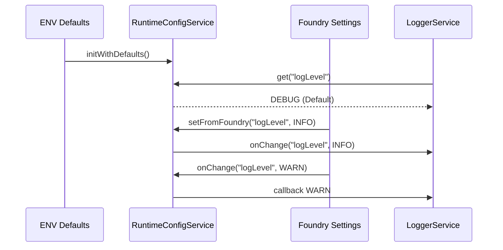

# Runtime Config Layer – Konzeptskizze

## Zielsetzung
- Build-Time Defaults aus `.env`/`VITE_*` als **Basis** verwenden.
- Foundry-Settings ab `init`-Hook aktivieren und damit Defaults **übersteuern**.
- Live-Änderungen über `game.settings` sofort an alle interessierten Services propagieren.
- Einheitliche API bereitstellen (`RuntimeConfigService`), statt dass jeder Service `ENV` und Foundry-Hooks selbst interpretiert.

## Hauptkomponenten
- **Environment Loader (`ENV`)**  
  Liefert Build-Time Defaults (z. B. `logLevel: DEBUG` im Dev-Build).

- **RuntimeConfigService**  
  - Speichert aktuellen Stand (`Map<key, value>`).  
  - Bietet `get(key)`, `setFromFoundry(key, value)` sowie `onChange(key, callback)` / `off`.  
  - Registriert eine Registry: `settingKey -> Set<callback>` für Benachrichtigungen.

- **ModuleSettingsRegistrar / FoundrySettingsAdapter**  
  - Registriert Foundry-Settings (z. B. `logLevel`).  
  - Liest initiale Werte (`game.settings.get`) und übergibt sie an den RuntimeConfigService.  
  - Hängt sich an `game.settings.onChange(...)` oder `Hooks.on("changeSetting", ...)` und ruft `setFromFoundry`.

- **Consumer (z. B. LoggerService)**  
  - Liest beim Start `runtimeConfig.get("logLevel")`.  
  - Registriert `runtimeConfig.onChange("logLevel", newLevel => logger.setLevel(newLevel))`.

## Ablaufdiagramm (Mermaid)



## Use Case 1 – Logger-Level
1. **Bootstrap (vor `init`)**  
   - `RuntimeConfigService` erstellt sich mit `ENV.logLevel`.  
   - `LoggerService` setzt `logger.setLevel(config.get("logLevel"))`.
2. **`init`-Hook**  
   - `ModuleSettingsRegistrar` registriert das Foundry-Setting `logLevel`.  
   - Liest mit `game.settings.get(...)` → resultiert in `INFO`.  
   - `RuntimeConfigService.setFromFoundry("logLevel", INFO)` ⇒ löst Callback aus, Logger stellt direkt auf `INFO`.
3. **Zur Laufzeit**  
   - Benutzer ändert Setting auf `WARN`.  
   - `game.settings` feuert OnChange → `RuntimeConfigService` setzt neuen Wert → Logger erhält Callback und reduziert Logging sofort.

## Use Case 2 – Cache & Metrics
- Gleicher Mechanismus: CacheService (oder zentrale CacheConfig) registriert Callbacks für `enableCacheService`, `cacheDefaultTtlMs`, `cacheMaxEntries` und ruft intern `cache.reconfigure(...)`.
- MetricsCollector/PerformanceTracker nutzen `enablePerformanceTracking`, `performanceSamplingRate`, `enableMetricsPersistence`, `metricsPersistenceKey`, um Verhalten live anzupassen.
- Bleibt ein Setting wie `cacheMaxEntries` auf ENV-/Foundry-Ebene undefiniert, liefert `RuntimeConfigService` bewusst `undefined`, damit Konsumenten den unbegrenzten Default erkennen und keine künstlichen Limits erzwingen.

## Implementierungsstand (v0.23.x)
- `RuntimeConfigService` (`src/core/runtime-config/runtime-config.service.ts`) hält ENV-Defaults (`isDevelopment`, `isProduction`, `logLevel`, `enablePerformanceTracking`, `performanceSamplingRate`, `enableMetricsPersistence`, `metricsPersistenceKey`, `enableCacheService`, `cacheDefaultTtlMs`, `cacheMaxEntries`) und bietet `get / setFromFoundry / onChange`.
- `ModuleSettingsRegistrar` (`src/core/module-settings-registrar.ts`) mappt definierte Settings (`logLevel`, `cacheEnabled`, `cacheTtlMs`, `cacheMaxEntries`) über `runtimeConfigBindings` auf den Service:
  - Nach dem Registern: `foundrySettings.get(...)` → `runtimeConfig.setFromFoundry(...)`
  - `onChange`-Callbacks werden automatisch um den Runtime-Bridge-Aufruf erweitert.
- Zusätzlich stehen optionale Settings für Observability bereit (`performanceTrackingEnabled`, `performanceSamplingRate`, `metricsPersistenceEnabled`, `metricsPersistenceKey`), sodass auch Perf-/Metrics-Flags zur Laufzeit geändert werden können.
- `ConsoleLoggerService` (`src/services/consolelogger.ts`) bindet sich via `bindRuntimeConfig()` an den Service; der DI-Wrapper injiziert das RuntimeConfigService und sorgt dafür, dass der Logger jederzeit den aktuellen Level zieht.
- Cache-bezogene Settings sind bereits angebunden (aktiv/deaktivieren, TTL, MaxEntries); weitere Werte (z. B. zukünftige Performance-Flags) lassen sich über zusätzliche `runtimeConfigBindings` ergänzen, sodass Consumer keine eigenen Foundry-Hooks benötigen.

### ENV-Verbraucher – Inventur (2025-11-15)

| Kategorie | Dateien | Begründung | Migrationsempfehlung |
|-----------|---------|------------|----------------------|
| **Early Bootstrap (muss vor DI laufen)** | `src/services/bootstrap-logger.ts`, `src/core/composition-root.ts`, `src/di_infrastructure/container.ts` | Logger & BootstrapPerformanceTracker benötigen sofortige Defaults, bevor Settings verfügbar sind. | Kurzfristig behalten; Schritt 3 dokumentiert die Ausnahmen, mittelfristig könnte ein minimaler RuntimeConfig-Snapshot zur Verfügung gestellt werden. |
| **DI-Setup & statische Registrierungen** | `src/config/dependencyconfig.ts`, `src/config/modules/cache-services.config.ts` | Registrieren `environmentConfigToken`/CacheConfig bevor das RuntimeConfigService zusätzliche Werte bekommt. | Auf RuntimeConfig umstellen, sobald Cache-/DI-Werte über `config.get()` gelesen werden können; ENV dient dann nur noch als Fallback bei fehlenden Settings. |
| **Runtime-Dienste mit ENV-Fallbacks** | `src/config/modules/core-services.config.ts`, `src/services/consolelogger.ts` | Core-Registrierung prüft aktuell ENV, falls RuntimeConfig nicht verfügbar ist; Logger initialisiert mit `env.logLevel`. | RuntimeConfig als primäre Quelle nutzen (Injection + Default aus Service). ENV nur noch für `new RuntimeConfigService(ENV)` beim Bootstrap. |
| **Definitionen & Hilfen** | `src/config/environment.ts`, `src/test/utils/test-helpers.ts`, `src/types/servicetypeindex.ts`, `src/tokens/tokenindex.ts` | Typdefinitionen/Test-Stubs – keine echten Verbraucher zur Laufzeit. | Keine Migration nötig. |

Diese Tabelle dient als Referenz für Schritt 4 des Migrationsplans: Alle produktiven Services sollen künftig ausschließlich über das RuntimeConfigService konfiguriert werden; direkte `ENV`-Lesen bleiben auf Bootstrap/Definition beschränkt.

### Bootstrap-spezifische Ausnahmen

| Komponente | Grund | Exit-Kriterium |
|------------|-------|----------------|
| `BootstrapLoggerService` (`src/services/bootstrap-logger.ts`) | Muss bereits vor Container-Validierung loggen, daher direkte `ENV`-Initialisierung. | Sobald RuntimeConfigService synchron vor Containerstart erzeugt und injiziert werden kann. |
| `CompositionRoot` (`src/core/composition-root.ts`) | Erstellt `BootstrapPerformanceTracker` noch vor DI und benötigt Flags wie `enablePerformanceTracking`. | Geplant: Mini-RuntimeConfig aus `ENV` konstruieren und durchreichen, sobald Cache/Settings layer fertig ist. |
| `ServiceContainer.createRoot/createScope` (`src/di_infrastructure/container.ts`) | Baut `RuntimeConfigService(ENV)` und `BootstrapPerformanceTracker`, bevor Tokens registriert sind. | Bleibt bis eine DI-unabhängige Fabric für RuntimeConfig existiert. |
| `registerCacheServices` (`src/config/modules/cache-services.config.ts`) | Statischer CacheConfig-Wert vor Hook-Registrierung, damit CacheService sofort arbeitet. | Nach Migration auf RuntimeConfig sollen Cache-Settings beim `init`-Hook neu angewendet werden. |
| `configureDependencies` (`src/config/dependencyconfig.ts`) | Registriert `environmentConfigToken`/`runtimeConfigToken` aus globalem `ENV`. | ENV bleibt Quelle für die initiale `RuntimeConfigService`-Instanz, aber weitere Services sollen nicht mehr direkt auf das Token zugreifen. |

Diese Ausnahmen werden im Migrationsverlauf regelmäßig überprüft; Ziel ist, mittelfristig nur noch Schritt 1 (RuntimeConfig aus ENV bootstrappen) beizubehalten und sämtliche Consumer via `runtimeConfigToken` zu bedienen.

## Methodenfluss (Beispielcode-Skizze)

```typescript
// bootstrap
const config = new RuntimeConfigService(ENV);

// module-settings-registrar
foundrySettings.register("logLevel", ...);
const level = foundrySettings.get("logLevel");
config.setFromFoundry("logLevel", level);
foundrySettings.onChange("logLevel", (value) => config.setFromFoundry("logLevel", value));

// consumer
logger.setLevel(config.get("logLevel"));
const unsubscribe = config.onChange("logLevel", (value) => logger.setLevel(value));
```

## Vorteile
- **Single Source of Truth** zur Laufzeit.  
- **Deterministischer Override**: ENV → Foundry → Live-Hooks.  
- **Geringe Kopplung**: Consumer kennen nur den ConfigService.  
- **Testbarkeit**: Config-Service kann isoliert getestet werden (Registry, Change-Events).

## Weiteres Vorgehen
1. `RuntimeConfigService` + Token einführen.  
2. Bestehende Consumer (Logger, Cache, später weitere) auf `config.get/ onChange` umstellen.  
3. Foundry-Settings erweitern (Cache-Settings) und OnChange-Chain implementieren.  
4. Optional: Persistente Defaults dokumentieren (`CONFIGURATION.md`, `CHANGELOG.md`).

